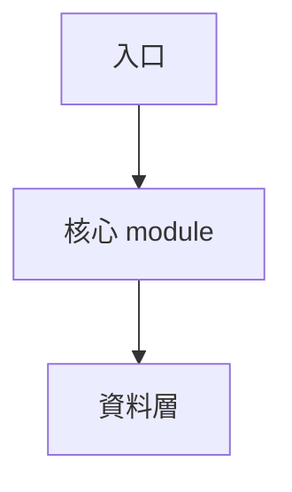

# analyze-repo

## 目的
針對一個入選 repo 做架構 / 資料設計深度分析，產出鐵人日誌風 entity 頁。

## 輸入
一個 repo URL（例：`https://github.com/owner/repo`）。

## 命名慣例
`<owner>__<repo>`（把 `/` 換成 `__`）。例：`karpathy/nanoGPT` → `karpathy__nanoGPT`。

## 步驟

### 1. 拉原料，存 `raw/<name>.md`

```bash
OWNER=<owner>
REPO=<repo>
NAME="${OWNER}__${REPO}"

# README
gh api repos/${OWNER}/${REPO}/readme --jq '.content' | base64 -d > /tmp/readme.md

# metadata
gh api repos/${OWNER}/${REPO} > /tmp/meta.json

# manifest (試 4 種)
for f in package.json pyproject.toml go.mod Cargo.toml; do
  gh api repos/${OWNER}/${REPO}/contents/${f} --jq '.content' 2>/dev/null | base64 -d > /tmp/${f} && echo "found: $f" && break
done

# tree (前 2 層)
DEFAULT_BRANCH=$(jq -r .default_branch /tmp/meta.json)
gh api repos/${OWNER}/${REPO}/git/trees/${DEFAULT_BRANCH}?recursive=1 \
  --jq '.tree[] | select(.path | split("/") | length <= 2) | .path' > /tmp/tree.txt
```

存成 `raw/${NAME}.md`，格式：
```markdown
# ${OWNER}/${REPO} — raw

- URL: https://github.com/${OWNER}/${REPO}
- Description: <from meta.json>
- Language: <lang>
- Topics: <topics>
- Stars: <count>
- Fetched: YYYY-MM-DD

## README
<原文>

## Manifest (<file>)
```<content>```

## Tree (top 2 levels)
```
<tree>
```

## Key entry files
<至多 3 個 README 提到的入口檔內容>
```

### 2. 寫 entity 頁 `repos/${NAME}.md`

**必含 metadata block（YAML frontmatter）：**
```yaml
---
repo: owner/repo
url: https://github.com/owner/repo
lang: Python
topics: [llm, agent]
stars: 1234
analyzed_at: YYYY-MM-DD
concept_tags: [slug-1, slug-2]
---
```

**必含六個區塊（順序固定）：**
```markdown
# owner/repo

## 前言
（我怎麼看到這個 repo、為什麼在意；一段 100-150 字）

## 系統架構


（一段 150-200 字，配 mermaid 一張）

## 資料設計
（schema / 儲存格式 / 資料流；150-200 字）

## 為什麼這樣做
（設計取捨、為什麼不用另一種做法；150-200 字）

## 我能學到
（能帶回自己專案的具體收穫；150-200 字）

## 費曼式回顧
（見下方詳細指引；共 180–300 字）

### 用生活比喻重講一次
（用一個日常場景 — 廚房 / 塞車 / 便當店 / 咖啡店 / 積木 …，
國中生能聽懂的詞彙，避開 API / schema / runtime / DAG / RAG 等術語；60–100 字）

### 你接下來最可能誤解的 3 個地方
1. **以為 X，但實際上 Y**（20–30 字）
2. **以為 X，但實際上 Y**（20–30 字）
3. **以為 X，但實際上 Y**（20–30 字）

### 換你解釋
（一句話邀請讀者用自己的話講給朋友聽；卡點回來對照）
```

**費曼式回顧的寫作要點**（依據：史丹佛 AI 教育應用研究 → 主動學習成效顯著；費曼學習法結合 LLM 可最大化記憶保留率）：

- **LLM 扮演「讀者的學生」角色**，不是教授。目的是暴露讀者的理解漏洞，不是炫技解說。
- **比喻要具體**：不要寫「就像一個系統」，要寫「就像巷口麵店老闆娘記單的方式」。動用五感。
- **3 個盲點格式一致**：全用「**以為 X，但實際上 Y**」對照句，讓讀者一眼掃到反差。
- **盲點要選「讀完前 5 段最容易誤讀的地方」**，不是隨便挑技術難點。
  - 好例子：「以為 local-first 就是不 call cloud，但實際上還是有 call，只是 loop 在本地」
  - 壞例子：「以為要用 Redis，但實際上用 SQLite」（這只是實作細節，不是理解漏洞）
- **不要在費曼段用 concept slug `[[...]]`**（那是給前面 5 段用；費曼段刻意留白讓讀者自己 map）

**字數：** 800–1000（`wc -m repos/${NAME}.md`；容忍 +/-100）

**至少 link 2 個 concept：** 文中用 `[[concept-slug]]` 標記，例：`用了 [[rag-chunking-strategies|semantic chunking]]`。即使 concept 頁尚未建立也先標，`update-concepts` 會補。

**新比喻 → glossary.md**：出現「XX 就像 YY」這種比喻 → append 一 row 到 `glossary.md`。

### 3. 產出 concept_tags list

從 metadata block 的 `concept_tags` 抽出。每個 slug 為 kebab-case 名詞短語（例：`rag-chunking-strategies`, `async-task-queue`）。

## 輸出
- `raw/${NAME}.md`
- `repos/${NAME}.md`
- `concept_tags`（list<string>，交給 `update-concepts`）
- 可能更新的 `glossary.md`

## 錯誤處理
- README 拉不到 → 從 meta.json `description` 頂替，文末加 `> ⚠️ 未讀 README，分析深度受限`
- 大檔（> 100KB entry file）→ 只拉前 200 行 + 加註「truncated」
- Rate limit → sleep 60s 重試一次
