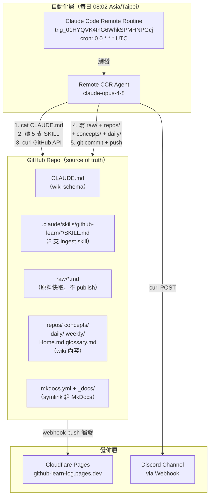
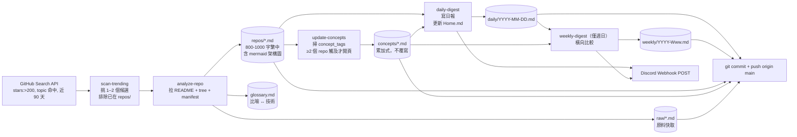

# github-learn-log

> 我的個人 wiki：每天由 [Claude Code routine](https://claude.ai/code/routines) 自動掃 GitHub trending，挑 1–2 個「架構深度 + 週末可重造」的專案，寫成鐵人日誌風的 markdown 網絡（entity 頁 × 累加式概念頁 × 日/週報），推到 Discord + 部署到 Cloudflare Pages。

**線上瀏覽**：<https://github-learn-log.pages.dev/>

**設計哲學**：套用 [Karpathy 的 llm_wiki 三層](https://gist.github.com/karpathy/442a6bf555914893e9891c11519de94f) — raw sources 不動 / wiki 由 LLM 寫 / schema (CLAUDE.md) 由人維護。

---

## 系統架構



## 資料流



---

## 主要組件

### 1. Claude Code Remote Routine（自動化引擎）

- **Routine ID**：`trig_01HYQVK4tnG6WhkSPMHNPGcj`
- **Cron**：`0 0 * * *` UTC = 每日 08:02 Asia/Taipei
- **執行環境**：Anthropic cloud CCR，`claude-opus-4-8`
- **管理**：<https://claude.ai/code/routines/trig_01HYQVK4tnG6WhkSPMHNPGcj>
- **權限**：
  - Push GitHub：透過 fine-grained PAT（Contents R/W），注入 `sources[].git_repository.authorization_token`
  - Push Discord：透過 webhook URL，注入 routine prompt 的 `DISCORD_WEBHOOK_URL` env

### 2. Ingest Skills（5 支）

Routine 執行時逐一讀取 `.claude/skills/github-learn/*/SKILL.md` 當作 spec：

| Skill | 職責 | 輸出 |
|---|---|---|
| `scan-trending` | curl GitHub API 找候選 | 1–2 個 repo shortlist |
| `analyze-repo` | 拉原料 + 寫 entity 頁 | `raw/*.md`、`repos/*.md`、`glossary.md` |
| `update-concepts` | 累加式建 / 更新概念頁 | `concepts/*.md`（≥2 repo 觸及才開） |
| `daily-digest` | 每日彙整 + Discord push | `daily/YYYY-MM-DD.md`、`Home.md`、webhook POST |
| `weekly-digest` | 週日產週報 + Discord push | `weekly/YYYY-Www.md`、`Home.md`、webhook POST |

### 3. Wiki 內容分層

依 [Karpathy llm_wiki](https://gist.github.com/karpathy/442a6bf555914893e9891c11519de94f) 三層：

- **Raw**（`raw/*.md`）— 從 GitHub API curl 下來的原始 README / tree / manifest，作為 wiki 生成的證據鏈；**不 publish** 到 CF Pages
- **Wiki**（`repos/`、`concepts/`、`daily/`、`weekly/`、`Home.md`、`glossary.md`）— LLM 依 schema 寫的整理層；publish
- **Schema**（`CLAUDE.md`、`.claude/skills/`）— 由人維護的寫作規範 / 累加規則 / 觸發條件；publish（讓讀者知道規則）

### 4. Cloudflare Pages（線上瀏覽）

- **URL**：<https://github-learn-log.pages.dev/>
- **Build tool**：MkDocs + Material（見 `mkdocs.yml`、`requirements.txt`）
- **Build command**：`pip install -r requirements.txt && mkdocs build`
- **Output**：`site/`
- **內容來源**：`_docs/` 內的 symlink 指向 root 各 wiki 目錄
- **排版控制**：各子目錄的 `.pages` 檔（awesome-pages plugin）
- **觸發**：每次 `main` push 自動 build（CF Pages GitHub App webhook）

### 5. Discord 推播

- **架構**：Discord Webhook（HTTP POST，不透過 bot / MCP，因為 remote routine 無 Discord plugin）
- **Target channel**：`1529833934354124920`
- **Webhook URL**：**不 commit 到 repo**，存在 routine prompt 的 `DISCORD_WEBHOOK_URL` env
- **內容格式**：日報 / 週報卡片 + Pages URL
- **想關**：Discord 設定 → delete webhook；或改 routine prompt 拿掉 URL

---

## 目錄結構

```
github-learn-log/
├── CLAUDE.md              # wiki schema（寫作規範、累加規則、觸發條件）
├── Home.md                # 首頁索引（自動更新，列所有 repos/concepts/daily/weekly）
├── index.md               # CF Pages 站台 landing（歡迎頁）
├── glossary.md            # 比喻 ↔ 技術對照
│
├── raw/                   # 原料快取，不 publish
│   └── <owner>__<repo>.md
├── repos/                 # entity 頁（800–1000 字繁中）
│   └── <owner>__<repo>.md
├── concepts/              # 跨 repo 概念累加頁
│   └── <slug>.md
├── daily/                 # 日報
│   └── YYYY-MM-DD.md
├── weekly/                # 週報（週日產）
│   └── YYYY-Www.md
│
├── .claude/skills/github-learn/    # ingest skills
│   ├── scan-trending/SKILL.md
│   ├── analyze-repo/SKILL.md
│   ├── update-concepts/SKILL.md
│   ├── daily-digest/SKILL.md
│   └── weekly-digest/SKILL.md
│
├── mkdocs.yml             # MkDocs 設定
├── requirements.txt       # Python 相依（mkdocs-material, awesome-pages）
├── _docs/                 # symlink 集合，給 mkdocs docs_dir 用
│   ├── index.md -> ../index.md
│   ├── Home.md -> ../Home.md
│   ├── daily -> ../daily
│   └── ... （其他）
├── site/                  # mkdocs build 產物（gitignore）
│
└── docs/superpowers/      # 設計文件
    ├── specs/2026-07-21-github-learn-log-design.md
    └── plans/2026-07-21-github-learn-log.md
```

---

## 執行方式

### 每日自動

Routine 每天 08:02 Asia/Taipei 自動觸發，走完 scan → analyze → update-concepts → daily-digest → commit + push → Discord push。**你什麼都不用做**。

### 手動觸發

想立刻跑一次而不等 cron：

```bash
# 需要 Anthropic OAuth token；透過 /schedule 或 RemoteTrigger tool
# 或到 UI 手動點：https://claude.ai/code/routines/trig_01HYQVK4tnG6WhkSPMHNPGcj
```

### 本地開發

改 skills / schema：

```bash
git clone https://github.com/a920604a/github-learn-log
cd github-learn-log
python3 -m venv .venv && .venv/bin/pip install -r requirements.txt
.venv/bin/mkdocs serve            # 本地起 http://127.0.0.1:8000 預覽
```

改動 CLAUDE.md 或 SKILL 檔要考慮 routine 也讀，避免破壞每日產出格式。

---

## 相關文件

- **設計 spec**：[`docs/superpowers/specs/2026-07-21-github-learn-log-design.md`](docs/superpowers/specs/2026-07-21-github-learn-log-design.md)
- **實作 plan**：[`docs/superpowers/plans/2026-07-21-github-learn-log.md`](docs/superpowers/plans/2026-07-21-github-learn-log.md)
- **Wiki schema**：[`CLAUDE.md`](CLAUDE.md)
- **首頁索引**：[`Home.md`](Home.md)

---

## 已知洞 / 待修

（狀態 2026-07-23）

- ⚠️ **遠端 routine push 不穩**：2026-07-22 首次自動觸發沒 push；設 PAT 後 2026-07-23 觸發仍沒 push。原因排查中（PAT 未生效 / agent 中途 crash / branch 錯位可能）。
- **Home.md 排版待美化**（MkDocs 渲染尚未精修）
- **中文搜尋弱**：MkDocs 內建 Lunr 對中文分詞不佳；未來若嫌難用可考慮遷 Astro Starlight (Pagefind)
- **Lint routine 尚未做**（孤兒 concept / 過期 concept / 斷鏈警告；spec §5 已定義規則）
