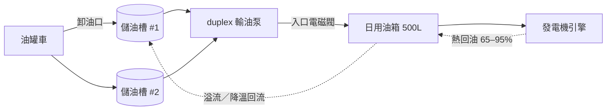

# 日用油箱與儲油槽（day tank / bulk fuel）

[dc-05](diesel-generator.md) 談發電機出得了多少 kW，[dc-05b](genset-start-and-transient.md) 談它多快出得來，[dc-05c](nfpa110-testing-and-wet-stacking.md) 談你怎麼知道它還行。這張卡談**它能撐多久**——答案不在發電機身上，在一條由儲油槽、泵、閥、日用油箱、回油管組成的鏈上。鏈裡任一環斷掉，滿載的儲油槽都救不了一台十分鐘後要熄火的引擎。



## 六格

**拓撲位置**：油罐車 → 卸油口 → 儲油槽（UST / AST）→ 輸油泵 → 日用油箱 → [dc-05](diesel-generator.md) 的引擎。**注意有一條回頭的邊**：引擎抽走的油只燒掉約 1/3，其餘熱油回流。這條回油路在 Tier III/IV 認定裡跟供油路同等關鍵。

**容量單位**：公升。但**槽容量不等於可用油量**——沉積層與泵吸入口高度以下的油抽不到，NFPA 慣用 1.33 係數（假設 75% 可用）反推槽體。該建模的是「可用公升」與換算出的「小時」。

**冗餘表達**：N = 一泵一管一槽。N+1 = duplex 泵 + 雙吸入管。2N = 兩條各自足量的獨立路徑。陷阱：**冗餘掛在路徑上而不是槽上**——兩座槽共用一顆泵或閥，就只有 N。

**遙測介面**：日用油箱控制盤（Modbus / 乾接點）+ 儲油槽磁伸縮液位計。典型設定值（Earthsafe）：

| 點位 | 設定 | 語意 |
|---|---|---|
| High level | 90% | 溢流警報 |
| Fill stop | 85% | 停止補油 |
| Fill start | 75% | 啟動補油 |
| Low level | 50% | 警報 |
| Critical low | 15% | **常接成引擎停機訊號** |
| Tank leak | — | 二次包封偵漏 |

**故障域**：日用油箱掛掉 → 它服務的所有發電機在數十分鐘內熄火，**與儲油槽是否滿載無關**，所以一台發電機配一個日用油箱是常態。輸油泵的電源路徑也算故障域——所有泵吃同一面盤或同一個 ATS 是 Uptime 點名的常見錯誤。

**維護特性**：採樣化驗、燃油過濾（polishing）、包封氣密測試、液位開關校驗、泵輪替。多數**不需發電機停機**，但需隔離該路徑——這正是「一顆閥擋住兩座槽」會出事的地方。

## 關鍵數字與計算

**經驗耗油率**（Earthsafe）：滿載約 `0.085 gal/h` 每 kW ≈ **0.322 L/h 每 kW**。部分負載時**單位耗油變差**，本卡用粗略修正係數 k（實務上改用廠商 fuel curve）：

| 負載率 | k |
|---|---|
| ≥ 75% | 1.00 |
| 50–75% | 1.08 |
| 25–50% | 1.18 |
| < 25% | 1.40 |

### 演算 1：日用油箱要多大

Earthsafe 的作法是「小時數 × 耗油率 × 1.33」：4 h × 50 gph = 200 gal，×1.33 = 266 → 取 **300 gal**。

本卡情境：2000 kW ESP、實際帶 900 kW（45%）。耗油 `0.32 × 900 × 1.18` = **339.8 L/h**。撐 1 小時需 350 L 可用量；可用區間是 fill stop 85% 到 critical low 15%（= 70% 槽容），故槽體 `350 ÷ 0.70` = **500 L**。

### 演算 2：補油循環——這才是日用油箱真正的節奏

fill start 75% → fill stop 85%，工作帶只有槽容的 **10% = 50 L**。

- 抽乾工作帶 = `50 ÷ 339.8` h = **8.83 分鐘** → 每小時補油 **6.8 次**
- 18 GPM（≈ 68 L/min）泵補滿 50 L 需 `50 ÷ 68` = **44 秒**；佔空比 `44 ÷ (8.83×60)` ≈ **8.3%**

**意義**：發電機一起來，日用油箱就進入 9 分鐘週期的振盪。閥卡住不開 → 約 1 小時後 critical low 停機；卡住不關 → 溢流。**補油週期本身就是要監控的訊號**：週期變短代表洩漏或耗油異常，週期消失代表閥或感測器死了。

### 演算 3：12 小時儲油與「同時可維護的油」

Uptime Tier Standard: Topology 要求**所有 Tier 都至少 12 小時**、在 N 負載下、且滿足該站的 CM / FT 目標。

站點：N = 2 台 2000 kW 發電機共擔 1,800 kW → 每台 900 kW → 全站 **679.7 L/h**。12 小時需求 8,156 L，除以 95% 可用率 ≈ 8,585 L。

設計成 **2 × 11,000 L**（各 10,450 L 可用）+ 2 × 500 L 日用油箱（各 350 L 可用）：

- **帳面**總可用 21,600 L → `21,600 ÷ 679.7` = **31.8 小時**
- **移走一座儲油槽後** = 11,150 L → **16.4 小時** ✅ 過關
- 若改成 2 × 5,500 L：帳面 16.4 小時，移走一座只剩 **8.7 小時** ❌ **不合格**
- 更糟：兩座槽共用一顆泵 → 移走那顆泵供油歸零，只剩日用油箱 700 L = **1.03 小時**

Uptime 原文：「業主宣稱有 48 小時，實際配置是兩座 24 小時的槽，那只有 24 小時的 concurrently maintainable fuel。」**baseline 是永遠拿得到的量，不是最好情況的原始儲量。**

### 演算 4：燃料週轉率——為什麼一定要 polishing

依 [dc-05c](nfpa110-testing-and-wet-stacking.md) 的月測（30 分鐘 ≥30% ESP = 600 kW）：單台單次 `0.32 × 600 × 1.18 × 0.5` = **113.3 L**，全站年耗 113.3 × 12 × 2 = **2,719 L**。全站儲油 22,000 + 1,000 = **23,000 L** → 年週轉率 **11.8%**，換過一輪要 **8.5 年**。

柴油在良好保存下的可用期普遍被引為 **6–12 個月**（30°C 以上更短）。**測試燒掉的油遠不足以讓油槽自然週轉**，資料中心的燃油幾乎必然老於保存期限 → 定期採樣（ASTM D975 / D6217 / D4057）與 fuel polishing 不是加值服務，是讓那 12 小時真的存在的前提。

### 地區差異：容量門檻不是同一個數字

- **美規（依 AHJ）**：Earthsafe 指出室內常見限制為「每室合計 240 gal、單槽 60 gal」；另有二手來源引 NFPA 110 室內上限 **660 gal**。→ **來源分歧**：兩個數字差一個量級且都自稱源於 NFPA 體系。實務上是 AHJ 逐案認定，**不要把任一個當通則**。
- **台灣**：柴油閃火點 21–70°C，屬公共危險物品第四類易燃性液體之**第二石油類・非水溶性液體，管制量 1,000 公升**；多種物品並存時以「現有量 ÷ 管制量」加總是否 > 1 判定。

  **對照很殘酷**：美規室內 660 gal ≈ 2,498 L 還在討論範圍，台灣**一個 1,000 L 日用油箱就已達管制量**，達管制量以上即須依《公共危險物品及可燃性高壓氣體製造儲存處理場所設置標準暨安全管理辦法》辦理。演算 3 那個 23,000 L 站點是 **23 倍管制量**。**美規數字不能照抄。**

## 常見誤解

**以為日用油箱的容量就是發電機能跑多久，但實際上它只是幾十分鐘的緩衝。** 真正的續航在儲油槽，而要拿到那些油得靠泵、閥、控制盤與**它們自己的電源**都活著。滿載的儲油槽配一顆停電的泵，等於零小時續航。

**以為兩座 24 小時的油槽等於 48 小時，但實際上只有 24 小時。** 冗餘容量的定義是「移走冗餘元件後還剩多少」，跟 [dc-05](diesel-generator.md) 的 N+1 邏輯一致，只是在燃油上特別容易忘記——油量看起來就是可以相加的純量。

**以為 critical low 是個警報，但實際上它常常是一個致動器。** 該位準開關通常直接接到發電機控制器當停機條件（避免吸入空氣導致燃油系統需重新排氣）。**一個位準感測器有能力自己關掉發電機。** 在資料模型裡把它跟 `low_level` 這種純警報放同一張表、同一種嚴重度，遲早有人在維護時誤觸。

## 對資料模型的意涵

1. **`FuelTank` 要跟 `Genset` 分開建模，且需 `kind`（DAY / BULK）與 `capacity_l` / `usable_l` 兩個容量欄位。** 這是 [dc-02](transformer.md) 銘牌 vs 降載、[dc-05](diesel-generator.md) ESP vs COP 之後第三次出現同一個模式：**鐵牌上的數字幾乎從來不是可以拿來算的數字。** 該抽成共用約定，而不是每張表各自處理。

2. **`autonomy_hours` 不能是欄位，必須是帶時間戳的推導值。** 它同時依賴當前液位、當前負載、耗油曲線與整條供油路徑的可用性。存成欄位就是保證會有一個過期的數字掛在儀表板上，而且會在最需要它正確的那天過期。

3. **燃油系統是一張圖，不是一個總和。** 需要 `FuelPath(source, pump, valves, dest)` 這種邊實體，才能回答「移走任一元件後還剩幾小時」——`concurrently_maintainable_hours()` = 逐一移除取最小值。**任何形如 `site.total_fuel_hours` 的欄位都是錯的。**

4. **位準設定值的有序性要進 CHECK 約束**：`critical_low < low < fill_start < fill_stop < high`；且 `critical_low` 要有 `is_shutdown_trigger` 旗標，在型別層級把致動點位跟純警報點位分開。

5. **燃油品質是時間序列實體，不是槽的屬性**：`FuelSample(tank, sampled_at, water_ppm, ...)` + 推導 `next_polish_due`。告警規則是「距上次合格採樣 > N 個月」而非任何即時讀值——**這是一個沒有感測器會叫你的故障。**

6. **合規欄位要能算**：`containment_l >= 1.25 * capacity_l` 的 CHECK，以及站台層級推導欄位 `regulated_quantity_multiple = Σ(capacity_l) / 1000`（台灣管制量倍數）。

## 該問 facility 的問題

1. 儲油槽幾座、各多少公升？**移走其中一座之後**，全站在設計負載下還剩幾小時？（要這個數字，不是總和）
2. 輸油泵與燃油控制盤的電源從哪來？是不是全部吊在同一面盤或同一個 ATS 上？
3. 燃油多久採樣化驗、多久 polishing？上次報告在哪、我們的油幾歲？critical low 是接成警報還是引擎停機？

## 動手練習（30–40 分鐘）

接續 [dc-05](diesel-generator.md) 的 `Genset` 與 [dc-05c](nfpa110-testing-and-wet-stacking.md) 的 `ComplianceEngine`，長出**燃油鏈**。重點跟前幾張不同：**要建的是圖，不是表**。三件事要擋住：**(a) 續航是推導值不是欄位；(b) 冗餘靠「逐一移除元件」算出來而不是相加；(c) 日用油箱與儲油槽的可用量算法不同。**

```python
from dataclasses import dataclass, field
from enum import Enum

Kind = Enum("Kind", "DAY BULK")
LPH_PER_KW = 0.32          # 0.085 gal/h/kW 的公制近似，本練習固定用 0.32

def k_factor(load_fraction: float) -> float:
    # TODO: >=0.75 -> 1.00 / >=0.50 -> 1.08 / >=0.25 -> 1.18 / else 1.40
    ...

@dataclass
class FuelTank:
    id: str
    kind: Kind
    capacity_l: float
    level_pct: float = 0.85
    critical_low: float = 0.15              # 以下皆為占槽容比例
    fill_start: float = 0.75
    fill_stop: float = 0.85
    high: float = 0.90
    bulk_usable_ratio: float = 0.95         # 只對 BULK 有意義
    containment_l: float = 0.0

    # TODO __post_init__: critical_low < fill_start < fill_stop < high；
    #      且 containment_l >= 1.25 * capacity_l。違反 -> ValueError
    # TODO usable_l():
    #   DAY : (level_pct - critical_low) * capacity_l     ← 抽到 critical low 就停機
    #   BULK: level_pct * capacity_l * bulk_usable_ratio  ← 沉積層與吸入口高度

@dataclass
class Component:                            # 泵、閥、控制盤都是它
    id: str
    in_service: bool = True

@dataclass
class FuelPath:
    source: FuelTank
    dest: FuelTank
    via: list[Component] = field(default_factory=list)
    # TODO available()   # 所有 via 元件都 in_service

@dataclass
class FuelSystem:
    tanks: list[FuelTank]
    paths: list[FuelPath]
    site_load_kw: float
    gensets: int
    esp_kw_each: float

    # TODO consumption_lph():
    #   lf = (site_load_kw / gensets) / esp_kw_each
    #   全站 = LPH_PER_KW * site_load_kw * k_factor(lf)
    # TODO reachable_litres():
    #   DAY tank 永遠算得到；BULK tank 只有存在一條 available() 的 path
    #   通到某個 DAY tank 時才算進去
    # TODO autonomy_hours()                    # reachable / consumption
    # TODO concurrently_maintainable_hours()
    #   對每個 tank 與每個 Component 逐一移除，取所有情境的最小 autonomy_hours
    # TODO regulated_quantity_multiple()       # Σ capacity_l / 1000（台灣管制量）

@dataclass
class DayTankCycle:
    tank: FuelTank
    consumption_lph: float
    pump_lpm: float
    # TODO working_band_l() = (fill_stop - fill_start) * capacity_l
    # TODO drain_minutes() / cycles_per_hour() / refill_seconds() / duty_pct()
```

**驗收標準**（2 × 2000 kW ESP、負載 1,800 kW、2 × 11,000 L 儲油槽、2 × 500 L 日用油箱、level 0.85）

| 呼叫 | 期望 |
|---|---|
| `k_factor(0.45)` / `consumption_lph()` | **1.18** / **679.68** |
| BULK / DAY 的 `usable_l()` | **8882.5** / **350.0** |
| `autonomy_hours()`（儲油槽 level 1.0） | **31.78** |
| `concurrently_maintainable_hours()` | **16.40** |
| 同上但改成 2 × 5,500 L 槽 | **8.72** ← 不合 Uptime 12 h |
| 兩座 BULK 共用一顆 pump，移走該 pump | **1.03**（只剩日用油箱） |
| `regulated_quantity_multiple()` | **23.0** |
| `FuelTank(fill_start=0.9, fill_stop=0.8, ...)` | **raise ValueError** |
| `containment_l=500` 配 `capacity_l=500` | **raise ValueError** |
| `drain_minutes()` / `cycles_per_hour()` | **8.83 / 6.80** |
| `refill_seconds()` / `duty_pct()`（pump 68 L/min） | **44.1 / 8.3** |

**加分題**：加 `FuelSample` 與 `annual_turnover_ratio()`——用 [dc-05c](nfpa110-testing-and-wet-stacking.md) 的月測耗油（每台每次 113.28 L）算出年週轉 **11.8%**、換完一輪 **8.5 年**，對照 6–12 個月的柴油可用期。產出是一行告警規則：**`next_polish_due` 不會被任何即時遙測觸發，只能由日期推導；沒人寫這條規則，油就會靜靜地壞掉，而所有儀表板都是綠的。**

## 自我檢核

**Q1. 儲油槽是滿的，發電機在跑，為什麼還可能在 40 分鐘後熄火？**

??? note "答案"
    因為引擎吃的是日用油箱，不是儲油槽。補油鏈任一環斷掉——泵失電、入口電磁閥卡在關閉、fill start 開關失效、吸入管失去引油——日用油箱就單向下降，到 critical low 觸發停機。工作帶只有槽容的 10%（本卡例子 50 L，約 9 分鐘），從 85% 掉到 15% 也只有約 1 小時。這就是為什麼補油**週期**本身要當訊號監控，而不是只監控液位。

**Q2. 業主說「我們有 22,000 公升、將近 32 小時的油」。Uptime 的 Tier III 審查會怎麼算這個數字？**

??? note "答案"
    會逐一移除元件重算。兩座 11,000 L 移走一座後剩 16.4 小時 → 過 12 小時門檻；兩座 5,500 L 移走一座只剩 8.7 小時 → 不合格；若兩座槽共用一顆泵或閥，移走它只剩日用油箱的 1.03 小時。**Uptime 明講 baseline 是「永遠拿得到的量」**，判定範圍涵蓋泵、手動閥、自動閥、控制盤與回油路徑。

**Q3. 這張卡會讓你的資料模型長出哪些欄位與約束？至少講出三個，其中一個要是「不能存成欄位」的。**

??? note "答案"
    （a）`capacity_l` 與 `usable_l` 分開，且 DAY / BULK 算法不同；（b）位準有序 CHECK `critical_low < fill_start < fill_stop < high`，加 `is_shutdown_trigger` 旗標把致動點位跟警報點位分型別；（c）`containment_l >= 1.25 * capacity_l`；（d）`FuelSample` 時間序列 + 推導 `next_polish_due`；（e）站台層級 `regulated_quantity_multiple`。
    **不能存成欄位的是 `autonomy_hours` 與 `concurrently_maintainable_hours`。** 前者依賴當前液位與負載，後者要對整張供油圖逐一移除元件求最小值——兩者都必須是帶時間戳的推導結果。任何 `site.total_fuel_hours` 這種相加得來的欄位都是錯的。
