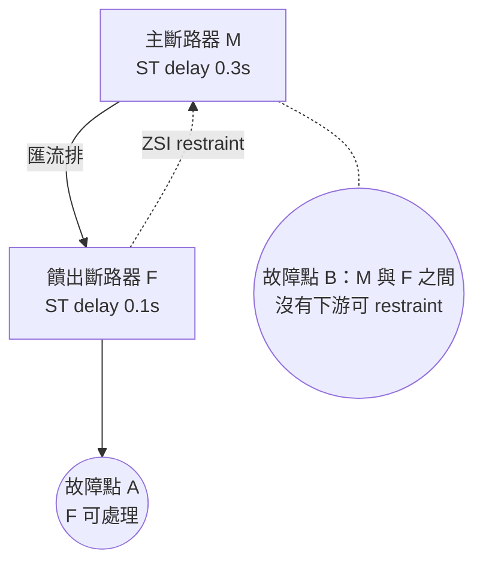

# 低壓盤的短路耐受與保護協調（short-circuit withstand & protection coordination）

[dc-07](lv-switchgear.md) 談這面盤**平常**能扛多少電流；這張卡談它**出事那一秒**能扛多少。兩者差 15 倍以上：同一面 3200 A 的盤，短路瞬間要面對 50 kA 以上的電流與對應的電磁力。而真正難的不是「扛不扛得住」，是**兩個目標互相打架**——選擇性協調要上游慢一點跳，人身安全（arc flash）要上游快一點跳。



## 六格

**拓撲位置**：不是一台設備，是 [dc-07](lv-switchgear.md) 那面盤的另一張臉。上游決定有多少故障電流可用（[dc-02](transformer.md) 的變壓器阻抗 `Z%` 是主要瓶頸），下游每顆斷路器與它構成一對「保護對」。

**容量單位**：kA，但要三個維度：**RMS 值 + 持續時間 + 額定種類**。`Icw`（短時耐受，配 1 s 或 3 s）、`Ipk`（峰值耐受，管機械力）、`Icc`（條件式，**依附特定上游 SCPD**）；斷路器本身另有 `Icu`（極限啟斷）與 `Ics`（運轉啟斷）。**五個都是 kA，五個意思不同。**

**冗餘表達**：反直覺——**冗餘會提高故障責任**。兩台變壓器並聯（tie 閉合）時可用故障電流接近相加，2N 反而更容易撞破 `Icw`。tie 常開不只為了切故障域，**也是為了不讓短路電流疊加**。

**遙測介面**：跳脫單元（Modbus TCP）的關鍵在**事件類**點位：`trip_cause`（LT/ST/INST/GF）、`trip_current`、波形擷取，以及 **`erms_engaged`（維護模式開關位置）**。**ZSI 接線是否正確幾乎無法遙測**——一對乾接點，平常沒訊號，正確與斷線長得一模一樣。

**故障域**：保護域 = 兩顆斷路器之間的區段。**選擇性失效時故障域往上膨脹**：本來只掉一路，結果主斷路器陪跳。這是唯一一種「故障域大小取決於設定值而非實體結構」的情況。

**維護特性**：ERMS 是**有時效的組態變更**——開了忘了關等於整面盤失去選擇性。跳脫單元需定期校驗，ZSI 需**注入電流的功能測試**而非導通測試。同 [dc-05c](nfpa110-testing-and-wet-stacking.md)：不測就不知道壞了沒。

## 關鍵數字與計算

### 演算 1：故障電流是變壓器阻抗的倒數決定的

無限匯流排假設下，變壓器二次側可用短路電流 `Isc ≈ In / Z%`。沿用 [dc-07](lv-switchgear.md) 的 2000 kVA / 380 V：

- `In = 2,000,000 / (1.732 × 380)` = **3,038 A**
- `Z% = 6%` → `Isc = 3,038 / 0.06` = **50.6 kA**；`Z% = 5%`（低阻抗機種）→ **60.8 kA**

**阻抗低 1 個百分點，故障電流多 20%。** 變壓器規格書上那個「效率比較好」的低阻抗選項，代價是下游整面盤與所有斷路器的短路等級往上跳一級——**採購時最容易被切開來看、實際上綁死的兩件事。**

### 演算 2：tie 閉合的瞬間，冗餘變成負債

兩台 2000 kVA / 6% 並聯到同一條匯流排（tie 閉合），忽略線路阻抗：

| 配置 | 匯流排可用故障電流 | 50 kA 盤 |
|---|---|---|
| 單台供電（tie 開） | **50.6 kA** | 勉強過 |
| **兩台並聯（tie 閉）** | **≈ 101 kA** | ❌ **超出一倍** |

再加上下游電動機反饋（冰水主機、水泵在故障瞬間倒灌，經驗值約其額定電流的 4–6 倍，持續數個週期），數字還要往上加。

**`Icw` 必須對照「最嚴苛的系統配置」，不是日常配置。** 多數機房日常是 tie 開——這個違規在正常運轉時**完全看不出來**，只在某次維護把兩端合起來的幾分鐘成立。這正是要把「系統配置」做成資料模型維度的理由。

### 演算 3：`Ipk` 不是 `√2 × Icw`

`Ipk = n × Icw`，`n` 由短路功率因數決定（IEC 61439-1 給了對照表）。對 `Icw = 50 kA` 這個級距：

| 算法 | 結果 |
|---|---|
| 純正弦假設 `√2 × 50` | 70.7 kA |
| **IEC 對照表 `n = 2.2`** | **110 kA** |

**低估 36%。** 差別來自故障電流起始的**直流偏移**（DC offset），第一個半週波的峰值遠高於對稱值。而 `Ipk` 管的是電磁力，力正比於電流平方——**低估 36% 的電流等於低估 85% 的力**。匯流排支撐、絕緣礙子、鎖固扭力全靠這個數字。

**來源分歧**：`n` 的分級依據，廠商文件（ABB、Schneider）說是依**短路功率因數 cos φ**（`n` 約 1.5–2.2）；也有二手文章寫成依**電流大小**分級。常見級距上兩者結果接近（`Isc` 大通常 cos φ 就低），但**規格書要引用標準原文的 cos φ 版本**。

### 演算 4：選擇性與 arc flash 的正面衝突

`E ∝ t`（入射能量近似正比於電弧持續時間）。同一個匯流排故障點：

| 情境 | 主斷路器清除時間 | 相對入射能量 |
|---|---|---|
| 選擇性設定（ST delay 0.3 s，讓下游先跳） | 0.3 s + 動作時間 ≈ **0.35 s** | **1.0×**（設 40 cal/cm²） |
| ZSI 未收到 restraint → 無延時 | ≈ **0.08 s** | **0.23×** → 約 9 cal/cm² |
| ERMS 啟用（維護模式，no intentional delay） | ≈ **0.05 s** | **0.14×** → 約 6 cal/cm² |

**40 cal/cm² 是一條著名的線**：超過它，NFPA 70E 的常規 PPE 分級不再提供對應防護，實務上等同「帶電時不准開門」。降到 10 cal/cm² 以下才回到可作業範圍。**唯一能由設計端控制的變數就是時間**——電壓、間距、電極配置建好之後都動不了。

**注意**：IEEE 1584-2018 的模型不是純線性（電弧電流、電極配置、箱體尺寸都會影響），上表是量級示意。**真正的數字必須由 arc flash study 算出並貼在盤上。**

### 地區差異：台灣沒有等效的強制條款

- **美規**：NEC 240.87 對 **≥ 1200 A** 的過電流保護裝置**強制要求**降低電弧能量的手段（ZSI、差動電驛、**ERMS 含就地狀態指示**、瞬時跳脫等），且要求**安裝時做性能測試並留紀錄**。
- **台灣**：《用戶用電設備裝置規則》要求啟斷容量（IC）須能安全啟斷裝設點可能發生之最大短路電流（含非對稱成分）並要求保護相互協調——但**沒有對應 240.87 的條款**。
- **後果**：**arc flash study 與 ERMS 在台灣是「你自己要寫進規格書」的東西**，不寫就不會有。同 [dc-07](lv-switchgear.md) 的 IEC 61439 驗證處境：模型備好了欄位，現場給不出數字。

## 常見誤解

**以為短路容量是一個數字，但實際上 `Icu` 與 `Ics` 差很多，而盤的 `Icc` 根本不是自己的屬性。** `Icu`（極限啟斷）是「跳完不炸，但可能報廢」；`Ics`（運轉啟斷，常見為 `Icu` 的 50–100%）才是「跳完還能服役」。盤體則是：`Icw` **無條件**，`Icc` **條件式**——只在「上游裝了廠商指定的那顆 SCPD」時成立。**把 `Icc = 65 kA` 的盤的上游斷路器換成別的型號，65 kA 當場失效**，而現場沒有任何東西會告訴你。

**以為上游斷路器容量比下游大就自然有選擇性，但實際上在高故障電流區完全不成立。** 低電流區靠時間—電流曲線分離確實有效；故障電流一旦大到觸發上游瞬時跳脫，兩條曲線重疊，**兩顆一起跳**。IEC 60947-2 因此區分**全選擇性**（極限電流 > 該點最大故障電流）與**部分選擇性**，而極限值來自廠商**成對實測**的 selectivity table——**是「一對設備」的性質**，換掉任一顆就要重查。

**以為 ERMS 既然更安全就該一直開著，但實際上它是拿選擇性換人身安全，只在有人站在盤前時才划算。** ERMS 啟用時主斷路器變成「無意圖延時」，一個下游小故障會讓它搶先跳掉整條匯流排——把單迴路事件放大成全站事件。**它是有時效的作業狀態，不是設定值**，必須綁工單與逾時告警。ZSI 的價值正在於自動達成同樣效果而不需要人記得關。

## 對資料模型的意涵

1. **短路額定不是欄位，是一張表。** 至少 `(kind, ka_rms, duration_s)` 三元組，`kind ∈ {Icu, Ics, Icw, Icc, Ipk}`；**`Icc` 這一列必須外鍵指向上游 SCPD 的型號**。這推翻「額定值放在 device 上」的直覺——**條件式額定是一對設備共同擁有的屬性**；少了這個外鍵，換上游斷路器時沒有任何機制會讓那 65 kA 失效。

2. **選擇性是邊的屬性，不是節點的屬性。** `SelectivityPair(upstream_id, downstream_id, kind ∈ {total, partial}, limit_ka)`。電力鏈本體是一棵樹，保護協調在同一棵樹上疊了一層「邊的性質」，且**會被『換一顆斷路器』整格失效** → 需要 `verified_at` 與變更事件觸發的 `invalidated_by`。

3. **可用故障電流是「系統配置」的函數，不是常數。** 演算 2 說明 tie 開／閉差一倍。要有 `SystemConfiguration` 維度（tie 位置、幾台電源並聯），每個配置存一份 `available_fault_ka`，耐受檢查跑**所有合法配置取 max**。**這產生一條事前可算、不必等故障的告警**：某配置下 `Isc > Icw` → 該配置本身違規，應由互鎖從實體上封死。

4. **ERMS 與 ZSI 是「保護狀態」，必須可觀測且有時效。** `erms_engaged` 要配 `engaged_at` / `work_order_id` 與逾時告警。ZSI 更麻煩：**正確性在正常運轉時不可觀測**，模型只能存 `last_zsi_functional_test_at` 並設到期告警——跟 [dc-05c](nfpa110-testing-and-wet-stacking.md) 同一個形狀。**凡是「只有故障當下才會被使用的功能」，都必須有一個測試日期欄位，否則資料庫會沉默地說謊。**

## 該問 facility 的問題

1. 每面盤的短路額定是 **`Icw`（無條件）還是 `Icc`（條件式）**？若是 `Icc`，指定的上游 SCPD 是哪個型號，**現場裝的是不是那一顆**？`Icw` 標 1 s 還是 3 s？
2. 短路電流計算有沒有涵蓋 **tie 閉合 + 兩台變壓器並聯**？有沒有三選二互鎖從實體上禁止該配置？電動機反饋算進去了嗎？
3. 有沒有做過 **arc flash study（IEEE 1584-2018）**？主斷路器有 ERMS 或 ZSI 嗎？**ZSI 做過注入電流的功能測試嗎**（不是導通測試）？

## 動手練習（30–40 分鐘）

接續 [dc-07](lv-switchgear.md) 的 `Assembly / Section / Circuit` 往上疊保護層。要擋住：**(a) 短路額定不能是裸數字；(b) `Icc` 沒有匹配的上游型號時必須失效；(c) 耐受檢查要跑遍所有系統配置。**

```python
from dataclasses import dataclass, field
from enum import Enum

RatingKind = Enum("RatingKind", "Icu Ics Icw Icc Ipk")

@dataclass(frozen=True)
class ShortCircuitRating:
    kind: RatingKind
    ka_rms: float
    duration_s: float | None = None        # Icw 必填；Icu/Ics 為 None
    upstream_scpd_model: str | None = None # Icc 必填，其餘必須為 None
    # TODO __post_init__: kind=Icw 而 duration_s is None -> ValueError
    #                     kind=Icc 而 upstream_scpd_model is None -> ValueError

@dataclass
class Breaker:
    id: str
    model: str
    st_delay_s: float | None      # None = 無短延時
    zsi_enabled: bool = False
    erms_engaged: bool = False

@dataclass
class SystemConfig:
    name: str                     # "tie_open" / "tie_closed(2)"
    sources_paralleled: int
    # TODO available_fault_ka(per_source_ka) ≈ per_source_ka * sources_paralleled

@dataclass
class Assembly:
    id: str
    ratings: list[ShortCircuitRating] = field(default_factory=list)
    upstream_scpd_model: str | None = None
    # TODO effective_withstand_ka() -> tuple[float | str, str]:
    #   Icw 直接採用；Icc 只在 upstream_scpd_model 完全相符時才採用，
    #   不符 -> 該筆視為無效；兩者皆無 -> ("UNKNOWN", 原因)
    # TODO check(configs, per_source_ka) -> list[違規配置名稱]

@dataclass
class SelectivityPair:
    upstream: Breaker
    downstream: Breaker
    kind: str                     # "total" | "partial"
    limit_ka: float | None        # partial 才有意義
    verified_at: str
    # TODO holds_at(fault_ka) -> bool: total 恆真；partial 需 fault_ka <= limit_ka
    # TODO clearing_time_s(fault_ka) -> tuple[float, str]:
    #   erms_engaged        -> (0.05, "erms")
    #   zsi + 選擇性成立     -> (st_delay_s, "zsi_restrained")
    #   zsi + 選擇性失效     -> (0.08, "zsi_unrestrained")
    #   否則                -> (st_delay_s, "time_delay")
```

**驗收標準**（`Icw = 50 kA / 1 s`；單台 50.6 kA；主 `st_delay_s = 0.3`）

| 呼叫 | 期望 |
|---|---|
| `check(["tie_open"], 50.6)` | **[]** ← 勉強過 |
| `check(["tie_open", "tie_closed(2)"], 50.6)` | **["tie_closed(2)"]** ← 101.2 > 50 |
| 盤只有 `Icc(65kA, upstream="XYZ-1")`，`upstream_scpd_model="XYZ-1"` | **(65.0, "Icc matched")** |
| 同上但現場換成 `"ABC-9"` | **("UNKNOWN", ...)** ← 不准 fallback 到 65 |
| `ShortCircuitRating(Icw, 50, duration_s=None)` | **raise ValueError** |
| `partial(limit_ka=35).holds_at(50.6)` | **False** ← 高電流區失去選擇性 |
| `clearing_time_s(50.6)`：ZSI 開 + 上式 False | **(0.08, "zsi_unrestrained")** |
| 同上但 `erms_engaged=True` | **(0.05, "erms")** ← ERMS 蓋過一切 |
| `clearing_time_s(10)`：ZSI 開 + partial 成立 | **(0.3, "zsi_restrained")** |

**加分題**：加 `incident_energy_proxy(t) = 40.0 * t / 0.35`，把上表清除時間換算成相對入射能量，對照演算 4 的 40 / 9 / 6 cal/cm²。真正的產出是**一行規格文字**：「主斷路器須具備 ZSI 與 ERMS（含就地狀態指示），並於 commissioning 階段以注入電流方式做功能測試」——**這是唯一能事前介入的時機**，蓋完之後補裝要停整面盤。

## 自我檢核

**Q1. 一面盤標示「短路容量 65 kA」，現場實際可用故障電流 50 kA。這樣安全嗎？**

??? note "答案"
    **資訊不足，不能回答。** 至少三問：(a) 65 kA 是 `Icw`（無條件）還是 `Icc`（條件式）？若是 `Icc`，**只在上游裝了廠商指定的那顆 SCPD 時才成立**，現場換過型號就當場失效。(b) 標的時間是 1 s 還是 3 s？上游實際清除時間有沒有超過它？(c) 那 50 kA 是哪一種系統配置下算的？**tie 閉合、兩台變壓器並聯時逼近 101 kA**，而這個配置只在某次維護的幾分鐘內成立。另外 `Ipk` 要獨立檢查——`n = 2.2` 時 110 kA，用 `√2` 估低估 36%，而電磁力正比於電流平方。

**Q2. 為什麼「選擇性協調」和「降低 arc flash 能量」是互相衝突的？ZSI 如何同時滿足兩者？**

??? note "答案"
    選擇性要求**上游刻意延時**（短延時 0.3 s 之類），讓最靠近故障的下游裝置先跳，把停電限縮到一路。但入射能量近似正比於電弧持續時間，這個延時直接把 arc flash 能量放大數倍——匯流排故障時可能衝到 40 cal/cm² 以上，等同「帶電不准開門」。**ZSI 讓上游動態決定要不要延時**：下游偵測到故障時送出 restraint 訊號，上游收到就守住延時（保住選擇性）；**沒收到就立刻跳**（故障在自己這一區，沒有下游能處理，延時毫無意義）。代價是接線正確與否在正常運轉時完全不可觀測，必須靠注入電流的功能測試驗證。ERMS 是同一問題的手動版：只在有人作業時犧牲選擇性換安全。

**Q3. 這張卡會讓資料模型長出哪些欄位與約束？其中哪一個推翻了「額定值屬於設備」的直覺？**

??? note "答案"
    （a）短路額定拆成 `(kind, ka_rms, duration_s)` 一張表，不准壓成單一 `short_circuit_rating`；（b）`SelectivityPair` 是**邊**上的物件，帶 `kind`（total/partial）、`limit_ka`、`verified_at`；（c）`SystemConfiguration` 維度，讓 `available_fault_ka` 成為配置的函數，檢查跑遍所有合法配置取 max；（d）`erms_engaged` 配 `work_order_id` 與逾時告警、`last_zsi_functional_test_at` 配到期告警。
    **推翻直覺的是 `Icc`。** 它只在上游裝了指定型號的 SCPD 時成立，所以那筆額定必須外鍵指向另一個物件——**它不是這面盤的屬性，是「這面盤 + 那顆上游斷路器」這一對的屬性**。同理 `SelectivityPair` 也是成對驗證的。**一旦有東西被換掉，這兩類資料要能自動失效，而不是靜靜地繼續為錯誤的決策背書。**
