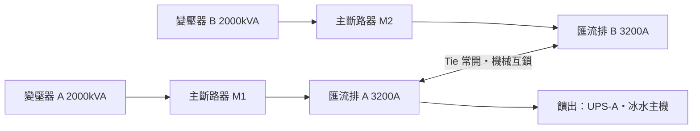

# 低壓主配電盤（LV switchgear / MDB）— 額定電流體系

電流從 [dc-02](transformer.md) 的變壓器二次側出來，第一個落腳處就是這面盤。它同時是三件事：**全站最大的一顆單點故障**、**幾乎所有電力遙測資料的產地**，以及**你的資料模型第一次會被「額定電流到底是哪一個額定電流」問倒的地方**——IEC 61439 在同一個迴路上定義了四種電流，數值全都不一樣。

> 本卡只談**容量與額定語意**；短路耐受（`Icw` / `Ipk`）、保護協調、ZSI 與 arc flash 見 [dc-07b](lv-short-circuit-and-coordination.md)。



## 六格

**拓撲位置**：上游是 [dc-02](transformer.md) 的變壓器二次側與 [dc-04](ats-transfer-switch.md) 的 ATS；下游是 `dc-08` UPS、冰水主機等機械負載。**它是電力鏈上第一個「一對多」的節點**——上游都是一條線，從這裡開始分岔。

**容量單位**：安培（A），不是 kW；而且不是一個數字是四個：`In` > `Inc` > `Ing`，加上盤體整體的 `InA`。詳見下節。

**冗餘表達**：N = 單端進線單匯流排。N+1 幾乎不存在（匯流排沒辦法半條）。實務上跳到 **main-tie-main（雙端）** 取得同時可維護性，或 **2N** 兩面完全獨立的盤。**Tie 是陷阱**：它讓兩條匯流排在電氣上可以合而為一，故障域也就跟著合併。

**遙測介面**：斷路器智慧跳脫單元（Micrologic / Power Xpert 等）走 Modbus TCP 上 EPMS。關鍵點位：`breaker_position`（open/closed/tripped，**與** connected/test/withdrawn 正交，見 [dc-03b](lsc-and-interlocks.md)）、`I_a/b/c/n`、`V_ll/ln`、`kW`、`PF`（**這面盤是全站計費與 PUE 分母的量測點**），以及匯流排接點的 IR 熱像——接點鬆動是慢性故障，且**直接侵蝕本卡談的所有額定值**。

**故障域**：單端配置下這面盤掉了 = 下游全掉，**發電機再 2N 也救不了**（電根本進不到負載）。Tie 閉合時兩條匯流排是同一個故障域。

**維護特性**：抽出式（draw-out）斷路器可在**不拆負載電纜**下抽出檢修，這是 UL 1558 switchgear 相對 UL 891 switchboard 最大的價值。熱像掃描、鎖固扭力複查、跳脫單元校驗多數需要**該迴路停電**——同時可維護性取決於下游是不是雙電源。

## 關鍵數字與計算

### 演算 1：380V 是台灣的成本詛咒

二次側滿載電流 `I = S / (√3 × V)`。同一顆 2000 kVA 變壓器：

| 系統電壓 | 計算 | 滿載電流 | 常見匯流排選型 |
|---|---|---|---|
| **380 V**（台灣三相四線 220/380V） | `2,000,000 / (1.732 × 380)` | **3,038 A** | 3200 A 或 4000 A |
| **480 V**（美規三相四線 277/480V） | `2,000,000 / (1.732 × 480)` | **2,406 A** | 2500 A |

**同樣的 kW，台灣要多流 26.3% 的電流。** 銅損正比於電流平方，所以台灣的低壓盤在同容量下更大、更貴、發熱更多，也更容易撞到匯流排級距天花板。**任何從美國白皮書抄來的「一面盤帶多少 kW」都不能直接用。** 依《電業供電電壓及頻率標準》，台灣低壓三相四線是 220/380V。

### 演算 2：IEC 61439 的四種電流——這才是這張卡的核心

BEAMA 指南（依 BS EN IEC 61439-2 Ed.3）給的層級是 `In ≥ Inc ≥ Ing`：

- **`In`**：元件在**自由空間**的額定（依 IEC 60947-2）。不是盤的額定。
- **`Inc`**：該迴路**是該區段中唯一帶載迴路**時的額定。裝進盤裡就已經比 `In` 小。
- **`Ing`**：該迴路**與同區段至少一個其他迴路同時連續帶載**時的額定。
- **`RDF = Ing / Inc`**，由**實測**推得，不是查表得來。**`InA`** 則是整面盤能分配的總電流。

驗證式：**`Σ(Inc × RDF) ≤ InA`**，以及對每個迴路 **`Ing = Inc × RDF ≥ Ib`**（`Ib` 是設計電流）。

情境：3200 A 盤，某區段 8 迴路各配 400 A MCCB，廠商宣告 `Inc = 355 A`、`RDF = 0.8`。

- `Ing = 355 × 0.8` = **284 A**
- `Σ(Inc × RDF) = 8 × 284` = **2,272 A ≤ 3,200 A** ✅ 盤體過關
- 但每台 UPS 實際連續拉 **300 A** → `Ib 300 > Ing 284` ❌ **迴路不過關**

**300 A 掛在 400 A 斷路器上，永遠不會跳。溫度限值卻已經違反了。** 這是低壓盤最陰險的失效模式：沒有告警，只有絕緣加速老化。合規只有兩條路——換 `RDF = 1.0` 的盤（`Ing = 355 ≥ 300` ✅），或要求該位置更高的 `Inc`。

### 演算 3：ALF 陷阱——資料中心是這張表的反例

若設計方**沒有指定 `Ib`**，IEC 61439-2 允許（不強制）廠商套用**假定負載係數 ALF**（BEAMA Table 1）：

| 負載型態 | ALF |
|---|---|
| 配電 2–3 迴路 | 0.9 |
| 配電 4–5 迴路 | 0.8 |
| **配電 6–9 迴路** | **0.7** |
| 配電 10 迴路以上 | 0.6 |

沿用演算 2：廠商假定每路 `400 × 0.7` = **280 A**，全區段 2,240 A，據此做溫升驗證。而真實 IT 負載是 8 × 300 = **2,400 A**，超出驗證前提 **7.1%**，且是 24×7 連續。

**這張表對資料中心幾乎全錯。** 它的前提是「不是所有迴路同時滿載」，而 IT 負載的定義就是同時且連續。所以規格書必須明寫 **RDF = 1.0** 或逐路給出 `Ib`——沉默接受 ALF 預設值等於默許一面被低估 30% 的盤。

**來源分歧（重要）**：BEAMA 明確指出 **RDF 與 ALF 是不同參數**——RDF 是實測的群組熱降額係數，ALF 只是缺乏負載資訊時推估 `Ib` 的假設值。但大量二手技術文章（含多個 switchgear 廠商部落格）把這張 0.9/0.8/0.7/0.6 直接稱作「RDF 表」。**採購規格書寫錯字會拿到不同的東西**，兩邊講法都要認得。

### 演算 4：兩套降額規則會疊加，綁死你的是比較小的那個

美規與台灣屋內線路裝置規則承襲 NEC 的**連續負載 80% 規則**（210.20(A)、215.3：OCPD ≥ 100% 非連續 + 125% 連續）。同一個 400 A 迴路：

| 限制來源 | 上限 | 依據 |
|---|---|---|
| 80% 額定 MCCB（UL 489） | `400 × 0.8` = **320 A** | 元件標準 |
| 100% 額定電力斷路器（UL 1066） | **400 A** | 元件標準 |
| IEC 61439 群組額定 `Ing` | **284 A** | 盤體熱驗證 |

**綁死的是 284 A，不是 320 A。** 換成 100% 額定的電力斷路器（switchgear 的作法）會把元件限制解開到 400 A，但盤體限制紋風不動。**「我換了 100% 額定斷路器所以可以拉滿」是錯的**——除非同時拿到 `RDF = 1.0` 的溫升驗證。

### 地區差異：台灣有兩套並行的盤體標準

- **標準體系分歧**：台灣 1995 年制定 **CNS 13542**「低電壓金屬閉鎖型配電箱」；2015 年為與國際接軌，依 IEC 61439-1 制定 **CNS 15783-1**。標檢局明確表示**兩套標準並行有其必要**，並指出國內具 CNS 13542 測試能力的實驗室有 **48 家**，具 IEC 61439-1 能力的僅 **9 家**。
- **實務後果**：本地製造的低壓盤**很可能從沒做過 IEC 61439 溫升驗證**，`InA` / `Inc` / `Ing` / `RDF` 這組宣告值**可能根本不存在**。你的模型準備好了欄位，現場給不出數字。
- **美規對照**：UL 1558（switchgear，電力斷路器、抽出式、有隔艙，最大 6000 A）vs UL 891（switchboard，模殼斷路器、多為固定式、密度高，最大 5000 A）。**短路耐受差異見 [dc-07b](lv-short-circuit-and-coordination.md)。**
- **環境溫度**：IEC 61439-1 基準 **35°C**，超過需再降額；台灣機電空間夏季常態超過這數字。

## 常見誤解

**以為斷路器沒跳就代表沒過載，但實際上盤體的熱限值比跳脫曲線嚴格得多。** 演算 2 的 300 A 掛在 400 A 斷路器上永遠不會跳，卻已經違反 `Ing = 284 A`。**斷路器保護的是電纜與下游設備，不是這面盤自己的溫升。** 沒有任何遙測點會告訴你——除非你把 `Ing` 存進資料庫並拿實測電流去比。

**以為 main-tie-main 就等於 2N，但實際上它是「同時可維護」，不是「容錯」。** Tie 的意義是讓其中一端可以停下來維護，代價是兩條匯流排具備被連通的能力。真正的 2N 是兩套獨立的盤、獨立房間或防火分隔、**不共用控制電源與自動化**。這跟 [dc-05](diesel-generator.md) 的 N+1 是同一個陷阱換外衣：**冗餘要看「移走一個之後」**。

**以為額定電流是設備的屬性，但實際上它是「設備 + 位置 + 鄰居 + 環境溫度」的函數。** 同一顆 400 A 斷路器裝在盤底通風處與盤頂靠變壓器處的 `Inc` 不一樣。**這是 [dc-02](transformer.md) 銘牌 vs 降額、[dc-05](diesel-generator.md) ESP vs COP、[dc-06](day-tank-and-bulk-fuel.md) 槽容 vs 可用量之後，同一模式第四次出現**，該抽成共用約定了。

## 對資料模型的意涵

1. **`Circuit` 需要四個電流欄位，不是一個。** `in_a`（元件）/ `inc_a`（迴路獨載）/ `ing_a`（群組）/ 以及所屬 `Section` 的 `rdf`，加 CHECK `in_a >= inc_a >= ing_a`。**任何叫 `rated_current` 的單一欄位都會在某次容量檢討時害到人**——它到底是哪一個？

2. **`Assembly` → `Section` → `Circuit` 三層不能扁平化。** RDF 與相互加熱是**區段層級**的性質；少了 `Section` 這層，`Σ(Inc × RDF) ≤ InA` 根本寫不出來，而它是這面盤唯一的容量真相。

3. **`max_continuous_current` 必須是推導值，並保留「誰綁死的」。** 三個來源取 min：元件額定（80% 或 100%）、群組額定 `Ing`、環境溫度降額。回傳該像 `(284.0, "assembly_ing")` 而非裸浮點數——「怎麼放寬」取決於誰綁死的。這是電力鏈第一次出現「上限有多個競爭來源」，`dc-11` PDU 與 `dc-14` rack PDU 會重複這個形狀。

4. **要有 `verified_to` 欄位並容忍 NULL。** 台灣兩套標準並行，代表驗證標準決定了 `inc_a` / `ing_a` / `rdf` **是否存在**。模型要能誠實表達「這面盤沒有這個數字」，而不是塞 0、塞 `in_a`、或塞一個型錄猜來的值。**未驗證的容量檢查必須回傳 UNKNOWN。**

## 該問 facility 的問題

1. 低壓盤的驗證標準是 CNS 13542 還是 CNS 15783-1（IEC 61439）？**如果是前者，`Inc` / `Ing` / `RDF` 從哪裡拿？** 請給溫升測試報告編號。
2. 規格書裡有沒有寫 RDF？寫多少？當初有沒有逐路提供 `Ib`，還是讓廠商套用假定負載係數？
3. 各饋出斷路器是 80% 還是 100% 額定？機電空間夏季實測溫度多少，有沒有做過 35°C 以上的降額？

## 動手練習（30–40 分鐘）

接續 [dc-06](day-tank-and-bulk-fuel.md) 的燃油鏈往下游走。**重點是「同一個物理量有四個合法數值」**，要擋住：**(a) 沒有單一 `rated_current`；(b) 上限是多來源取 min 且說得出誰綁的；(c) 未驗證不等於通過。**

```python
from dataclasses import dataclass, field
from enum import Enum

BreakerType = Enum("BreakerType", "MCCB ICCB LVPCB")   # 80% / 80% / 100%
Verified    = Enum("Verified", "CNS13542 CNS15783 UL891 UL1558 NONE")

@dataclass
class Circuit:
    id: str
    in_a: float                      # 元件自由空間額定
    inc_a: float | None              # 迴路獨載額定（無 61439 驗證時為 None）
    breaker: BreakerType
    ib_a: float                      # 設計電流（連續）
    # TODO __post_init__: inc_a 非 None 時需 in_a >= inc_a，否則 ValueError
    # TODO device_limit_a():  LVPCB -> in_a * 1.0；其餘 -> in_a * 0.8

@dataclass
class Section:
    id: str
    rdf: float | None                # 實測值；None = 未驗證
    circuits: list[Circuit] = field(default_factory=list)
    ambient_c: float = 35.0
    # TODO ing_a(c): c.inc_a * rdf（任一為 None -> None）
    # TODO ambient_derate(): <=35°C 為 1.0；每超過 5°C 乘 0.95（簡化）
    # TODO max_continuous(c) -> tuple[float, str]:
    #   {"device": device_limit_a() * ambient_derate(), "assembly_ing": ing_a(c)}
    #   None 的候選不放進來；回傳 min 值與它的來源鍵
    # TODO violations(): 所有 ib_a > max_continuous 的迴路

@dataclass
class Assembly:
    id: str
    ina_a: float
    verified_to: Verified
    sections: list[Section] = field(default_factory=list)
    # TODO verify_ina() -> tuple[bool | str, str]:
    #   Σ over sections of Σ(inc_a * rdf) <= ina_a
    #   任一區段 rdf is None -> ("UNKNOWN", 原因)，不准當成通過
```

**驗收標準**（3200 A 盤／8 路 400 A／`inc_a=355`／`ib_a=300`）

| 呼叫 | 期望 |
|---|---|
| `rdf=0.8` 的 `ing_a(c)` / `max_continuous(c)` | **284.0** / **(284.0, "assembly_ing")** ← 不是 320 |
| 同上但 `breaker=LVPCB` | **(284.0, "assembly_ing")** ← 換 100% 額定也沒放寬 |
| 改成 `rdf=1.0`（MCCB） | **(320.0, "device")** ← 綁死的來源換人了 |
| `rdf=1.0` + `LVPCB` | **(355.0, "device")**（400 vs Inc 355 取 min）|
| `violations()`：`rdf=0.8` / `rdf=1.0` | **[c]**（300 > 284）/ **[]** |
| `verify_ina()`：8×284=2272 vs 3200 | **(True, ...)** |
| `rdf=None` 的 `verify_ina()` | **("UNKNOWN", ...)** ← 不是 True |
| `ambient_c=45` + `rdf=1.0` + MCCB | **(288.8, "device")** ← 溫度反超成為瓶頸 |
| `Circuit(in_a=400, inc_a=450, ...)` | **raise ValueError** |

**加分題**：寫 `alf_shortfall()`，對演算 3 的 **7.1%** 對答案。真正的產出是一行採購規格文字：**「本盤所有饋出迴路須以 RDF = 1.0 驗證，或依附表逐路 `Ib` 進行溫升驗證」**——它是**唯一能在事前擋住問題的介入點**，事後任何遙測都看不見。

## 自我檢核

**Q1. 一個 400 A 斷路器上掛 300 A 的 24×7 連續負載，斷路器從來沒跳過。這樣合規嗎？**

??? note "答案"
    不一定，而且很可能不合規。至少要過三關：(a) **元件**——80% 額定 MCCB 上限 320 A，過關。(b) **群組額定 `Ing = Inc × RDF`**——若 `Inc = 355`、`RDF = 0.8`，上限只有 **284 A**，300 A 已經違反。(c) **環境溫度**——IEC 61439-1 基準 35°C，超過要再降額。**綁死的是最小的那個，而斷路器對這件事完全沉默**：它保護的是電纜與下游設備，不是盤體自己的溫升。這種過載沒有任何遙測點會叫，只會表現為絕緣加速老化。

**Q2. 規格書上寫「本盤 RDF = 0.7」跟「本案採用假定負載係數 0.7」有什麼差別？為什麼對資料中心特別致命？**

??? note "答案"
    BEAMA 明確指出兩者是**不同參數**。**RDF** 是實測的群組熱降額係數（`RDF = Ing / Inc`），描述**盤能承受什麼**；**ALF（假定負載係數）**是設計方沒給 `Ib` 時廠商用來推估負載的假設值，描述**負載大概長什麼樣**。ALF 表的前提是「不會所有迴路同時滿載」——而 IT 負載的定義就是同時且連續，所以這張表對資料中心是**結構性錯誤**。放任廠商套用 ALF = 0.7 而實際負載是 `In` 的 75%，等於拿到一面按照少 7% 熱量驗證過的盤，且沒有任何跳脫保護會提醒你。

**Q3. 這張卡會讓你的資料模型長出哪些欄位與約束？至少三個，其中一個要是「不能存成欄位」的。**

??? note "答案"
    （a）`Circuit` 四個電流欄位 `in_a` / `inc_a` / `ing_a` 與 `Section.rdf`，加 CHECK `in_a >= inc_a >= ing_a`——**不准有叫 `rated_current` 的單一欄位**；（b）`Assembly → Section → Circuit` 三層結構，因為 RDF 是區段層級性質，扁平化就寫不出 `Σ(Inc × RDF) ≤ InA`；（c）`verified_to` 允許 NULL，且**未驗證的容量檢查必須回傳 UNKNOWN 而非 True**。
    **不能存成欄位的是 `max_continuous_current`。** 它是元件額定、群組額定 `Ing`、環境溫度降額三者取 min 的推導值，且必須連同「綁死它的來源鍵」一起回傳——只知道 284 A 沒有用，要知道是 `assembly_ing` 綁的還是 `device` 綁的，才知道下一步該去談 RDF 還是該換斷路器。
