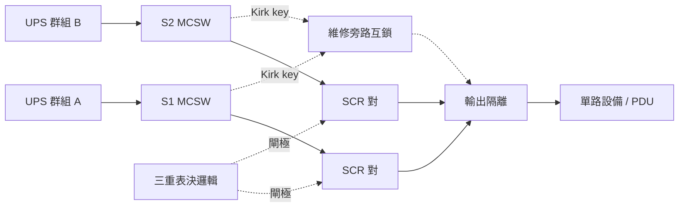

# 靜態切換開關（Static Transfer Switch, STS）

到 [UPS](ups-double-conversion.md) 為止，電力鏈都是「一路電，盡量不要斷」。這張卡換了問題：**A、B 兩條母線都活著，而有些設備只有一條電源線。** STS 用 SCR（閘流體）在兩個**同時通電**的來源之間切換，快到伺服器電源供應器來不及察覺。它跟 [ATS](ats-transfer-switch.md) 的差別不是速度而是前提：ATS 切「市電 vs 發電機」（一邊通常是死的），STS 切「兩條都活的匯流排」。UL 也分兩本標準——ATS 走 UL 1008，固態走 **UL 1008S**。



> **這張卡只講一台 STS 內部**：SCR、轉換速度、故障狀態機。「兩個源之間的關係」——相位同步、兩條路是否真獨立、雙母線容量怎麼算——拆成 `dc-10b`。

## 六格

### 拓撲位置

上游：**兩條都在通電的饋線**，分別來自 [UPS](ups-double-conversion.md) A、B 兩個獨立群組，且**同電壓、同相序、同頻率**（PDI 規格書第一句就寫死）。下游：單路設備，或變壓器型 PDU（`dc-11`）。外包一層 Kirk key 互鎖的維修旁路，讓整台 STS 可摘掉。

### 容量單位

連續電流（250–1600 A）× 電壓（208/400/480/600 V）→ kVA。**兩側各自都要 100% 額定**——「兩個源」不等於兩份容量。過載（PDI）：125% 30 min / 150% 2 min / 300% 30 s / 500% 10 s。短路耐受 22 kAIC 標配（65/100 選配），明訂不靠 SCR 熔絲達成。

### 冗餘表達

**STS 本身沒有 N / N+1 / 2N。** 它是「把 2N 母線的冗餘遞送給單路負載的轉接頭」，本體是不折不扣的單點。冗餘只發生在內部零件：三重表決邏輯 PCB、雙 gate driver、三重邏輯電源、備援操作介面。

### 遙測介面

Modbus RTU / TCP ／ SNMP v1 ／ web ／ 4 個可程式乾接點。

| 點位 | 意義 |
|---|---|
| `active_source`（S1 / S2） | 目前吃哪一邊。**全卡最重要的點位**，地位等同 dc-08 的 `upsOutputSource` |
| `preferred_source` + `retransfer_enabled` + `retransfer_delay`（4 s–10 min） | 設定值，決定會不會自己切回 |
| `S1/S2 SCR Open`、`S1/S2 SCR Shorted` | **latched**，修好並 reset 前不會消失 |
| `Transfer Inhibit`、`Sources out of Sync` | 轉換被禁止／兩源超出同步窗——**冗餘無效** |
| `Maintenance Mode`、`S1/S2 Bypass CB closed` | 維修旁路狀態 |
| 512 筆事件記錄 + 波形圖 | 轉換只有幾毫秒，沒波形就查不出原因 |

PDI 明訂**設定不可從 BMS / DCIM 遠端修改**——遙測唯讀固然好，也代表 `preferred_source` 這種欄位在你的資料庫裡**永遠是副本**。

### 故障域

STS 掉 → 它下面**全部**單路負載跟著掉；機櫃級 ATS 壞了只死一櫃，200 kVA 的 STS 壞了死一整區。這是 WP 62 反對用大型 STS 的核心論點。SCR 故障處置見動手練習——重點是都 latched，畫面上仍有「兩個源」，實際只剩一個。

### 維護特性

維修旁路要人在現場操作 Kirk key 與 MCSW，期間電子元件全部隔離、**沒有自動轉換**。年度紅外線熱像、SCR 與散熱片檢查、風扇更換。SCR 短路難測——好壞的壓降差通常小於 0.5 V（WP 62）。

## 關鍵數字與計算

### 演算 1：「4 毫秒」不是常數，而餘裕比想像中薄

1/4 cycle 幾毫秒取決於頻率；而廠商往往提供**兩種演算法**，第二種是刻意慢的。

| | 1 cycle | 1/4（快速 POG） | 3/4（抗湧流 VSS 最壞） |
|---|---|---|---|
| **60 Hz（台灣、美規）** | 16.67 ms | **4.17 ms** | **12.50 ms** |
| 50 Hz（歐洲、中國） | 20.00 ms | 5.00 ms | 15.00 ms |

兩條容忍度：ITIC 說 IT 設備在 0 V 下可撐 **20 ms**；WP 62 實測一顆**重載** SMPS 撐了 **18 ms**。取嚴格的 18 ms 算餘裕：

```
60 Hz + POG ：18 − 4.17  = 13.83 ms
60 Hz + VSS ：18 − 12.50 =  5.50 ms
50 Hz + VSS ：18 − 15.00 =  3.00 ms   ← 只剩原本的 21.7%
```

**為什麼有人刻意選慢的**：下游若是變壓器型 PDU，快速轉換會讓磁通不連續而產生湧流；VSS 演算法多花半個週期對齊 volt-second，把湧流壓在額定 2 倍內。所以轉換時間是**設定值不是規格值**，取決於下游有沒有變壓器——一個不在這台設備身上的事實。

### 演算 2：下游短路時，「有兩個源」剛好不能用

PDI 的**高負載電流抑制**出廠設在約 **3 倍**額定。一台 600 A / 480 V STS：容量 `S = √3 × 480 × 600 = 498.8 kVA`，抑制門檻 `≈ 3 × 600 = 1800 A`。

下游一顆 100 A 分路 bolted fault，可用故障電流用 [dc-07b](lv-short-circuit-and-coordination.md) 那筆 50.6 kA 概算——遠遠越過 1800 A，**抑制立刻啟動**。而短路本身會把電壓拉塌，於是此刻的畫面是：來源電壓異常、STS 看得到、但依設計不准動。它只能等上游斷路器清除：**有選擇性協調約 0.3 s，啟用 ERMS 約 0.05 s**——兩個都遠超 ITIC 的 20 ms。

**下游故障期間 STS 下游全部會掉，「兩個源」一點忙都幫不上。** 這跟 dc-08 演算 5（UPS 供不出跳脫電流、只能轉旁路借市電）同形：**故障電流從來不由這台設備提供**。但抑制邏輯本身是對的——不抑制的話，STS 會把下游短路接到另一條健康母線，一次故障拖垮兩條路。**它用「這段時間不保護」換「不要把災難傳染出去」。**

## 常見誤解

**以為裝了 STS 就讓單路設備得到 2N，但實際上你是把兩條路的冗餘換成一台設備的可靠度。** WP 62 講得比廠商狠：在架構本來就穩的機房裡「加 STS 帶來的可靠度下降大過它提供的好處」。它給的 MTBF 是 STS 400,000–1,000,000 小時、機櫃 ATS 700,000–1,500,000 小時——**慢的那個反而比較不會壞**。

**以為 4 ms 遠低於 20 ms 所以永遠安全，但實際上餘裕會從 13.8 ms 掉到 3.0 ms。** 抗湧流演算法（下游有變壓器時必須開）拉長到 3/4 cycle，50 Hz 場再多 2.5 ms，而 18 ms 是實測值不是保證值。**這三個變數沒有一個住在 STS 身上。**

**以為 STS 下游短路時它會像斷路器一樣切掉故障，但實際上它會凍結、什麼都不做。** 抑制在約 3 倍額定就介入，之後 STS 對電壓異常視而不見，把自己當成導線等上游斷路器動作。**你的選擇性協調清除時間，直接決定 STS 下游會不會全滅。**

## 來源分歧

**同一台設備的 MTBF，兩邊差 2–5 倍：**

- **Schneider WP 62（Rev 1，約 2010）**：400,000–1,000,000 小時，註明「基於業界估計」；同文結論是 10 kVA 以下單路設備的最佳解是**機櫃型 ATS 而非 STS**。
- **PDI / Eaton WaveStar 規格書（2017）**：「MTBF 超過 **2,000,000 小時**」，靠三重表決邏輯與全面冗餘達成。

**兩邊很可能在算不同的東西**：WP 62 算的可能是整台，PDI 明寫算的是「關鍵交流輸出匯流排」，中間又隔七年。**但選型結論的分歧是真的**：一邊說別裝，一邊賣給你。可驗證的問法不是「STS 可不可靠」，而是「**你報的 MTBF 邊界畫在哪裡？含不含輸出斷路器？含不含旁路操作的人為誤動作？**」——WP 62 把人為誤操作列為主要失效模式之一，而它不會出現在任何規格書的 MTBF 裡。

## 對資料模型的意涵

1. **`active_source` 是邊的狀態，不是節點的欄位。** 一台 STS 有兩條上游邊，恰好一條導通，`upstream_id: str` 在這裡直接破功——本軌跡**第四次**要求邊要有身分（`dc-03b`、`dc-05c`、`dc-07b`）。`PowerEdge(id, src, dst, role, energized)` 不能再拖，`dc-10b` 會直接用它。
2. **「有兩個源」是宣稱，`redundancy_effective` 才是事實。** 只要 `transfer_inhibit` 為真、任一 SCR 故障 latched、或維修旁路關閉中，冗餘就是零。`source_count = 2` 必須被禁止進入任何告警規則。
3. **告警要多 `latched` 與 `reset_required` 兩個欄位。** SCR 開路／短路修好前不會自己消失，也**不該被 ack 掉**。W33 建議的 `Alarm(severity, code, message, entity_ids, raised_at)` 裝不下——它預設告警都隨條件消失。
4. **轉換時間不是這台設備的屬性**，是 `algorithm × line_hz × downstream_has_transformer × load_pct` 的函數（演算 1）。存成 `transfer_time_ms = 4` 的系統，在有人為了下游 PDU 切成抗湧流那天起就開始說謊。
5. **維修旁路是「人為降級」家族第四次現身**（`dc-03b` 互鎖、`dc-07b` ERMS、`dc-08` bypass）。共用實體要有 `engaged_at` / `engaged_by` / `work_order_id` / `expected_restore_at`。

## 該問 facility 的問題

1. **轉換演算法設哪一種？下游有沒有變壓器型 PDU？高負載電流抑制門檻多少、調過嗎？** 前兩題決定演算 1 的餘裕，第三題決定演算 2 的凍結範圍。
2. **`Retransfer` 設 Yes 還是 No、延遲幾秒？SCR 的 latched 告警現場怎麼 reset、誰有權限、有留記錄嗎？** 前者決定 `dc-10b` 該用哪個情境當常態，後者決定你能否信任「告警消失 = 問題解決」。

## 動手練習（30–40 分鐘）

接續 [dc-08](ups-double-conversion.md) 的 `Ups` 往下游走。今天做**一台 STS 的狀態機**，把 PDI 那組 SCR 故障處置規則寫成可驗收的行為，並讓告警第一次有 `latched` 語意。

```python
from dataclasses import dataclass, field
from enum import Enum

Src  = Enum("Src",  "S1 S2")
Mode = Enum("Mode", "NORMAL BYPASS_1 BYPASS_2 MAINTENANCE")
Scr  = Enum("Scr",  "OK OPEN SHORTED")
Sev  = Enum("Sev",  "INFO WARNING CRITICAL")

@dataclass
class Alarm:
    code: str; severity: Sev; message: str; entity_ids: list[str]
    latched: bool = False          # ← 今天新增
    acked:   bool = False
    # TODO ack():     latched 者不改變 active()
    # TODO active():  latched -> 永遠 True，直到 reset()

@dataclass
class Sts:
    id: str
    rating_a: float
    active: Src = Src.S1
    mode:   Mode = Mode.NORMAL
    load_a: float = 0.0
    transfer_inhibit: bool = False
    scr:          dict[Src, Scr]  = field(default_factory=lambda: {s: Scr.OK for s in Src})
    breaker_open: dict[Src, bool] = field(default_factory=lambda: {s: False  for s in Src})

    # TODO update_inhibit():       load_a > 3 * rating_a -> transfer_inhibit
    # TODO redundancy_effective(): False 若 transfer_inhibit / mode != NORMAL
    #                              / 任一 scr != OK / 任一 breaker_open
    # TODO on_scr_fault(side, state)  ← PDI 三條規則，全部 latched CRITICAL
    #   1. 導通側 SHORTED    -> 跳開「對側」進線開關（active 不動）
    #   2. 非導通側 SHORTED  -> active 轉到「該短路側」+ 跳開「未短路側」
    #   3. 任一側 OPEN       -> 若是導通側則轉到另一側
    # TODO reset():  僅在所有 scr 回 OK 時允許；清 latched 並復歸 breaker_open
    # TODO alarms() -> list[Alarm]
```

**驗收**（`Sts("sts1", rating_a=600, load_a=270, active=S1)`）

| 情境 | 期望 |
|---|---|
| 初始 `redundancy_effective()` | **True** |
| `load_a = 1900` / `1800` 後 `update_inhibit()` | **False** ／ **True**（`> 3×` 不含等於，邊界不觸發） |
| `mode = BYPASS_1` | **False**，且 `alarms()` 含一條 `INFO`「維修旁路，無自動轉換」 |
| 規則 1 `on_scr_fault(S1, SHORTED)` | `active` 仍 **S1**；`breaker_open[S2]` |
| 規則 2 `on_scr_fault(S2, SHORTED)` | `active` → **S2**；`breaker_open[S1]` |
| 規則 3 `on_scr_fault(S1, OPEN)` | `active` → **S2** |
| 上一格之後 `alarms()[0].ack()` → `.active()` | 仍為 **True**（latched 不可被 ack 消掉） |
| 未修好就 `reset()` ／ 修好後 `reset()` | **raise** ／ 成功且 `breaker_open` 全 False |

**重點在第七行**：latched 告警 ack 之後仍然 active。前九張卡都預設「條件消失＝告警消失」，SCR 故障是第一個不成立的——**它會在畫面上被按掉，但設備仍只剩一個源。**

**加分題**：實作 `effective_transfer_ms(algorithm, line_hz)` 與 `ride_through_margin_ms(smps_ms=18.0)`，驗證 `("VSS", 50) → 15.0 / 3.0`。輸入沒有一個是 `Sts` 的欄位，所以它們**不該是 `Sts` 的 method**。

## 自我檢核

**Q1. 一台 STS 的兩條輸入來自 A、B 兩條 UPS 母線，儀表板顯示「Source 1 正常、Source 2 正常、負載 45%、在 Source 1」。這台 STS 現在真的有冗餘嗎？**

??? note "答案"
    **看不出來。** 至少四件事會讓冗餘歸零，卻不改變上面任何數值：

    1. **`Transfer Inhibit` 生效中**——下游有大電流（≈3 倍額定）時邏輯禁止轉換，Source 2 再健康也切不過去。
    2. **`SCR Shorted` latched 未 reset**——系統已跳開其中一側進線開關，實際只剩一個源，但「兩個源都正常」仍為真。
    3. **維修旁路關閉中**——電子元件被隔離，沒有自動轉換。
    4. **兩條輸入在上游合流**——追到底是同一台 UPS 或同一面盤。這項連遙測都不會變，是設計缺陷不是狀態（留給 `dc-10b`）。

    所以模型不能有 `source_count = 2` 餵給告警規則，只能有 `redundancy_effective()` 這個把前三項納入的衍生值，加一份靠拓撲比對產出的稽核報表處理第四項。

**Q2. 廠商說「轉換 4 ms，遠低於 IT 設備 20 ms 容忍度」。這句話什麼情況下會變得很緊？把數字算出來。**

??? note "答案"
    **三個變數一起往壞的方向走時，餘裕從 13.83 ms 掉到 3.00 ms**（演算 1；基準用 WP 62 實測重載 SMPS 的 18 ms，比 ITIC 的 20 ms 誠實）。

    三個變數：**（a）演算法設定**——下游有變壓器型 PDU 時必須開抗湧流（1/4 → 3/4 cycle）；**（b）市電頻率**——台灣 60 Hz，歐洲／中國 50 Hz，型錄那個「4 ms」通常是 60 Hz 的數字；**（c）下游負載率**——18 ms 是重載實測，輕載長很多，但不能拿輕載數字做設計。

    **這三個變數沒有一個住在 STS 身上。** 所以「轉換夠不夠快」是一條跨設備規則（STS 設定 × 下游 PDU 型式 × 電網頻率 × 負載率），跟 W33 那條「電池 runtime > 發電機起動時間」一樣，掛在任何單一設備上都寫不出來。

**Q3.（建模）SCR 短路是 latched 告警——修好並 reset 前不會消失。這會讓你的告警模型長出什麼欄位、什麼約束、什麼查詢？跟前九張卡的告警有什麼結構差別？**

??? note "答案"
    **欄位**：`Alarm` 加 `latched`、`acked`、`reset_at` / `reset_by`——reset 是一個**有人負責的動作**，不是條件變化。`active()` 不能只看條件，latched 者一律回 `True` 直到 reset。

    **約束**：`ack()` 對 latched 告警**不得改變 `active()`**。這是整題的核心——前九張卡的告警都是「條件為真就叫、消失就停」，可以安全 ack。SCR 故障不行：ack 之後設備仍只剩一個源，**進線開關還是跳開的**。允許 ack 消掉它，等於允許一個人用一次點擊把「這台 STS 沒有冗餘」變成看不見。

    **查詢**：`redundancy_effective()` 必須把 latched 告警當輸入——**告警反過來成為狀態計算的來源**，第一次不只是輸出。

    **結構差別**：前九張卡的告警是**狀態的函數**（`f(現在的量測)`），SCR latched 告警是**歷史的函數**（`f(曾經壞過, 有沒有人來修)`）。它是 `dc-05c` / `dc-06` / `dc-07b` 那家族的另一半：

    ```
    測試型  ：last_verified_at 過期  → 「你不知道它還行不行」
    可算型  ：Isc(config) > Icw      → 「這個配置本身違規」
    latched ：曾經壞過且沒人來修      → 「它現在確實是壞的」   ← 新增
    ```

    三者都**不能只看即時遙測算出來**。`Alarm` 得先補上 `latched`，`dc-10b` 才有辦法在上面疊拓撲層的稽核告警。
