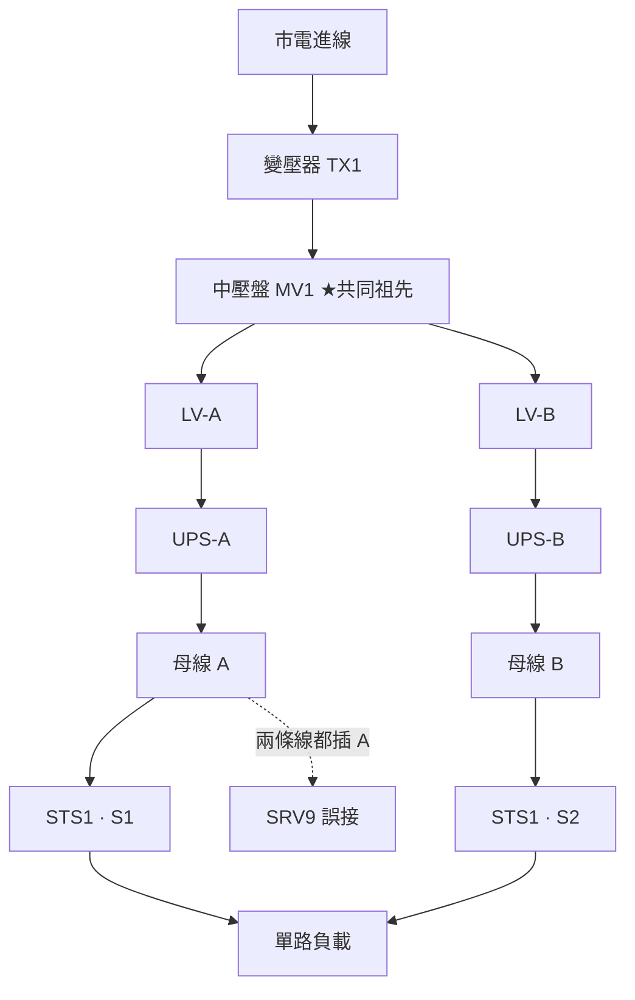

# STS 的兩源關係（dual-source relationship）

[dc-10](static-transfer-switch.md) 講的是**一台 STS 內部**：SCR、轉換速度、latched 故障。這張卡把鏡頭拉遠，問三個**不住在那台設備身上**的問題：兩個源在電氣上對不對得起來（相位）、在拓撲上是不是真的兩條路（共祖）、兩條母線各要留多少容量（會計）。三個問題的共同點是——**它們的答案都不在任何一台設備的欄位裡**，而這正是資料模型該負責的地方。

> **先澄清一句**（W34 週報點名）：dc-10 自我檢核 Q3 寫「告警反過來成為狀態計算的來源」，照字面實作會做出循環依賴。正確的做法是把 latched 狀態放在**事實欄位**上（`scr` / `breaker_open`），告警與 `redundancy_effective()` 都是它的**下游**。本卡沿用這個方向。



## 六格（這一格的主體是「一對源」，不是一台機器）

### 拓撲位置

不是「上游接誰」，而是**兩條上游路徑往上走，在哪裡合流**。圖中 STS1 名目上有兩個源，實際上兩條路在 `MV1` 就合而為一——`MV1` 掉了，兩個源同時死。**最近共同祖先（lowest common ancestor）以下的冗餘才是真的。**

### 容量單位

每條母線都要能吃下**它可能單獨承擔的最大負載**，不是它平常的負載。Uptime 的 Fault-Tolerant Power Compliance Spec 要求雙路設備兩邊分擔「在平均值 ±10% 內」——所以正常狀態下每條約 50%，**故障狀態下瞬間變 100%**。詳見演算 2：這個最大值要靠**枚舉配置取 max** 算出來，不能用「現在讀值 ×2」。

### 冗餘表達

`source_count = 2` 是宣稱。真正的 2N 要同時滿足三件事：**（a）** LCA 在你關心的邊界之外；**（b）** 每條母線的 peak 容量夠；**（c）** 該轉換的時候轉得過去（同步窗、抑制、latched 故障）。三者任一不成立，帳面上的 2N 就是 N。

### 遙測介面

跟 dc-10 不同：這一格的點位是**成對的**。

| 點位 | 意義 |
|---|---|
| `Synchronization phase angle`（Vertiv 列為常規計量值） | 兩源即時相位差。**這是全卡唯一能直接觀測到「兩源關係」的數字** |
| `Sources Out of Sync` | 超出同步窗 → 手動轉換被拒 |
| `Source 1/2 Over/Under Frequency`、`Phase Rotation Error` | 相序錯誤是**接線缺陷**，不是狀態 |
| 兩側 `Input AC current` 各相 | 用來驗證 ±10% 分擔規則；偏差大 = 有東西單邊掛著 |
| 拓撲獨立性 | **沒有點位。** 只能靠你的資料庫比對單線圖算出來 |

最後一列是重點：**四件會讓冗餘歸零的事情裡，第四件（兩源共祖）連遙測都不會變。**

### 故障域

兩個源的故障域是 **LCA 以上的所有節點**。加一台 STS 的可靠度效益是共祖的函數，不是 STS 的函數：兩條路若共用一個高失效率的祖先，改善會從一個數量級塌到接近 1。

### 維護特性

concurrent maintainability 的判準是：**把任一條路整條停掉，負載還活著嗎。** 停 A 的時候，所有 `preferred_source = S1` 的 STS 會轉去 B，於是 B 的瞬時負載跳到演算 2 的 `peak_load(B)`——**維護窗口是最容易撞到容量上限的時刻，而它是可預期的。**

## 關鍵數字與計算

### 演算 1：頻率差決定同步窗多久開一次，而 Δf = 0 反而可能永遠不開

相位差以 **360° × Δf 每秒**的速率滑動。Vertiv STS2 的使用者可調同步窗**上限 ±30°**（窗寬 60°），窗外禁止手動轉換。

```
滑動率 = 360 × Δf  (度/秒)
窗內時間 = 60 / (360 × Δf)      窗重現週期 = 1 / Δf
```

| Δf | 滑動率 | 每次窗內時間 | 多久開一次 |
|---|---|---|---|
| 0.5 Hz | 180 °/s | **0.33 s** | 2.0 s |
| 0.1 Hz | 36 °/s | **1.67 s** | 10.0 s |
| 0.02 Hz | 7.2 °/s | 8.33 s | 50.0 s |
| **0 Hz（兩源同接市電）** | 0 | **0 或 ∞** | **永不改變** |

最後一列是陷阱。Δf = 0 表示相位差**凍結在某個值**——落在窗內就永遠可切，落在窗外就**永遠切不了**，而且不會有任何東西隨時間變好。

**什麼會造成一個凍結的偏移？[變壓器的向量組](transformer.md)。** Dyn11 與 Dyn1 的時鐘數差 2，即 `2 × 30° = 60°` 的固定相位差。兩條饋線各走一台向量組不同的變壓器 → 相位差恆為 60°：

- **手動轉換**：60° > 30° 窗上限 → **永遠被拒**
- **緊急轉換**：Vertiv 只保證「可容忍最高 30° 失相轉換」→ 60° **超出保證範圍**

這是一個**設計期缺陷**：驗收當天不會發現（兩個源都亮綠燈），要到第一次真的需要轉換那天才發現。**而它的成因是一台不在這張卡裡的設備的一個欄位。**

### 演算 2：把「一個週期」直接減掉會得到嚇人的負數，而那個減法是錯的

若買了 Optimized Transfer（可在 ±180° 任意相位轉換），代價是轉換時間拉到「typically less than one line cycle」。拿 dc-10 那個 18 ms 重載 SMPS 實測值硬減：

```
60 Hz：18 − 16.67 =  1.33 ms
50 Hz：18 − 20.00 = −2.00 ms   ← 負的
```

**但這個減法不成立。** Vertiv 明寫 optimized transfer 期間會 pulse-fire 對側 SCR，**負載電壓全程維持在 ITIC 曲線內**——那一個週期不是「一個週期的 0 V」。

**這個坑的價值不在數字，在於它證明了 `transfer_time_ms` 這個欄位是有歧義的**：它到底是「從離開舊源到接上新源」還是「負載看到的斷電時間」？兩者在快速 BBM 轉換下幾乎相等（所以前十張卡沒事），在 optimized transfer 下差了一個數量級。**存成一個 float 的系統，會在有人為了下游變壓器打開這個選項那天開始說謊——而且是往安全的方向說謊。**

### 演算 3：雙母線容量會計 —— 枚舉配置取 max，兩種直覺捷徑都是錯的

某機房 A/B 雙母線，五組負載（380/220 V 3φ、PF 0.99）：

| 負載 | 型式 | kW | 接法 |
|---|---|---|---|
| L1 | 雙路 | 100 | A + B 各半 |
| L2 | 雙路 | 120 | A + B 各半 |
| L3 | 單路經 STS | 80 | preferred = A |
| L4 | 單路直接 | 60 | 只有 A |
| L5 | 單路直接 | 40 | 只有 B |

**正常狀態**：`A = 50 + 60 + 80 + 60 = 250 kW`，`B = 50 + 60 + 0 + 40 = 150 kW`。

枚舉：

| 配置 | A 承擔 | B 承擔 |
|---|---|---|
| 正常 | 250 | 150 |
| **B 全失**（L5 陣亡，STS 留 A） | **360** | 0 |
| **A 全失**（L4 陣亡，STS 轉 B） | 0 | **340** |
| STS 轉去 B（retransfer 關） | 170 | 230 |

```
peak_load(A) = 360 kW      peak_load(B) = 340 kW
```

**兩種直覺捷徑同時被打臉**：

- 「現在讀值 ×2」→ A 得 500（**高估 140**）、B 得 300（**低估 40**）。**低估的那一側是會燒東西的那一側。**
- 「兩條母線加起來」→ 400，A、B 都不等於它。單路負載在一邊死掉、不會搬家，所以總和沒有物理意義。

接上 [80% 連續負載規則](lv-short-circuit-and-coordination.md)（`topic-02`）：A 側饋線若標稱 400 kW，連續可用只有 `400 × 0.8 = 320 kW` < 360 → **不合格**。換算電流：

```
I = 360000 / (√3 × 380 × 0.99) = 360000 / 651.6 = 552.5 A
需求框架 = 552.5 / 0.8 = 690.7 A  →  取 800 A
```

**注意誰決定了這個 800 A**：L4、L5 那兩顆「沒人承認的單路設備」。Uptime 的實測是**機房裡 1–10% 的伺服器兩條線插在同一側**——它們不會出現在任何設計圖上，只會出現在 peak 計算的差額裡。

## 常見誤解

**以為兩條輸入分別來自 A、B 母線就是兩條獨立的路，但實際上獨立性是「最近共同祖先」的函數。** A/B 這兩個字只是標籤。要證明獨立，得從兩個輸入各自往上追到你關心的邊界（站點？區域？電網？），確認路徑不相交。開篇那張圖裡兩條路在 `MV1` 合流——**這件事在任何一台設備的遙測裡都看不到**，而且 Uptime 說機房裡 1–10% 的伺服器根本是兩條線插同一側，連機櫃層都不成立。

**以為 Δf = 0 代表兩個源同步，但實際上它代表相位差被凍結——可能凍在窗外。** 兩條饋線同接市電時頻率必然相同，於是相位差永遠不變。若上游兩台變壓器向量組不同（Dyn11 vs Dyn1 = 固定 60°），同步窗**永遠不會打開**，手動轉換永久被拒，而緊急轉換超出廠商保證的 30°。**「同步」是關係的屬性，「頻率」是各自的屬性，兩者不能互推。**

**以為雙路設備需要兩個源同步才安全，但實際上真正雙路的設備完全不在乎。** Uptime 的 Fault-Tolerant Power Compliance Spec 白紙黑字：兩個 AC 源**可以**不同步、電壓/頻率/相序/相位角各不相同，只要各自在規格內即可。更狠的是同一份規格明列——**設備內外的主動切換裝置（機械式或電子式轉換開關）不被接受**為容錯手段。**同步是 STS 的需求，不是負載的需求。** 你為了少數單路設備引進一台 STS，等於把「兩條路必須同相」這條約束強加到整個 A/B 系統的設計上（向量組、饋線長度、未來擴充），代價由所有負載共同承擔。

## 來源分歧

**分歧一：BBM 還是 MBB —— 本卡取得的新證據讓它收斂了一半。**

- **Socomec**（W34 預先取材）：預設且建議 **BBM**；MBB「技術上可行但很少用，重疊兩個獨立源會產生不受控的環流」。
- **Vertiv STS2 規格書（2023）**：措辭沒有模糊空間——「All transfers shall be **a fast break-before-make with no overlap** in conduction」、「The switching action **shall not connect together the two sources** of power that would allow backfeeding」。

**兩份獨立來源在「獨立兩源之間的 STS」上一致：BBM。** 那些講 MBB 重疊導通的資料，講的很可能是 **UPS 內部**的靜態開關（逆變器↔旁路，同一台 UPS 主動同步）——同樣叫「靜態開關」，同步前提完全不同。**仍未收斂的是**：Vertiv 的 Optimized Transfer 會 pulse-fire 對側 SCR 以維持電壓，這在功能上介於 BBM 與 MBB 之間，而規格書仍稱它是 BBM。**要問廠商的是「pulse firing 期間兩側 SCR 是否同時導通」**，而不是「你們是 BBM 還是 MBB」。

**分歧二：MTBF 現在有四個版本，而且邊界定義相同的兩家仍差兩倍。**

| 來源 | MTBF | 邊界 |
|---|---|---|
| Schneider WP 62（約 2010） | 40 萬–100 萬 h | 未明確，註「業界估計」 |
| **Vertiv STS2（2023）** | **> 100 萬 h** | **明寫「critical AC output bus 的失效間隔」** |
| PDI / Eaton WaveStar（2017） | > 200 萬 h | 明寫「關鍵交流輸出匯流排」 |
| Socomec | 150 FIT ≈ 667 萬 h | λ 模型 |

**Vertiv 與 PDI 的邊界敘述幾乎逐字相同，數字仍差 2 倍。** 所以「邊界不一致」只解釋得了一部分——**剩下的差異來自各自的計算方法，而沒有一家公開它。** 該問的仍是那句：含不含輸出斷路器？含不含旁路操作的人為誤動作？（WP 62 把人為誤操作列為主要失效模式，它不會出現在任何規格書的 MTBF 裡。）

## 對資料模型的意涵

1. **`PowerEdge` 必須有身分，`DeviceRegistry` 必須存在——欠了四週，今天清掉。** 本卡三個問題全部需要**全圖查詢**：`ancestors(id)`、`lowest_common_ancestor(a, b)`、`is_independent(a, b)`。這些不是任何實體的 method，只能掛在 registry 上。`upstream_id: str` 這種欄位到此正式退休。
2. **「同步」的三個數字量的是三件事，不能塞同一欄。** `sync_window_deg`（**設定值**，Vertiv 上限 ±30）／`emergency_tolerance_deg`（**設備能力**，Vertiv 保證 30，買 Optimized 後 180）／`mbb_safe_deg`（**物理條件**，約 5°，本設備用不到但 UPS 內部靜態開關用得到）。三者混用會做出「窗口設 180 度」這種看似合法的設定。
3. **`peak_load_kw(bus)` 是枚舉配置取 max 的衍生值，不是欄位。** 輸入包含每個負載的 `cording`（dual / single-A / single-B / via-STS）與每台 STS 的 `preferred_source`。約束：`peak_load_kw(bus) ≤ 0.8 × feed_rating_kw`。**這條約束會在「有人新增一台單路設備」時自動變成違規**——而那正是現實中唯一會發生的事件。
4. **`transfer_time_ms` 要拆成 `switch_time_ms` 與 `load_dead_time_ms`。** 演算 2 證明兩者在 optimized transfer 下差一個數量級，且合成起來的誤差**永遠往安全方向**（看起來比實際更快）。跟 W34 連貫性檢視 #2 的 `basis` 欄位同一個病：**分不清基準的欄位，錯的方向永遠是把標準放鬆。**
5. **兩棵樹的橫向邊今天定案**（W34 #5，最後一次機會）：`PowerEdge.role` 增加 `"safety_system"`，`FireCompartment.safety_system_feeds: list[str]` 指向 `PowerEdge.id`。理由：「本區劃的排風機必須掛發電機盤」既不是 `upstream` 也不是 `fire_compartment`，是空間樹節點依賴電力樹節點。留了位置，`dc-22`（CRAH 接不接 UPS）與 `dc-20` 就不用改骨架。

## 該問 facility 的問題

1. **拿單線圖，把 A 路與 B 路各自往上追，標出最近的共同節點在哪一層。** 是同一面中壓盤？同一台變壓器？同一條進線？這一題的答案直接決定你的 2N 是幾個 9。
2. **兩條源的變壓器向量組相同嗎？STS 的同步窗設幾度？有沒有買 Optimized Transfer？** 三題合起來決定「需要時切不切得過去」——而現況只會顯示綠燈。
3. **A/B 母線的 peak（N-1）負載會計是誰做的、多久重算一次？現在有多少單路設備、有清單嗎？** 沒有清單的話，演算 3 的 L4 / L5 就是你不知道的那 1–10%。

## 動手練習（30–40 分鐘）

**這就是欠了四週的 `DeviceRegistry`。** 前十張卡的 model 全是單一實體，今天第一次做**全圖查詢**。

```python
from dataclasses import dataclass, field
from enum import Enum

Cording = Enum("Cording", "DUAL SINGLE_A SINGLE_B VIA_STS")
Sev     = Enum("Sev", "INFO WARNING CRITICAL")

@dataclass(frozen=True)
class PowerEdge:                      # ← 邊終於有身分（第五次要求，今天兌現）
    id: str
    src_id: str                       # 上游 device id
    dst_id: str                       # 下游 device id
    role: str = "feed"                # feed | bypass | tie | safety_system  ← W34 #5
    energized: bool = True

@dataclass(frozen=True)
class Finding:                        # ← 三張卡引用、零次定義，今天補上
    policy_id: str
    severity: Sev
    message: str
    entity_ids: list[str]
    # 注意：Finding 不得有 acked（那是 Alarm 的事），Alarm 用 origin_finding_id 指回來

@dataclass
class Load:
    id: str; kw: float; cording: Cording
    sts_id: str | None = None         # cording == VIA_STS 時必填

@dataclass
class DeviceRegistry:
    edges: dict[str, PowerEdge] = field(default_factory=dict)
    loads: dict[str, Load]      = field(default_factory=dict)
    sts_preferred: dict[str, str] = field(default_factory=dict)   # sts_id -> "A" | "B"
    feed_rating_kw: dict[str, float] = field(default_factory=dict)

    # TODO upstream_edges(device_id) -> list[PowerEdge]
    # TODO ancestors(device_id) -> set[str]      （含自己；注意環路要偵測，別無限遞迴）
    # TODO lowest_common_ancestor(a, b) -> str | None
    #      定義：兩者 ancestors 交集中，「深度最大」者。無交集回 None（= 真獨立）
    # TODO is_independent(a, b, boundary: str) -> bool
    #      LCA 為 None，或 LCA 在 boundary 之上（不含 boundary 以下）→ True
    # TODO peak_load_kw(bus: str) -> float
    #      枚舉四種配置取 max（正常 / A 全失 / B 全失 / STS 反向）
    # TODO audit() -> list[Finding]
    #      規則 1：任一 STS 的兩個輸入 is_independent 為 False → CRITICAL
    #      規則 2：任一雙路負載兩條線的 LCA 低於母線層（誤接）→ CRITICAL
    #      規則 3：peak_load_kw(bus) > 0.8 * feed_rating_kw[bus] → WARNING
```

**建這張圖**（照本卡開頭的 mermaid）：`UTIL → TX1 → MV1 → {LV-A, LV-B}`、`LV-A → UPS-A → BUS-A`、`LV-B → UPS-B → BUS-B`、`BUS-A → STS1`、`BUS-B → STS1`；負載用演算 3 的 L1–L5；外加 `SRV9` 兩條線都接 `BUS-A`。

**驗收**

| 情境 | 期望 |
|---|---|
| `lowest_common_ancestor("BUS-A", "BUS-B")` | **`"MV1"`** |
| `is_independent("BUS-A", "BUS-B", boundary="MV1")` | **False** |
| 把 `LV-B` 改接到新增的 `TX2 → MV2`，再問一次 | LCA → **`"UTIL"`**；`is_independent(..., boundary="MV1")` → **True** |
| `peak_load_kw("BUS-A")` ／ `peak_load_kw("BUS-B")` | **360.0** ／ **340.0** |
| 誤用「現在讀值 ×2」 | 500 ／ 300 ← **跑出這兩個數就是踩到演算 3** |
| `feed_rating_kw["BUS-A"] = 400`，`audit()` | 含規則 3 的 WARNING（360 > 320） |
| `audit()` 對 `SRV9` | 含規則 2 的 CRITICAL（兩條線 LCA = `BUS-A`） |
| 拔掉 L4、L5 後 `peak_load_kw("BUS-A")` | **300.0**（單路設備正是那 60 kW 差額的來源） |

**加分題**：`ancestors()` 加一個 `energized=False` 的邊要不要走的參數。**要走**——維護中的邊在拓撲上仍是共祖，`is_independent` 是設計屬性不是運行狀態。把這個判斷寫成註解留給三個月後的自己。

## 自我檢核

**Q1. 儀表板顯示：Source 1 正常、Source 2 正常、Sources in Sync、SCR 全部 OK、非旁路模式、負載 45%。dc-10 列的前三項失效原因全部排除了。這台 STS 現在有冗餘嗎？**

??? note "答案"
    **還是看不出來。** dc-10 的第四項——**兩條輸入在上游合流**——完全不會反映在上述任何一個數值裡，而它是四項裡唯一的**設計缺陷**而非狀態。

    再加上本卡新增的第五項：**母線容量不足**。B 平常只有 150 kW，看起來很閒；A 掛掉那一刻它要吃 340 kW。若 B 的饋線只有 400 kW 標稱（連續 320 kW），這台 STS 轉過去的瞬間就把 B 推進過載。**「負載 45%」這個數字誤導性極強：它是正常配置下的值，而冗餘要問的是故障配置下的值。**

    這兩項的共同結構：**它們都是全圖查詢的結果，不是任何設備的欄位。** 所以 `redundancy_effective()` 不能只是 `Sts` 的 method——它需要 registry。

**Q2. 兩條饋線都來自同一條市電，因此頻率一模一樣。運維反映「手動轉換按下去永遠是 Sources Out of Sync」。給出診斷方向，並算出相位差。**

??? note "答案"
    **Δf = 0 不是好消息，是壞消息**：相位差被凍結，不會隨時間滑進窗口。演算 1 的最後一列。

    最可能的成因是**上游兩台變壓器的向量組不同**。Dyn11 與 Dyn1 的時鐘數差 2，每一格 30° → **固定相位差 60°**。

    - 60° > Vertiv 同步窗上限 **±30°** → 手動轉換**永遠**被拒（不是偶爾，是永遠）
    - 60° > 廠商保證可容忍的失相轉換 **30°** → 緊急轉換也超出保證範圍

    **診斷順序**：先看 STS 的 `Synchronization phase angle` 計量值（若穩定停在 ~60° 就確診）→ 再核對兩台變壓器銘牌的向量組 → 最後才懷疑設定值。**注意這是設計期缺陷，驗收當天兩個源都是綠燈，要到第一次真的需要轉換才會發現。**

**Q3.（建模）「A 母線平常負載 250 kW」與「A 母線要準備 360 kW」是兩個不同的數字。這件事會讓你的資料模型長出什麼欄位、什麼約束、什麼查詢？跟前十張卡的容量欄位有什麼結構差別？**

??? note "答案"
    **欄位**：每個負載要有 `cording: DUAL | SINGLE_A | SINGLE_B | VIA_STS`，`VIA_STS` 者還要 `sts_id`；每台 STS 要有 `preferred_source`。**`peak_load_kw` 本身不是欄位**——它是 `f(所有負載的 cording, 所有 STS 的 preferred, 枚舉的配置集合)`。存成欄位的那一刻，它就會在下一台單路設備上架時過期。

    **約束**：`peak_load_kw(bus) ≤ 0.8 × feed_rating_kw[bus]`（併入 `topic-02` 的 80% 連續負載規則）。這條約束的價值在於**它會被「新增一顆單路設備」這個動作自動觸發**——而那是現實中唯一頻繁發生的變更。

    **查詢**：枚舉配置取 max。不能用 `sum()`（400，沒有物理意義），更不能用 `現在讀值 × 2`（A 高估 140、**B 低估 40**）。

    **結構差別**：前十張卡的容量欄位都是**單一實體的屬性**——變壓器 kVA、發電機 ESP、UPS kW、電池 kWh，查一張表就有答案。`peak_load_kw` 是**一組實體在一組假設配置下的極值**：

    ```
    dc-02 ~ dc-09：capacity = 實體的欄位           → SELECT
    dc-07b       ：Isc      = 配置的函數           → 算一次
    dc-10b       ：peak_load = max(配置集合)       → 枚舉 + 取極值   ← 新增
    ```

    第三種的成本是前兩種的量級之上，但它是唯一能回答「N-1 之後還活著嗎」的形式。**而且配置集合本身要能列舉——這反過來要求你的圖是完整的，包括那 1–10% 沒人承認的單路設備。**
