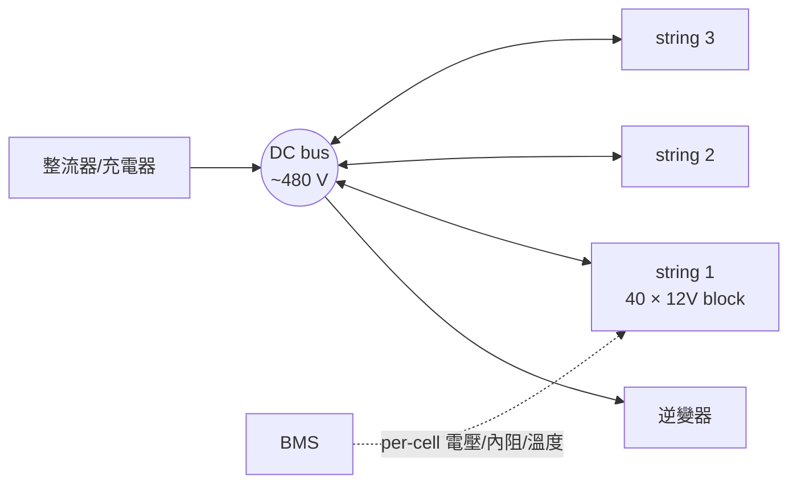

# UPS 電池組（battery string / bank）

[UPS](ups-double-conversion.md) 那張卡把電池畫成 DC bus 上的一個方塊帶過，但那個方塊是整條電力鏈唯一**平時不在電流路徑上、卻決定整條鏈成敗**的東西。整流器與逆變器每天工作，壞了立刻看得出來；電池浮充三年，你不知道它還剩多少——直到市電斷的那一秒。這張卡講：怎麼算它、怎麼把「它到底行不行」變成資料庫查得到的欄位。



## 六格

### 拓撲位置

上游：UPS 內建整流器兼充電器。下游：**沒有下游**——它並聯在直流匯流排上，是旁支不是路徑上的一節。這是後面所有事情的根源：故障沉默，因為它平時不承載電流。

### 容量單位

**不是 kW，也不是 Ah。** 選型用 **W/cell @ N 分鐘 to 末端電壓（EOD，典型 1.67 V/cell）** 的恆功率放電表。Ah 標的是 20 小時率，跟 8 分鐘放電不是同一個工況（演算 1）。四層各有單位：cell（V、W/cell、內阻 μΩ）→ block（12 V＝6 cells）→ string（串電壓、串數）→ bank（kWh）。

### 冗餘表達

N＝單串，**一顆 cell 開路整串退出**。N+1＝多並一串。2N＝A/B 兩台 UPS 各自的 bank。**「三串並聯」不等於「壞一串還有 2/3」**：剩兩串扛全部負載 → 放電率升高 → Peukert 再打折（演算 3）。

### 遙測介面

- **RFC 1628 標準 MIB**：`upsBatteryStatus`（4 態）、`upsSecondsOnBattery`、`upsEstimatedChargeRemaining`、`upsBatteryVoltage`／`Current`／`Temperature`
- **VRLA 外掛 BMS**（多為 Modbus TCP）：per-cell 電壓／內阻／溫度、intercell 連接溫度
- **鋰電內建 BMS**：SOC、SOH、cell balancing、rack 級 minor/major 保護、充放電電流上限

標準 MIB 給的是「還剩幾 %」這種安慰劑。**真正能預測失效的（per-cell 內阻趨勢、SOH）全在私有介面上**，這是自建系統必須處理的斷點。

### 故障域

**沉默故障的教科書案例**：平時零徵兆，市電一斷才發現。單串失效 → runtime 非線性縮短。熱失控 → 鉛酸也會，鋰電則放出 CO、CO₂、H₂、HF 與烷類。

### 維護特性

VRLA 三層：**月**目視與環境、**季**per-cell 內阻＋熱像、**年**扭力抽查＋容量放電測試。**容量測試要把 bank 拉去放電，那段時間 UPS 沒有電池**——必須跟發電機測試與另一路的維修窗口錯開排。鋰電近乎免維護，但多了 BMS 韌體與消防合規。制度細節見[電池測試制度](battery-testing-regime.md)。

## 關鍵數字與計算

### 演算 1：電池選型用 W/cell，不是 Ah

IT 負載 480 kW，逆變器效率 96% → 電池要供的直流功率 `480 / 0.96 = 500 kW`。

配置 240 cells（40 個 12 V block 串聯），標稱 `240 × 2 V = 480 V DC`，放電末端 `240 × 1.67 = 400.8 V`。

- 末端電流：`500,000 / 400.8 = 1248 A` ← 匯流排與熔絲要按這個選，不是按標稱電壓算
- 每 cell 需求：`500,000 / 240 = 2083 W/cell`

查廠商 8 分鐘率表，若某型號 8 min to 1.67 V/cell 只給 **700 W/cell** → 需要 `⌈2083 / 700⌉ = 3 串`並聯。

**注意這裡從頭到尾沒出現 Ah。** 拿「12 V 100 Ah」去推「480 V × 100 Ah ＝ 48 kWh，夠用 5 分鐘」是錯的：那個 100 Ah 是 20 小時率（5 A）測出來的，8 分鐘率下實際可取出的容量只剩約 **50–55%**。

### 演算 2：溫度每高 8–10°C，壽命砍半

Schneider WP229 的經驗法則：**平均環境溫度每升 8–10°C，電池服務壽命減半**（VRLA 與鋰電皆適用）。VRLA 在 25°C 的服務壽命取 4 年（WP229 的 TCO 模型值），電池間長期實測 32°C：

`4 × 2^(−7/9) ≈ 4 × 0.583 = 2.3 年`

在 10 年 UPS 壽命內，換電池次數從 2 次（第 4、8 年）變成 **4 次**，TCO 模型裡「battery refresh $108,790」這項直接翻倍。

**所以電池間的溫度告警不是「怕它現在壞」，是「壽命預算正在燒」。** 這是趨勢型告警，門檻設在月均溫而非瞬時值。

### 演算 3：runtime 的三重打折（接 [dc-08](ups-double-conversion.md) 演算 4）

Peukert：`t₂ = t₁ × (I₁/I₂)^k`，VRLA 的 `k ≈ 1.2–1.3`，取 1.25。標稱 8 分鐘 @ 100% 負載。

**打折 1 — 負載率不是線性：**

| 負載率 | runtime |
|---|---|
| 50% | `8 × 2^1.25 = 19.0 min`（不是 16） |
| 67.5% | `8 × (1/0.675)^1.25 = 13.1 min` |
| 90% | `8 × (1/0.9)^1.25 = 9.1 min` |

**打折 2 — 老化：** EOL 定義是容量掉到銘牌 80%。IEEE 485 的 **aging factor 1.25（= 1/0.8）** 就是要你按 EOL 而非出廠值設計。上面 90% 那格在 EOL 時是 `9.1 × 0.8 = 7.3 min`。**打折 3 — 溫度：** 低溫側內阻上升、電壓掉更快，再少幾個 %。

接上 [dc-08](ups-double-conversion.md) 演算 3：4 台 N+1 掉一台 → 負載率 67.5% → 90% → runtime 從 13.1 掉到 **EOL 時的 7.3 分鐘**。[柴油發電機](diesel-generator.md)起動到穩定帶載要 10 秒以上，7.3 分鐘看似很寬——**但前提是發電機第一次就起得來**。真正的問題是：你的儀表板顯示的是這四個數字裡的哪一個？

### 演算 4：把 kWh 算出來（下一張卡的輸入）

上面三個演算都在講功率與時間，但消防、TCO、運輸法規全部用**能量 kWh** 計。一台 1 MW UPS、6 分鐘 runtime 的電池標稱能量：

`1000 kW × 0.1 h = 100 kWh（輸出） ÷ 0.96（逆變器） ÷ 0.8（可用放電深度） ≈ 130 kWh`

拉到 10 分鐘：`1000 × (1/6) ÷ 0.96 ÷ 0.8 ≈ 217 kWh`——**能量、重量、體積同步加 67%**。VRLA 與鋰電在這裡分道揚鑣：WP229 的 1 MW／6 分鐘配置，VRLA 佔 5.4 m²、11,340 kg；鋰電 2.2 m²、2,767 kg（**約 1/4 重、1/2.5 面積**）。樓板承重與電池室面積是改不動的實體約束。

這個 kWh 同時是消防法規的輸入——NFPA 855 對鋰電有每防火區的能量上限，直接決定一間電池室放得下幾台 UPS。細節見 `battery-fire-compliance`。

## 常見誤解

**以為電池標 100 Ah 就有 100 Ah 可用，但實際上高率放電下 8 分鐘率可取出的容量只有 20 小時率標稱值的一半左右。** 而且 UPS 電池根本不用 Ah 選型，用 W/cell 恆功率放電表（演算 1）。把 Ah 當能量單位存進資料庫是這一段的第一個錯。

**以為「浮充電壓正常＝電池健康」，但實際上劣化的 cell 在浮充下電壓完全正常。** 唯一的真實指標是 per-cell 內阻趨勢與容量放電測試。而測試有個殘酷的悖論：你為了確認電池行不行而做的那次放電，正好是這一年裡 UPS 最沒有保護的 30 分鐘。

**以為換鋰電只是把箱子換掉，但實際上不是 drop-in。** 即使標稱電壓相同，UPS 也可能要升級韌體或硬體：充電曲線不同、runtime 公式不同、BMS 要整合，還要重過消防（NFPA 855、UL 9540A）。Schneider WP229 明講這點。

## 來源分歧

**VRLA 到底能撐幾年，兩邊差一倍以上：**

- Schneider WP229：**service life 3–6 年**，TCO 模型取 4 年。
- 廠商型錄常見：**"10-year design life"**。

這兩個不是同一個東西——**design life 是理想條件下的設計值，service life 是真實環境（含溫度、循環次數、放電深度）下的實際值**。買的時候看到 10 年、四年就要換，通常就是踩到這個。**資料模型必須把這兩個當成不同欄位存**，否則你連「我們是不是被坑了」都問不出口。

## 對資料模型的意涵

1. **`BatteryString` 必須是獨立實體，不是 UPS 上的幾個欄位。** 一台 UPS ↔ 多串；欄位 `cells_per_string`、`nominal_vdc`、`eod_vpc`、`install_date`、`chemistry`（VRLA / LFP / NMC）。串同時是失效單元與更換單元，不獨立出來就表達不了。
2. **容量要存「曲線」不是純量。** `discharge_rating: [(minutes, w_per_cell)]`，runtime 是查表＋插值＋Peukert＋老化係數的衍生值。存一個 `runtime_min = 8`，那個 8 在演算 3 的四種情境下沒有一種是對的。
3. **壽命要四個欄位**：`design_life_years`（型錄）、`service_life_est_years`（依實測溫度推算）、`predicted_eol_date`（衍生）、`actual_replacement_date`。對應上面的「來源分歧」——塞進同一欄的系統回答不了「為什麼四年就要換」。
4. **溫度不是環境資料，是壽命模型的輸入。** `ambient_c_monthly_avg` 必須存時序並餵給 `service_life_est_years`（演算 2）。把電池間溫度當成跟機房溫度同一類的環境點位，就永遠不會發現「我們的電池為什麼比別人短命」。
5. **`energy_kwh` 是衍生欄位但必須物化。** 它由放電曲線推得（演算 4），卻是消防、樓板承重、運輸法規的共同輸入——這些消費者都不該自己重算一次。同理 `weight_kg` 與 `footprint_m2` 要跟 `chemistry` 綁在一起。

## 該問 facility 的問題

1. **電池間全年溫度曲線有紀錄嗎？月均幾度？** 演算 2 的輸入；沒有它就解釋不了「型錄寫 10 年、我們四年就換」。
2. **廠商報的 runtime 是幾分鐘率、在幾度、算不算老化係數？** 這三個條件不講清楚，8 分鐘這個數字沒有意義。
3. **電池室的樓板承重上限是多少？** 演算 4 的 11,340 kg 對舊建物翻新是真實限制，也是鋰電最常被選中的理由。

## 動手練習（30–40 分鐘）

接續 [dc-08](ups-double-conversion.md) 的 `Ups` / `RedundancyGroup`，往下長出電池層。要擋住三件事：**(a) 容量是曲線不是純量；(b) runtime 要過 Peukert ＋老化兩層折扣；(c) 壽命是溫度的函數不是型錄上的常數。**

```python
from dataclasses import dataclass, field
from datetime import date
from enum import Enum

Chem = Enum("Chem", "VRLA LFP NMC")

@dataclass
class BatteryString:
    id: str
    chemistry: Chem
    cells_per_string: int          # 例 240
    eod_vpc: float                 # 例 1.67
    install_date: date
    design_life_years: float       # 型錄值，例 10
    # 放電曲線：[(分鐘, W/cell)]，例 [(5, 900), (8, 700), (15, 450), (30, 260)]
    discharge_rating: list[tuple[float, float]] = field(default_factory=list)

    # TODO nominal_vdc():  cells_per_string * 2.0
    # TODO eod_vdc():      cells_per_string * eod_vpc
    # TODO eod_current_a(load_kw): load_kw*1000 / eod_vdc()   # 演算 1 的 1248 A
    # TODO w_per_cell_at(minutes): 在 discharge_rating 上線性插值
    #      超出表格範圍 -> ValueError（刻意不外推：外推放電曲線是實務大忌）
    # TODO deliverable_kw(minutes): w_per_cell_at(m) * cells_per_string / 1000
    # TODO energy_kwh(): deliverable_kw(8) * 8/60 / 0.8       # 0.8 = 可用 DoD

@dataclass
class BatteryBank:
    id: str
    ups_id: str
    strings: list[BatteryString] = field(default_factory=list)
    ambient_c_monthly_avg: float = 25.0
    peukert_k: float = 1.25

    # TODO service_life_years():
    #      design_life_years * 2 ** (-(ambient_c_monthly_avg - 25) / 9)      # 演算 2
    # TODO predicted_eol_date(): install_date + service_life_years
    # TODO runtime_min(load_kw, at_eol: bool) -> float:
    #      1. rated_kw = sum(s.deliverable_kw(8) for s in strings)   # 以 8 分鐘率為基準
    #      2. t = 8 * (rated_kw / load_kw) ** peukert_k              # Peukert
    #      3. at_eol -> t *= 0.8                                     # 老化係數 1/1.25
    #      load_kw > rated_kw 時仍要能算（結果 < 8）
    # TODO strings_online_derate(n_failed): 掉 n 串後負載率上升，重呼叫 runtime_min
    #      ★ 這裡最容易寫錯成線性：掉 1/3 的串 != runtime 掉 1/3
```

**驗收標準**（`cells_per_string=240`、`eod_vpc=1.67`、`discharge_rating=[(5,900),(8,700),(15,450),(30,260)]`、單串、`design_life_years=10`）

| 呼叫 | 期望 |
|---|---|
| `nominal_vdc()` / `eod_vdc()` | **480.0** / **400.8** |
| `eod_current_a(500)` | **≈1247.5 A** |
| `w_per_cell_at(8)` / `w_per_cell_at(11.5)`（插值） | **700.0** / **575.0** |
| `w_per_cell_at(60)` | **raise ValueError**（不外推） |
| `deliverable_kw(8)` / `energy_kwh()` | **168.0** / **28.0** |
| `runtime_min(load_kw=168, at_eol=False)` | **8.0** |
| `runtime_min(load_kw=84, at_eol=False)` | **19.0**（±0.1；**不是 16**） |
| `runtime_min(load_kw=186.7, at_eol=False)` | **9.1**（±0.1） |
| 同上 `at_eol=True` | **7.3**（±0.1） |
| `ambient_c_monthly_avg=32` 的 `service_life_years()` | **≈5.8**（10 × 2^(−7/9)） |
| 3 串、負載 400 kW，掉 1 串後的 runtime | 明顯**低於**原值的 2/3 |

**加分題**：把 `BatteryBank` 掛回 dc-08 的 `Ups`，讓 `RedundancyGroup.alarms()` 多一條——**群組處於 N−1 時用升高後的負載率重算 runtime，若 EOL runtime < 發電機起動時間 × 安全係數（10 秒 × 20 = 200 秒）就升 CRITICAL**。這條規則要同時讀電池、UPS、發電機三個實體，正是「DCIM 不能只做設備清單」的具體證據。

## 自我檢核

**Q1. 供應商說這批 VRLA 是「10 年設計壽命」，你們機房電池間常年 30°C。請估算實際該編幾年的汰換預算？**

??? note "答案"
    先分清 **design life ≠ service life**：10 年是型錄的 design life（25°C 理想條件）。套溫度法則，每高 8–10°C 壽命減半，取 9°C：`10 × 2^(−5/9) ≈ 6.8 年`。而 Schneider WP229 給的 VRLA 真實 service life 區間是 **3–6 年**（TCO 模型取 4 年），所以 6.8 年這個數字仍偏樂觀——溫度只是眾多老化因子之一，還有循環次數與放電深度沒算進去。務實做法：**編 5 年，同時把電池間月均溫記錄起來**，兩年後用自己的實測數據取代廠商的假設。這也是為什麼 `design_life_years` 與 `service_life_est_years` 必須是兩個欄位。

**Q2. 儀表板顯示「電池狀態 normal、SOC 100%、預估 runtime 8 分鐘」，同時 UPS 群組因為一台故障進入 N−1。這三個數字有幾個還可信？**

??? note "答案"
    第一個大致可信，但它只代表沒觸發即時告警，不代表容量足夠（沉默故障）。SOC 100% 可信，它講的是充飽了，跟「充飽了能撐多久」是兩件事。**第三個一定不可信**：8 分鐘是標稱值（100% 負載、出廠容量、25°C）。N−1 讓負載率從 67.5% 升到 90%，Peukert 修正後 9.1 分鐘，再套 EOL 係數 0.8 → **7.3 分鐘**。更麻煩的是很多 UPS 回報的 `upsEstimatedMinutesRemaining` 只做負載率的線性換算，沒做 Peukert 也沒做老化——**它給你的數字偏樂觀，而且是在你最需要它準確的那一刻。**

**Q3.「電池容量是一條曲線不是一個數字」這件事，會讓你的資料模型長出什麼欄位與什麼限制？**

??? note "答案"
    **一張子表**：`discharge_rating(string_id, minutes, w_per_cell)`——多筆列，不是主表上的一個欄位。**一條約束**：查詢函式在超出表格範圍時要 raise 而不是外推。放電曲線兩端非線性得厲害，外推出來的數字比沒有數字更危險，因為它看起來像資料。**一個衍生層**：`runtime` 不能是儲存欄位，只能是 `f(負載, 老化, 溫度, 線上串數)`；把它物化成單一欄位的設計，那個值在演算 3 的四種情境下沒有一種是對的。

    最深的一層是**單位的選擇決定你能不能問對問題**。存 Ah 的系統連「這組電池在 90% 負載下能撐多久」都表達不出來，因為 Ah 裡沒有放電率這個維度。這跟軟體系統把「請求數」與「延遲分佈」混為一談是同一個錯誤——**平均值丟掉的正是你最需要的那條尾巴**。
