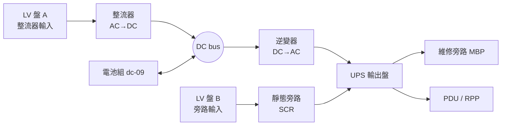

# UPS 不斷電系統（雙轉換式 / double-conversion, VFI）

前面七張卡的設備有個共同弱點：**它們全都需要時間**。[ATS](ats-transfer-switch.md) 切換要幾百毫秒，[柴油發電機](diesel-generator.md)從起動到帶載要 10 秒以上，但伺服器電源供應器只能撐約 20 ms。這個空窗只有電池能補。UPS 就是「把電池接上負載」的工程化包裝：整流器把交流變直流（順便餵飽電池），逆變器再把直流變回乾淨的交流；市電消失時直流匯流排由電池頂住，逆變器根本不知道上游斷了。這就是 IEC 62040-3 的 **VFI**（Voltage and Frequency Independent）等級。



## 六格

### 拓撲位置

上游：**兩條獨立的交流輸入**——整流器輸入與旁路輸入，可來自[低壓盤](lv-switchgear.md)的不同區段甚至不同變壓器。這是 UPS 與前面所有設備最大的結構差異。
下游：UPS 輸出盤 → `dc-11` PDU / `dc-12` RPP → `dc-10` STS → 機櫃 PDU。外部再包一層維修旁路盤（MBP）把整台 UPS 摘掉。

### 容量單位

**kVA 與 kW 兩個數字都要給**，關係是 `kW = kVA × 輸出 PF`。老機種輸出 PF 0.8/0.9，2015 年後的資料中心機種普遍 unity（1.0）。輸入 PF（IGBT 整流器約 0.99）與輸入 THDi（< 5%）是給上游[短路與協調](lv-short-circuit-and-coordination.md)看的，不是容量。模組化機型還有第三個單位：**功率模組數**（例如 8 × 50 kW）。

### 冗餘表達

| 型態 | 長相與單點 |
|---|---|
| N | 單機單匯流排；維修只能靠旁路，期間無保護 |
| 內部 N+1 | 機箱多插一個功率模組。只冗餘模組，**機箱／靜態旁路／輸出匯流排仍是單點** |
| 並機 N+1 | 多台併到同一輸出匯流排；匯流排本身是單點 |
| 2N 雙匯流排 | A/B 兩套獨立，各餵伺服器一顆 PSU。主流做法 |
| 分散式冗餘 | 3 台以上各自獨立進出線，靠下游 STS 湊；多 MW 場才划算 |

### 遙測介面

SNMP（**RFC 1628 標準 UPS-MIB，根 OID `1.3.6.1.2.1.33`**）+ 廠商私有 MIB + Modbus TCP。

| 物件 | 意義 |
|---|---|
| `upsOutputSource` | 供電來源（normal/bypass/battery/…）。**全卡最重要的點位**，決定其他數值怎麼解讀 |
| `upsOutputPercentLoad` | 負載率 %。分母是單機銘牌不是群組容量，見演算 3 |
| `upsBatteryStatus` | unknown / normal / low / depleted，不是布林 |
| `upsSecondsOnBattery` / `upsEstimatedMinutesRemaining` | 已放電秒數／剩餘分鐘，**後者是估計值，隨負載率變動** |
| `upsAlarmsPresent` / `upsAlarmTable` | 告警清單，廠商擴充最多的地方 |

標準 MIB **沒有**的：模組級狀態、旁路品質、電池單體電壓、運轉模式（ECO/VFI）。這些只能靠私有 MIB 或 Modbus，是自建系統最容易踩空的地方。

### 故障域

電池組掉 → 平時無感，**市電一斷就全滅**（沉默故障，UPS 最危險的失效模式）。逆變器掉 → 轉靜態旁路，負載活著但失去保護。**靜態旁路掉 → 逆變器故障時無路可退**。整台掉 → 2N 下另一路接手，N+1 下看群組剩餘容量。

### 維護特性

電池每年目視／內阻檢測（見 `dc-09`）、直流電容約 5–7 年、風扇約 5 年。**做這些一定要把負載移到維修旁路**，期間毫無保護——所以維修窗口要跟發電機測試錯開，不能排同一天。

## 關鍵數字與計算

### 演算 1：kVA 與 kW，兩個都要過

某機種標 **500 kVA / 400 kW**（輸出 PF 0.8）。IT 設計負載 420 kW、負載 PF 0.95。

- kVA 需求：`420 / 0.95 = 442 kVA` → 500 kVA 過關 ✅
- kW 需求：`420 kW` vs 機器 400 kW → **不過** ❌

**kVA 有餘裕不代表能用。** 換成 unity PF 的 500 kVA / 500 kW 機種，同一個外殼多出 100 kW（≈ 200 台 500 W 伺服器）。所以資料模型不能只存一個 `capacity`。

### 演算 2：效率差 3% 是多少錢與多少熱

IT 負載 1000 kW，比較三種效率（數字對齊 Vertiv 白皮書的世代表：老機 94%、現代雙轉換 97%、高效模式 99%）：

| 效率 | 輸入 kW | 損失 kW |
|---|---|---|
| 94% | 1000 / 0.94 = **1063.8** | 63.8 |
| 97% | 1000 / 0.97 = **1030.9** | 30.9 |
| 99% | 1000 / 0.99 = **1010.1** | 10.1 |

損失**全部變成熱**，還要冷氣搬走。設冷卻 COP = 4（搬 1 kW 熱花 0.25 kW 電）：

`94% vs 97% 總電力差 = (63.8 − 30.9) × 1.25 = 41.1 kW`　→　`41.1 × 8760 = 360,036 kWh/年`

以台電產業用電概算 **NT$3.5/kWh** → 約 **NT$126 萬／年**（**地區差異**：Vertiv 白皮書用 US$0.10/kWh，兩者不可互換；台灣費率另隨時間電價與契約容量浮動）。這 41.1 kW 同時進了 PUE 的分子。

### 演算 3：N+1 的負載率要用 N−1 當分母

4 台 500 kW（unity）並機，N+1 表示 3 台就夠。IT 負載 1350 kW。

- 正常：4 台分擔 → 每台 `1350/4 = 337.5 kW` = **67.5%**
- 掉一台：3 台分擔 → 每台 `1350/3 = 450 kW` = **90%**

若告警門檻設在「單機 90%」，儀表板上是 67.5% 一片綠燈，**但系統已經站在 N−1 的臨界上**。正確分母是群組 N−1 容量：`1350 / 1500 = 90%`。

倒推可用上限：實務把 N−1 負載率壓在 90% 以內 → `1500 × 0.9 = 1350 kW`。銘牌總和 2000 kW，**可用只有 1350 kW，擱置 32.5%**（接 `topic-04`）。

### 演算 4：runtime 不是常數

標稱「8 分鐘 @ 100%」的電池組，降到 50% 負載**不是** 16 分鐘而是 20–25 分鐘（Peukert 效應）。反過來更要命：演算 3 掉一台後負載率 67.5% → 90%，runtime 縮短幅度**大於**比例。詳見 `dc-09`。

### 演算 5：UPS 供不出跳脫電流

逆變器過載能力典型為 **110%/60 min、125%/10 min、150%/1 min**，靜態旁路普遍設計成承載 **125% 額定**。下游一顆 32 A 分路短路時要數百到數千安培才跳得開，逆變器限流 150–200% 根本供不出來。**UPS 的動作是立刻轉靜態旁路，借市電的短路容量去跳那顆斷路器**，跳完再轉回。這整段在遙測上只留下一次幾十毫秒的 bypass 事件；沒有事件記錄的話，你只會看到一次「無法解釋的下游斷電」。

## 常見誤解

**以為 UPS 是一進一出的盒子，但實際上它有兩個獨立的交流輸入。** 整流器輸入與旁路輸入可來自不同的盤。設計上這是優點，對資料模型卻是硬需求：單一條 `power_feed → device` 撐不住，NetBox 預設電力模型在這裡就不夠用（接 `topic-10`）。

**以為切到靜態旁路是「降級但仍受保護」，但實際上那一刻 UPS 的保護價值歸零。** 負載直接吃市電，電池充得再飽也用不上——逆變器不在路徑上。旁路模式的 UPS 可用性等同於沒有 UPS。所以「電池正常＋在旁路」不是綠燈，是紅燈。

**以為 UPS 下游短路時 UPS 會供應故障電流把斷路器跳開，但實際上它跳不開、只能轉旁路借電。** 見演算 5。這會讓你在做下游[選擇性協調](lv-short-circuit-and-coordination.md)時搞錯電流來源：算協調要用**旁路路徑的**可用短路電流，不是逆變器的。

## 來源分歧

**高效模式（ECO / eConversion）算不算不打折的保護？兩家講法直接相反：**

- **Schneider**：eConversion「meets the same Class 1 performance rating as Double Conversion」，適用資料中心與關鍵業務。
- **Vertiv**：傳統 ECO mode「serve as marketing hype rather than a concrete way of improving efficiency」——旁路路徑無濾波與功因補償，舊世代切換要 10 ms；並明講 **VFD 無法保證 Class 1 回應**，所以他們的 Dynamic Online 索性拿掉 VFD，只在 VI 與 VFI 間切。

切換時間數字也散：Vertiv 列「舊世代 10 ms／VI 2–4 ms／Dynamic Online ≈0 ms」，其他來源泛稱靜態旁路 4–10 ms。**兩邊講的可能不是同一個「切換」**（高效模式→逆變器 vs 逆變器→旁路）。問 FAE：「你報的毫秒數是哪兩個模式之間的？」

## 對資料模型的意涵

1. **上游 feed 必須一對多且帶角色。** `UpsFeed(role: RECTIFIER | BYPASS, source_panel_id, breaker_id)`。兩條 feed 指向同一面盤時要查得出來並標記為單點風險——這是稽核報表，不是告警。
2. **`operating_mode` 是狀態機欄位不是布林**：`NORMAL / ON_BATTERY / STATIC_BYPASS / ECO / MAINTENANCE_BYPASS / OFF`。**告警規則必須依 mode 分岔**：`STATIC_BYPASS` 升一條「負載未受保護」高優先告警，`MAINTENANCE_BYPASS` 屬計畫內、同一條降為 info 但仍要計時。
3. **容量要三個欄位不是一個**：`rating_kva`、`rating_kw`、`output_pf`，`usable_kw` 是衍生值取 `min(rating_kw, rating_kva × output_pf)`。跟 [dc-07](lv-switchgear.md) 的「同一物理量有四個合法數值」是同一個病。
4. **負載率告警要掛在群組層級。** `RedundancyGroup(topology, members, n_required)`，門檻分母是 `n_required × member_usable_kw` 而非單機銘牌。單機 `upsOutputPercentLoad` 只能做元件健康度，**不能做容量規劃告警**（演算 3）。
5. **`runtime` 要拆成兩個欄位**：規格值 `runtime_at_full_load_min`（常數）與即時估計 `runtime_est_min`（量測值＋時戳），不可混用同一欄。

## 該問 facility 的問題

1. **旁路輸入來自哪一面盤？跟整流器輸入同一面嗎？** 若是，這台 UPS 的「兩個輸入」在故障域上其實是一個。
2. **有沒有啟用 ECO / eConversion？誰有權切、有沒有進事件記錄？** 若有人為省電偷偷開了 ECO，監控看到的「正常」跟實際保護等級是脫節的。
3. **靜態旁路的過載額定跟上游斷路器協調過了嗎？** 演算 5 的情境下，該跳的是下游分路，不是 UPS 旁路進線。

## 動手練習（30–40 分鐘）

接續 [dc-07b](lv-short-circuit-and-coordination.md) 的電力鏈模型往下游走。這次要擋住三件事：**(a) 一台 UPS 有兩條上游 feed；(b) 容量取 `min(kW, kVA×PF)`；(c) 負載率告警的分母是群組 N−1 而不是單機銘牌。**

```python
from dataclasses import dataclass, field
from enum import Enum

FeedRole = Enum("FeedRole", "RECTIFIER BYPASS")
Mode     = Enum("Mode", "NORMAL ON_BATTERY STATIC_BYPASS ECO MAINTENANCE_BYPASS OFF")
Topo     = Enum("Topo", "STANDALONE PARALLEL_N_PLUS DUAL_BUS_2N")

@dataclass
class UpsFeed:
    role: FeedRole
    source_panel: str

@dataclass
class Ups:
    id: str
    rating_kva: float
    rating_kw: float
    output_pf: float
    mode: Mode
    feeds: list[UpsFeed] = field(default_factory=list)
    # TODO __post_init__: feeds 必須恰好含一個 RECTIFIER 與一個 BYPASS，否則 ValueError
    # TODO usable_kw(): min(rating_kw, rating_kva * output_pf)
    # TODO single_sourced(): 兩條 feed 的 source_panel 相同 -> True
    # TODO protected(): 只有 NORMAL / ON_BATTERY / ECO 算受保護

@dataclass
class RedundancyGroup:
    id: str
    topology: Topo
    n_required: int                  # 撐住負載所需的最少台數
    members: list[Ups] = field(default_factory=list)
    load_kw: float = 0.0
    # TODO capacity_kw():    sum(usable_kw of 所有 members)
    # TODO n_minus_1_kw():   n_required * 最小 member 的 usable_kw
    # TODO load_pct():       load_kw / n_minus_1_kw() * 100   ← 分母是這個
    # TODO per_unit_pct_now():        load_kw / 現存台數 / usable_kw * 100
    # TODO per_unit_pct_after_fail(): load_kw / (現存台數-1) / usable_kw * 100
    # TODO alarms() -> list[tuple[str, str]]:  (severity, message)
    #   任一 member.mode == STATIC_BYPASS      -> ("CRITICAL", "負載未受保護")
    #   任一 member.mode == MAINTENANCE_BYPASS -> ("INFO",     "計畫維修，負載未受保護")
    #   任一 member.single_sourced()           -> ("WARNING",  "兩條 feed 同源")
    #   load_pct() > 90                        -> ("CRITICAL", "N-1 容量不足")
    #   load_pct() > 80                        -> ("WARNING",  "接近 N-1 上限")
```

**驗收標準**（4 × `Ups(rating_kva=500, rating_kw=500, output_pf=1.0)`，`n_required=3`，`load_kw=1350`）

| 呼叫 | 期望 |
|---|---|
| `usable_kw()`；改 `rating_kw=400,pf=0.8`；改 `pf=0.8` | **500.0** / **400.0**（綁 kW）/ **400.0**（綁 kVA×PF） |
| `capacity_kw()` / `n_minus_1_kw()` | **2000.0** / **1500.0** |
| `load_pct()` | **90.0** ← 不是 67.5 |
| `per_unit_pct_now()` / `per_unit_pct_after_fail()` | **67.5** / **90.0** |
| `alarms()`（全 NORMAL） | 含 `("CRITICAL", "N-1 容量不足")` |
| `load_kw=1200` 時 `load_pct()` / `alarms()` | **80.0** / **[]**（80 不 > 80） |
| 一台切 `STATIC_BYPASS` / `MAINTENANCE_BYPASS` | CRITICAL「負載未受保護」/ 同義但降為 **INFO** |
| 兩條 feed 同 panel | 含 `("WARNING", "兩條 feed 同源")` |
| `Ups(feeds=[RECTIFIER])` | **raise ValueError** |

**加分題**：寫 `from_rfc1628(code) -> Mode`，把 `upsOutputSource` 的整數列舉（`3=normal, 4=bypass, 5=battery`）映射到 `Mode`——你會發現 **RFC 1628 分不出 static bypass 與 maintenance bypass**（都是 `4`）。**這個缺口就是你的系統必須自己補一個欄位的證據。**

## 自我檢核

**Q1. 四台 500 kW（unity PF）並機做 N+1，儀表板上單機負載率顯示 70%。這個系統安全嗎？**

??? note "答案"
    光看這個數字答不出來。70% 的分母是單機銘牌。換成 N−1 視角：負載 = 4 × 500 × 0.7 = 1400 kW；N−1 容量 = 3 × 500 = 1500 kW；N−1 負載率 = **93.3%**，已超過實務 90% 門檻。掉一台後三台各吃 466.7 kW，撐得住但沒有第二次失效的餘裕，且電池 runtime 會顯著短於標稱值。**單機負載率是元件健康度指標，不是容量規劃指標。**

**Q2. 監控系統收到「電池狀態正常、輸出電壓正常、負載率 40%」三個綠燈。這台 UPS 一定沒問題嗎？**

??? note "答案"
    不一定。若它正在**靜態旁路**模式，這三個數字全是真的，但負載直接吃市電、完全沒有保護——電池充得再飽也進不了路徑。所以 `upsOutputSource` 比任何數值點位都重要：**它決定其他點位怎麼解讀**。電池的沉默故障也在這裡：內阻劣化的電池在浮充下電壓完全正常，只有實際放電或內阻測試才看得出來。

**Q3.「UPS 有兩條上游輸入」這件事，會讓你的資料模型長出什麼欄位與什麼約束？**

??? note "答案"
    三樣。**欄位**：`UpsFeed` 關聯物件，含 `role` 列舉（RECTIFIER / BYPASS）與 `source_panel_id`、`breaker_id`。**約束**：每台恰好一條 RECTIFIER ＋ 一條 BYPASS。**衍生查詢**：`single_sourced()` ——兩條 feed 指向同一面盤時要查得出來。第三樣最有價值，因為它是**設計缺陷偵測**而非即時告警：盤配錯的問題在遙測上永遠是綠燈，只有拿拓撲關係比對才看得見。這也是 NetBox 預設電力模型撐不住的第一個具體斷點。
