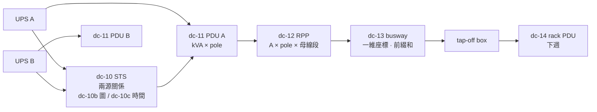

# 2026-W35 週報：分岔的那一週

第五份週報，本週 **5 張卡**，是這條軌跡目前最滿的一週（W31 四張、W32 三張、W33 五張、W34 三張）。而且是在**兩天空窗**（8/25、8/26 沒產出）之後，用 8/27 與 8/28 各補兩張追回來的——節奏檢討見文末。

這五張卡有一條藏在底下的主線：**電力鏈走到這裡，第一次從「一條粗的」變成「很多條細的」，而每分岔一次，容量就多長出一個維度。**

| 卡 | 分岔到什麼程度 | 容量是幾維的 |
|---|---|---|
| `dc-10b` / `dc-10c` STS 兩源關係 | 還沒分岔，但**上游有兩條** | 不是維度，是**配置集合上的極值**＋**時間軸上的窗** |
| `dc-11` PDU | 第一次分岔（一台 → 幾十條） | **二維**：kVA × pole |
| `dc-12` RPP | 分岔被**搬到現場** | **三維**：A × pole × 母線段，外加 **method 維度** |
| `dc-13` busway | 分岔被**攤成一條線** | 一維座標上的**前綴和**——第一次「順序有意義」 |

W34 的母題是「事實不住在電力樹上」。**本週的母題是：容量不是一個數字。** 五張卡從五個不同方向證明同一件事，而且每一次的證明方式都不一樣——一次是枚舉、一次是時間、一次是二維、一次是選演算法、一次是排序。

---

## 本週卡片

- **[dc-10b STS 的兩源關係（一）拓撲獨立性與雙母線容量會計](../devices/sts-two-source-relationship.md)** — **共同祖先永遠存在，問題只在它在第幾層**；「獨立嗎」是深度題不是是非題，而 `is_redundant: bool` 存下來就會在有人改接線那天靜默說謊。
- **[dc-10c STS 的兩源關係（二）相位同步窗與頻率漂移](../devices/sts-source-synchronization.md)** — **兩源頻率完全相同正是壞消息**：Δf = 0 代表相位差凍結，落在窗外就永遠切不過去，而成因是上游兩台變壓器銘牌上的一個字串（Dyn11 vs Dyn1 = 固定 60°）。
- **[dc-11 PDU 配電單元](../devices/pdu-floor.md)** — 容量在這裡分岔成**兩個維度**，而且通常是 **pole 先用完**：72 極盤只能裝 24 條迴路，kVA 還剩 31%（約 64 kW）永遠賣不掉，儀表板卻顯示「利用率 69%，還有空間」。
- **[dc-12 RPP 遠端配電盤](../devices/rpp-remote-power-panel.md)** — **×0.80 不是物理常數**，是「80% rated 斷路器＋列名外殼」這個組合的屬性；IEM 的 RPP 標配 100% rated，同一顆 400 A 主開關差 **52.7 kVA ≈ 8.7 個機櫃**。
- **[dc-13 匯流排 busway 與插接箱](../devices/busway-and-tap-off-box.md)** — **位置第一次變成計算的輸入**：約束不是「總和 ≤ 額定」而是「每段的**前綴和** ≤ 該段額定」，中央饋入時左 500／右 300 總和合法卻仍違規。

---

## 串起來

### 一、電力鏈的下半段：分岔、再分岔、攤平

先把五張卡放回同一條線上。從 UPS 出來之後到機櫃之前，這是本週走完的路：



**這條線上有一件反直覺的事：故障域不是一路變細的。**

直覺會說，愈往下游、分岔愈多，一次故障影響的範圍就愈小。前三段確實如此——PDU 掉 → 下游機櫃**那一邊**；RPP 主開關跳 → 該 RPP 下的機櫃那一邊；RPP 單一分路跳 → 只死一條 whip。故障域被切細，這正是 RPP 存在的第二個理由。

**然後 busway 把它變粗回來。** 一條 run 上所有機櫃的 A 側共用同一根導體，饋入斷路器一跳，**整列同時消失**——比 RPP 粗，因為 RPP 至少每櫃各有一顆分路開關。細分岔的好處在 busway 上換成了「布線彈性」與「加櫃不用停電」，代價是故障域回胖了一級。

**這件事在單線圖上完全看不出來**，因為單線圖畫的是「誰接誰」，不是「誰跟誰共用一根導體」。要模型能回答它，`BuswaySegment` 就必須是一等公民——run 是段的有序集合，而不是一條邊。

### 二、本週最漂亮的連鎖：0.80 這個數字被修正了兩次

這是三張卡在四天內接力完成的一次自我修正，值得完整記下來，因為**它示範了「這條軌跡到底在幹嘛」**。

**第一次（`dc-11`，8/27）**：PDU 那張卡算 225 kVA 變壓器配 400 A 主開關，寫下 `400 × 0.80 = 320 A`，並把 ×0.80 當成連續負載的通則用了。算式沒錯，結論（銘牌 225、可用 210.6，差一整個機櫃）也對。

**第二次（`dc-12`，8/28）**：RPP 那張卡發現 0.80 是**倒數**——NEC 210.20(A) 要求 OCPD ≥ 125% 連續負載，而其**例外**允許：斷路器**與外殼的組合**經 UL 489 §7.1.4 測試並標示 100% rated 時，直接用 100%。IEM 的 RPP 標配就是 100% rated。同一顆 400 A：

```
80% rated ：√3 × 380 × 400 × 0.80 = 210.6 kVA
100% rated：√3 × 380 × 400        = 263.3 kVA
差 52.7 kVA ≈ 8.7 個 6 kW 機櫃
```

**且 100% 不是斷路器單獨的屬性**——不能拿一顆 100% 斷路器丟進任何盤就當 100% 用，外殼必須一起被列名。所以它不是一個欄位，是**兩個欄位的合取**：`Breaker.rating_style` ＋ `Panelboard.enclosure_listed_100pct`。

**第三次（`dc-13`，同日）**：busway 再分一次——**打折的是上游那顆饋線斷路器（NEC 210.20(A) / 215.3），不是 busway 本體**。busway 的 400 A 是 UL 857 熱測試結果，把 0.8 塞進 busway 的欄位會**兩邊各扣一次**。故 `Busway.ampacity_a` 與 `Feeder.continuous_a` 是兩個物件上的兩個數，容量取 min。

四天之內，同一個 0.80 從「常數」→「(斷路器, 外殼) 組合的屬性」→「掛在上游那顆斷路器身上」。**每一次修正的方向都一樣：把常數變成有出處的欄位。** 而它的代價是可量化的——把 0.80 寫死在每台 100% rated 的設備上，就是**憑空丟掉 25% 的容量**，且沒有任何東西會報錯。

> 這也是為什麼 `dc-12` 立下 `derating_basis` 這個欄位：**降載可以有，但要說得出出處。** `dc-13` 立刻用上了它（環境溫度降載只查到二手來源 → 標 `unknown`，不要假設 1.0）。

### 三、「還剩多少」這個問題，本週有五種答案，其中四種是錯的

把五張卡的「剩餘容量」指標排在一起看，會發現一個非常一致的病：

| 指標 | 看起來 | 實際上 |
|---|---|---|
| 儀表板「兩條母線各 60 / 80 kW，額定 140」 | 還很空 | **看儀表板推不出容量夠不夠**，要枚舉失效配置取 max（`dc-10b`） |
| PDU「利用率 69%」 | 還有 31% | **pole 已經 100%**，那 31%（約 64 kW）永遠賣不掉（`dc-11`） |
| RPP「840 A 掛在 400 A 上，滿了」 | 超載 | 那是**出廠標配**；實測法（30 天峰值 ×1.25）說還能加 19 櫃（`dc-12`） |
| busway「剩餘插孔 107」 | 還能加 107 櫃 | 電流預算只有 **13 顆**，差約 9 倍；連續槽式**連「孔」這個實體都不存在**（`dc-13`） |
| 「總和 800 A 以內就好」（中央饋入） | 合法 | 左 500 已過載——**約束是前綴和不是總和**（`dc-13`） |

**五個都是把多維的東西壓成一個數字造成的。** 而它們共用同一個修法：**回傳型別不能是 `float`。**

- `dc-10b`：`capacity` 要回 `worst_case_bus_load(configs)`，而 **LCA 深度本身就是要存進報表的數字**，不是判斷完就丟
- `dc-11`：`capacity_report()` 回 `{kva_pct, pole_pct, binding}`——**瓶頸是哪一維本身就是結論**
- `dc-12`：`headroom()` 回 `{amps, method, valid, window_days}`——**算法選擇本身就是要存的結論**，而且資料不足 30 天時 `valid=False`，「我還不知道」必須可表達
- `dc-13`：`free_capacity()` 回 `{amps, racks, free_outlets, binding}`——`free_outlets` 在連續槽式必須是 `None`，**不准回 0**

`binding` 這個欄位本週出現了三次（`dc-10b` 的 LCA 深度、`dc-11` 的 kVA-vs-pole、`dc-13` 加分題要求跨 RPP 與 busway 取 min 並回報哪一端先卡住）。**三次之後它不再是某張卡的細節，是這條電力鏈的共同回傳型別。** 這是下面連貫性檢視 #1 的由來。

### 四、「算得出來的一律不存」——規則在本週被立起來，也在本週被打了兩個洞

這條規則的完整生命週期剛好落在這一週，很值得記錄：

1. **`dc-10b`**：`is_redundant: bool` 不准存——獨立性是圖查詢結果，存下來會在有人改接線那天說謊，**而且沒有任何遙測會變**
2. **`dc-11`**：`Breaker.phase` 不准存——相位是 `phase_of(position, numbering)`，有人把開關從 position 3 移到 5，相位變了欄位不會變。並就地宣布「**這是第三次遇到同一個形狀**（`is_redundant`、`Isc`、`phase`），三次之後應該當成規則」
3. **`dc-12`**：**規則有例外。** ABB SMISSLINE 這類插拔式母線，多極裝置可插在任何位置、可帶電移動做相位平衡——**相位是插法，位置算不出來**。正解不是推翻規則，是**把規則的前提變成欄位**：`Panelboard.phase_mode: Literal["by_position","explicit"]`
4. **`dc-13`**：同一個教訓第二次，而且更狠——`tap_access: Literal["fixed_outlet","continuous_slot"]`。`continuous_slot` 下 `outlet_count` / `free_outlets` / `outlet_pitch_mm` **必須不存在**（不是設成 0）。**這不是規格差異，是型別分水嶺。**

從「規則」到「規則的前提是欄位」只花了兩天。**而 `dc-13` 把它推到最後一步：不只前提要是欄位，前提還會決定哪些欄位存不存在。** 這是本週在資料模型上走得最遠的一步——從「值可能是錯的」進到「欄位本身可能不合法」。

同一個形狀在本週第三次現身，是 `dc-13` 的 `change_class`：`dc-12` 立的 `requires_outage_to_add_circuit: bool` 不夠用，因為 OSHA 2025-08-25 解釋函確認 busway 插接箱插拔屬**能量作業**——不停機，但要工單、合格人員、PPE。**布林會把它錯分到「不用管」**，正解是三態 `Literal["outage_required","energized_work_permit","no_permit"]`。

> **本週規律**：`bool` 這個型別在這條軌跡上已經連續失敗四次（`is_redundant`、`installed`（`dc-03b`）、`requires_outage`、以及 `dc-10c` 的「`transfer_time_ms` 存成一個 float」）。**凡是「看起來是是非題」的欄位，先問一次它是不是深度題、三態題、或根本是查詢。**

### 五、獨立性要逐維度檢查——空間共命運，本週第三次

`dc-10b` 指出：LCA 不只存在於電力樹，**空間樹上也有 LCA，而且它在單線圖上完全看不見**。A、B 兩路電池若在同一防火區劃，那就是空間樹上 depth = 0 的共祖——**電力樹上的 2N 在消防樹上是 1N**。

然後這個形狀在同一週又出現了兩次，一次比一次具體：

- **`dc-12`**：ABB 把 A、B 兩台 RPP 裝進**同一個櫃子**（賣點是省 50% 佔地）。**共櫃 = 共火災、共淹水、共誤操作。** 冗餘在電氣上成立、空間上不成立。
- **`dc-13`**：A、B 兩條 busway run 若吊**同一組吊架**，同一件事，只是換成鋼構。

三次，三種設備，同一個結論：**`lowest_common_ancestor()` 要在兩組邊上各跑一次，而不是把空間當成裝飾欄位。** `dc-10b` 的骨架已經把它做出來了（遍歷參數化 `tree="power" | "space"`），這是 W34 連貫性檢視 #5 那條「兩棵樹的橫向邊」真正被兌現的地方——**欠了四週的 `DeviceRegistry` 這週清掉了**。

### 六、掉一個會連鎖到哪：本週的三條新連鎖

W34 記過「消防要求回頭吃掉電力鏈的容量」。本週的連鎖是往下游走的：

**連鎖 A：一個變壓器銘牌字串 → 整區手動轉換永遠按不下去。** `dc-10c` 的 Dyn11 vs Dyn1 差 60°，超過同步窗上限 30° **也**超過保證可容忍失相 30°。**驗收當天兩個源都是綠燈**，因為每個源各自都在規格內；壞的是關係。而它不會隨時間變好——Δf = 0 時相位差**凍結**，不像 ATS 切發電機那樣「等一下窗就開了」。**同一個名詞（同步檢查），在 ATS 上是等待問題，在 STS 上是是非問題。**

**連鎖 B：LCA 的一次維護窗口 → 兩源同時失效，而行事曆上只是一筆單一作業。** `dc-10b` 把 W34 的「衝突檢查看的是冗餘疊加後是否歸零」推進一步：**單一窗口落在 LCA 上就足以致命**，不需要兩個窗口重疊。所以 `MaintenanceWindow` 要有 `subject_id`，衝突檢查要能對它跑 `ancestors()`。

**連鎖 C：SCCR 沿路徑取 min → 一顆便宜的插接箱斷路器把整條 35 kA 的 busway 拉到 10 kA。** `dc-13`：Schneider 400 A busway straight 標 35 kA，標配 QOU 插接箱斷路器只有 10 kA。若該點可用故障電流 22 kA，**系統 SCCR = 10 kA < 22 kA → 誤用**。原廠自己寫明插接箱的短路額定同時受 busway、drop cord 與接頭限制。**這是「條件式額定」在本軌跡的第五次現身**（`dc-07b` 的 `Icc`、`dc-07b` 的 selectivity pair、STS 的 `PC` 級熔絲、接地系統決定極數，加上今天這個）——見下面的間隔複習。

---

## 自我測驗

**Q1.（事實回憶）連續負載的 ×0.80 這個係數，本週被修正了兩次。它到底掛在哪個物件身上？三張卡各給了什麼答案？**

??? note "答案"
    **它掛在「上游那顆斷路器 ＋ 它的外殼」這個組合上，不掛在被保護的設備上。**

    - **`dc-11`（錯的版本）**：當成通則，`kva_derated() = min(kva_nameplate, √3 × V_LL × main_amps × 0.80)`
    - **`dc-12`（第一次修正）**：0.80 是 NEC 210.20(A) 的**倒數**（OCPD ≥ 125% 連續負載）。其例外允許：斷路器**與外殼的組合**經 UL 489 §7.1.4 測試並標示 100% rated 時不打折。所以是**兩個欄位的合取**：`Breaker.rating_style` ＋ `Panelboard.enclosure_listed_100pct`。宣告 100% 而外殼未列名 → **寫入時擋掉，不准靜默退回 0.8**
    - **`dc-13`（第二次修正）**：打折的是**上游饋線斷路器**，不是 busway 本體。busway 的 400 A 是 UL 857 熱測試結果。塞進 busway 欄位會兩邊各扣一次

    **代價**：380Y/220V、400 A 主開關，210.6 kVA vs 263.3 kVA，差 **52.7 kVA ≈ 8.7 個 6 kW 機櫃**。把 0.80 寫死在每台 100% rated 設備上 = 系統性低估 25%，且不會報錯。

**Q2.（事實回憶）儀表板顯示 Source 1 = 60.00 Hz、Source 2 = 60.00 Hz、兩源電壓都正常，運維說手動轉換永遠被拒。為什麼「頻率完全相同」正是壞消息？把數字算出來。**

??? note "答案"
    **頻率是各自的屬性，同步是關係的屬性，前者推不出後者。** Δf = 0 → 相位差**凍結**，不會隨時間滑進窗口；落在窗內永遠能切，落在窗外**永遠切不了，而且不會變好**。

    ```
    滑動率 = 360 × Δf  (°/s)
    Δf = 0.1 Hz → 36 °/s，窗（±30°）每 10 s 開一次，每次 1.67 s
    Δf = 0     → 0 °/s，窗「永不改變」  ← 這一列是重點
    ```

    最可能成因是**上游兩台變壓器向量組不同**：Dyn11 與 Dyn1 時鐘數差 2，每格 30° → 固定 `2 × 30° = 60°`。60° **同時**超過使用者可調同步窗上限（Vertiv ±30°）與保證可容忍失相能力（30°），**手動與緊急轉換都不保證**。

    **診斷順序**：看 `Synchronization phase angle`（穩定停在 ~60° 即確診，這是全卡唯一直接可觀測的兩源關係數字）→ 核對兩台變壓器**銘牌**向量組 → 最後才懷疑設定值。**這是設計期缺陷，驗收當天兩個源都是綠燈。**

    **對照**：ATS 切「市電 vs 發電機」時 Δf ≠ 0（發電機在調速），窗會週期性打開，同步檢查是**等待**問題；STS 切兩條市電母線時 Δf = 0，是**是非**問題。同一個名詞，兩種行為。

**Q3.（應用 · 建模）一條鏈：RPP（400 A 主、100% rated、外殼已列名、BCMS 顯示 30 天峰值 180 A）→ 一顆 400 A 饋線斷路器 → 一條 400 A busway（端點饋入，已掛 9 顆 30 A 插接箱）。問「這一列還能加幾櫃」，每櫃一路 30 A。算出來，並說出 `binding` 是誰。**

??? note "答案"
    **要分兩段算，取 min，而且答案會因為饋線斷路器的 `rating_style` 差 4 倍。**

    **RPP 端**（實測法，NEC 220.87，資料 ≥ 30 天所以 `valid=True`）：

    ```
    既有負載 = 1.25 × 180 = 225 A
    剩餘     = 400 − 225 = 175 A  →  175 / 30 = 5 顆
    ```

    **busway 端**（打折掛在上游饋線斷路器身上，不在 busway 上）：

    ```
    已用 = 9 × 30 = 270 A
    @80% rated ：饋線連續 = 400 × 0.80 = 320 A → 剩 50 A  → 1 顆
    @100% rated：饋線連續 = 400        = 400 A → 剩 130 A → 4 顆
    ```

    **取 min：@80% 是 1 顆、@100% 是 4 顆，兩種情況 `binding` 都是「busway 的上游饋線斷路器」，不是 RPP、也不是 busway 本體的 400 A。** 同一套實體硬體，只因為一個 `rating_style` 欄位差 3 顆機櫃。

    **對你的模型**：這就是 `dc-13` 加分題要的東西，而它寫不出來，除非 `Rpp.headroom()` 與 `Busway.free_capacity()` **回同一個型別**——現在一個回 `{amps, method, valid, window_days}`、一個回 `{amps, racks_at_6kw, free_outlets}`，兩者沒有共同欄位可以取 min，`binding` 也無處可放。見連貫性檢視 #1。

    **還有第三道閘門，跟容量無關**：SCCR 沿路徑取 min。busway 35 kA、插接箱斷路器 10 kA → 系統 10 kA。若該點可用故障電流 22 kA，**這條鏈根本不該通過設計審查，不管還剩幾安培。**

**Q4.（應用）一台 400 A busway 從中央饋入。有人說「左右加起來 800 A 以內就好」。他錯在哪？這個約束跟 `dc-12` 的母線段約束是什麼關係？**

??? note "答案"
    **總和對，分佈錯。** 導體是每方向各 400 A，左 500 / 右 300 總和 800 合法，但**左半段的前綴和 500 > 400 已過載**。

    正確約束是**沿路徑的前綴和**：對每一個切點，該側 tap 電流和 ≤ 該段額定。端點饋入時最吃緊的永遠是第一段，前綴和退化成總和——所以前十幾張卡從來沒撞上它。

    **與 `dc-12` 的關係**：ABB 那台 400 A 進線的 RPP 標 `Ina = 2×250 A`（兩條母線各 250 A），A 段 300 / B 段 100 總和 400 ✓ 但 A 段違規 ✗。**形狀完全相同，差別在段有沒有方向**：RPP 的段是**離散且無序**的集合，busway 的段是**有序**的，離饋入端的距離決定誰疊在誰上面。

    **`dc-13` 因此是這條電力鏈上第一個「順序有意義」的設備**——前面所有卡的 `validate()` 只需要看集合，這張第一次需要看排序。而 NEC 368.17(B) 還允許一條 run 中途接一段**額定較低**的 busway（條件：≤ 15 m、額定 ≥ 上游保護的 1/3、不接觸可燃物），所以 `ampacity` 是**段的屬性不是 run 的屬性**。

**Q5.（建模判斷）本週出現了三個「模式欄位」：`Panelboard.phase_mode`、`Busway.tap_access`、`change_class`。它們解決的是同一類問題嗎？什麼時候該把一條規則的前提變成欄位，而不是直接推翻規則或到處寫 if？**

??? note "答案"
    **是同一類問題，但三者作用在三個不同的層次，這個差別本身就是要記下來的東西。**

    | 欄位 | 它讓什麼變得合法／非法 | 層次 |
    |---|---|---|
    | `phase_mode: by_position \| explicit` | `Breaker.phase` 這個**欄位**在 `by_position` 下是謊言、在 `explicit` 下是必填 | **欄位的存在性** |
    | `tap_access: fixed_outlet \| continuous_slot` | `outlet_pitch_mm` / `free_outlets` 在連續槽式**連型別都不成立**（必須是 `None`，不准是 0） | **型別分水嶺** |
    | `change_class`（三態） | 取代 `requires_outage: bool`——「不停機但要工單」是布林接不住的**中間態** | **值域的基數** |

    **判準（本週歸納出來的）：當你發現同一個欄位在兩種設備上「一個是必要、一個是謊言」時，模式必須先被記錄。** 這不是推翻規則，是把規則隱含的前提顯性化。`dc-11` 的「凡是算得出來的一律不存」沒有錯，錯在把它當成**無條件的**——它的前提是「相位由盤面位置決定」，對 NEMA bolt-on 盤成立，對插拔式母線不成立。

    **反過來，什麼時候不該加模式欄位**：如果兩種情況只是**數值不同**（42 極 vs 168 極、35 kA vs 10 kA），那是欄位值，不是模式。模式欄位的門檻是**它會改變 schema 的形狀**——讓某個欄位從必填變非法、或讓某個回傳型別從 `int` 變 `None`。

    **最容易做錯的一件事**：用 `Optional` 假裝模式。`free_outlets: int | None = 0` 看起來能表達連續槽式，但 `0` 與 `None` 在聚合時會被同等對待，於是「這條 busway 插孔用完了」與「這條 busway 沒有插孔這種東西」變成同一個報表列。**`dc-13` 明寫「不准回 0」就是在防這個。**

---

## 間隔複習

本週是 index 預告的「**雙軌全開**」第一次：兩週前（W33）與四週前（W31）各抽一張。W31 是第二次被抽（W33 抽過 `dc-02`），這次換一張。

### 抽 W33 的 [dc-07b 低壓盤的短路耐受與保護協調](../devices/lv-short-circuit-and-coordination.md)（2026-08-12，18 天前）

**Q. 三週前你學過：`Icc = 65 kA` 的盤，只在「上游裝了廠商指定的那顆 SCPD」時成立，換一顆型號 65 kA 當場失效。本週 `dc-13` 的 SCCR 沿路徑取 min，是同一件事嗎？兩者在 schema 上要長出一樣的東西嗎？**

??? note "答案"
    **是同一個大類（「額定不是設備自己的屬性」），但 schema 需求不同，混在一起會做出一個接不住任何一邊的欄位。**

    | | `dc-07b` 的 `Icc`（條件式額定） | `dc-13` 的系統 SCCR（路徑最小值） |
    |---|---|---|
    | 依賴什麼 | **一個特定型號**的上游 SCPD | **整條路徑上所有元件**的 `sccr_ka` |
    | 失效時機 | 有人換掉那顆上游斷路器 | 有人在路徑上插入一個較低額定的元件 |
    | schema | `RatingRow(kind, ka_rms, duration_s)` ＋ **外鍵指向上游 SCPD 型號** | 逐件 `sccr_ka` ＋ `series_rated_with`，查詢時**沿路徑取 min** |
    | 查詢形狀 | 「這一列額定還有效嗎」（**驗證**） | 「這一點的實際額定是多少」（**聚合**） |

    **共同點才是重點**：兩者都**不能存成 device 上的一個數字**，而且兩者失效時**現場都沒有任何東西會告訴你**——沒有告警、沒有遙測變化、外觀完全一樣。`dc-07b` 當時的結論是「條件式額定是一對設備共同擁有的屬性」，`dc-13` 把「一對」推廣成「一條路徑」。

    **順帶點名**：這是「條件式額定」在本軌跡的第五次。前四次是 `Icc`、selectivity pair（**選擇性是邊的屬性不是節點的屬性**，且換任一顆就要重查）、STS 的 `PC` 級（耐受值綁定一顆特定型號的 uR 快速熔絲）、接地系統決定極數。**五次之後它應該是模型裡的一個一等公民型別，而不是每張卡各寫一次。**

### 抽 W31 的 [dc-03b LSC 服務連續性分級與抽出式斷路器互鎖](../devices/lsc-and-interlocks.md)（2026-07-31，30 天前）

**Q. 四週前你學過 `maintenance_impact(unit_id)`：從 `lsc_category` 推出「維護這一格要停掉誰」（LSC1 → 全盤、LSC2B → 只有自己）。本週 `dc-13` 立了 `change_class` 三態。這兩個是同一個查詢嗎？**

??? note "答案"
    **不是。它們回答的是變更審查上兩個相鄰但不同的問題，而且必須都有，缺一個就會做出錯誤的排程。**

    ```
    maintenance_impact(unit)  →「做這件事，誰會沒電」        （影響範圍）
    change_class(action)      →「做這件事，要不要停電／要不要工單」（作業性質）
    ```

    - **LSC2B 的抽出式斷路器**：`maintenance_impact` = 只有自己 → 但抽拉本身仍是 `outage_required`（該回路要停）
    - **busway 加一顆插接箱**：`maintenance_impact` = **沒有人會沒電** → 但 `change_class` = `energized_work_permit`（OSHA 2025-08-25 引 NFPA 70E table 130.5(C)：插入／移除 busway 插接裝置**不論運轉狀態**都存在電弧閃絡可能）
    - **ABB SMISSLINE 帶電插拔 MCB**：兩者都最寬鬆，但仍不是 `no_permit`

    **第二列就是為什麼布林不夠用**：影響範圍為零、作業性質卻不是零。用一個 `requires_outage: bool` 會把它歸到「不用管」，然後有人不穿 PPE 去插一顆 tap。

    **`dc-03b` 另一件本週剛好被再次驗證的事**：`position` 不能是 `installed: bool`，要 `enum{REMOVED, DISCONNECTED, TEST, CONNECTED, TRANSIT}`，**`TRANSIT` 不可省**。本週 `bool` 又失敗了兩次（`is_redundant`、`requires_outage`）——**四週前那個判斷現在看是對的，而且是同一個病。**

---

## 本週的 model code 連貫性檢視

先結算舊帳。**本週是這條軌跡開始以來清帳最多的一週**，因為 `dc-10b` 的動手練習就是那個欠了四週的 `DeviceRegistry`。

| 來源 | 項目 | 狀態 |
|---|---|---|
| W34 #1 | `dc-09` 的 `energy_kwh()` 改名 | 🔴 **仍未做**，且情況變複雜了——見下面 #3 |
| W34 #2 | `ThresholdPolicy` / `CodeRule` 合併成 `Policy` | 🟡 **部分**：`dc-10c` 用了 `policy_id="VECTOR_GROUP_MISMATCH"`，形狀對了；但 `Policy` 本體仍未定義 |
| W34 #3 | `Finding` 從未被定義 | 🔴 **惡化**：本週三張卡的 `validate()` 回 `list[str]`，一張卡的 `audit()` 回 `list[Finding]`。**同一週內兩種型別**，見 #2 |
| W34 #4 | `Alarm` / `Finding` 分界 | ✅ **被採納了**：`dc-10b` 開頭真的補上了 W34 要求的澄清（「latched 故障狀態住在 `scr` / `breaker_open` 上，`Alarm` 與 `redundancy_effective()` 都是它的下游」），循環依賴的隱患解除。`dc-13` 另補一條 `AlarmRule.origin` + `mutable`（設備內建 vs 平台自訂） |
| W34 #5 | 兩棵樹的橫向邊 | ✅ **兌現**：`dc-10b` 的骨架留了 `FireCompartment.safety_system_feeds`，且遍歷參數化成 `tree="power" \| "space"` |
| W33 #3 | `DeviceRegistry` 缺席 | ✅ **欠四週，本週清掉**。`dc-10b` 建圖、`dc-10c` 在同一張圖上疊第二種遍歷 |
| W33 #5 | `Bound` 值物件 | ✅ **第一次真的被用**：`dc-10c` 的 `Angle(deg, kind)`，而且加了「不同 kind 之間禁止比較 → `TypeError`」 |
| W33 #1 | `Assembly` 名稱碰撞 | ⚠️ 仍未收斂（本週沒碰） |
| W33 #2 | `EnergyStore` 抽象 | ⚠️ 仍未動 |

**W34 那條規律再次成立**：**具體到可以直接貼進 code 的建議會被採納，抽象的不會。** W34 的五項建議裡，寫成 dataclass 或一句話澄清的（#4、#5）都進了卡片；需要跨卡重構的（#1、#2、#3）一項都沒動。**所以下面五項全部寫成可貼的 code 或可執行的改名指令。**

本週新增五處，前兩處是紅的。

### 🔴 1. 「還剩多少」有三種回傳型別，而 `dc-13` 加分題已經需要跨它們取 min

三張卡各自定義了一個容量報表，欄位互不相交：

```python
# dc-11
capacity_report() -> {"kva_pct", "pole_pct", "binding", "stranded_kw"}
# dc-12
headroom(method)  -> {"amps", "method", "valid", "window_days"}
# dc-13
free_capacity()   -> {"amps", "racks_at_6kw", "free_outlets"}
```

**問題有三層**：

1. **`dc-13` 的加分題要求「取 `min(RPP 剩餘, busway 剩餘)` 並回報哪一端先卡住」——這寫不出來**，因為兩邊沒有共同欄位可以比較，`binding` 也只有 `dc-11` 與 `dc-13` 有、`dc-12` 沒有
2. **`method` 只有 `dc-12` 有**，但它其實是普世的：`dc-11` 的 pole 維度是「數出來的」、kVA 維度是「算出來的」，`dc-13` 的插孔數在連續槽式根本不存在——**全部都是「這個數字怎麼來的」**
3. **`racks_at_6kw` 把假設寫進了欄位名**，而 `dc-13` 自己算的是 30 A/櫃（19.7 kVA），`dc-11` 算的是 6 kW/櫃。**同一份 code 裡兩種機櫃**，聚合時會靜默錯

**收斂建議**（可直接貼，20 分鐘）：

```python
from dataclasses import dataclass
from typing import Literal

Method = Literal["nameplate", "measured_125pct", "pole_count", "prefix_sum", "outlet_count"]

@dataclass(frozen=True)
class Dimension:
    """單一維度的剩餘量。amps=None 代表『這個維度在這台設備上不存在』，
    與 amps=0.0（用完了）必須分得開。"""
    name: str                 # "current" | "pole" | "outlet" | "segment"
    remaining: float | None   # ★ None = 不適用（連續槽式的 outlet）
    used_pct: float | None
    method: Method            # ★ 這個數字怎麼來的，跟值住在一起
    valid: bool = True        # 資料不足（<30 天）時 False，不准靜默退回別的 method
    note: str = ""

@dataclass(frozen=True)
class CapacityReport:
    entity_id: str
    dims: list[Dimension]
    rack_profile_a: float = 30.0     # ★ 不要叫 racks_at_6kw

    def binding(self) -> Dimension:                     # 最先耗盡的那一維＝結論
        ...
    def racks(self) -> int | None:                      # binding.remaining / rack_profile_a
        ...
    @staticmethod
    def chain_min(*reports: "CapacityReport") -> tuple[float, str]:
        """沿鏈取 min，回 (剩餘, 是誰卡住)。dc-13 加分題要的就是這個。"""
        ...
```

**為什麼是第一順位**：**下一張卡 `dc-14`（rack PDU）會是第四種容量報表**——它有 U 空間、插座數、每插座電流、整條 whip 電流，至少四個維度。現在統一，成本是 20 分鐘；等 `dc-14` 寫完再統一，就是四張卡一起改。而 `dc-13` 的加分題**現在就寫不出來**，這是它已經在痛的證據。

### 🔴 2. `validate() -> list[str]` 與 `audit() -> list[Finding]` 是同一件事的兩種型別

```python
dc-10c:  SourcePair.audit(reg) -> list[Finding]      # 帶 severity + policy_id
dc-11:   Panelboard.validate() -> list[str]          # 純字串
dc-12:   Panelboard.validate() -> list[str]          # 純字串（三種基數的違規）
dc-13:   Busway.validate()     -> list[str]          # 純字串（四條規則）
```

**字串版丟掉了三樣東西**：`severity`（`dc-13` 明寫「型別違規（**不是警告**）」——這個區別在 `list[str]` 裡無法表達）、`policy_id`（違反的是哪一條規則、誰說的：NEC 368.17(B)？UL 489 §7.1.4？廠商型錄？）、`entity_ids`（是哪兩顆相鄰斷路器違規）。

而 W34 已經說過 `Finding` 是「模型裡出現頻率最高的型別，而它是一行 TODO 註解」。**本週它被引用了第五、六、七次，仍然沒有定義，而且新增的三次還換了型別。**

**收斂建議**（跟 W34 #2/#3 一起做，這樣 `Policy` 就免費了）：

```python
@dataclass(frozen=True)
class Finding:
    id: str
    policy_id: str                 # → Policy.authority 就是 W34 加分題要的 source_edition
    severity: Literal["CRITICAL", "WARNING", "INFO"]
    entity_ids: list[str]          # 成對約束需要兩個，分段約束需要一整段
    message: str
    computed_at: str
    # ★ 不得有 acked —— Finding 是設計期事實，不會被人「知道了」就消失（W34 #4）
```

**然後把三張卡的 `validate()` 一律改成回 `list[Finding]`**。這是純機械改寫，但**必須在 `dc-14` 之前做**，否則第四張卡會照抄 `list[str]`。

**額外好處**：`dc-10b` 明寫「`Isc(config) > Icw` 是**可算型違規**，該在設計審查／互鎖層擋掉，不是掛一條會被 ack 掉的告警」，`dc-11` 與 `dc-12` 也各自重複了這個結論。**有了 `Finding` 這個型別（沒有 `acked` 欄位），這件事就從「三張卡各講一次的原則」變成「型別系統擋得住的事」。**

### 🟡 3. `_derated` 命名規約自己漂了三次

W34 立的規約是：「打過折的量一律 `_derated` 後綴，未打折的一律 `_nameplate`，不准有無後綴的版本」。本週三張卡各自實作了「打完折的連續容量」，三個名字：

```python
dc-11:  Pdu.kva_derated()          # ×0.80 寫死在裡面
dc-12:  Rpp.main_continuous_amps() # 吃 continuous_factor(style, enclosure_listed)
dc-13:  Busway.feed_continuous_a() # 沿用 dc-12 的 continuous_factor
```

**三個名字、兩種單位、一個把係數寫死。** 而 `dc-12` 又補了一層要求：`_derated` 後綴不夠，還要 `derating_basis` 說明**打折的理由**。

**收斂建議**：

```python
# 全域唯一一份，三張卡都呼叫它
def continuous_factor(style: RatingStyle, enclosure_listed_100pct: bool) -> float:
    if style == "100_percent" and not enclosure_listed_100pct:
        raise ValueError("宣告 100% rated 但外殼未列名 —— 不准靜默退回 0.8")
    return 1.0 if style == "100_percent" else 0.80

# 命名：<量>_<單位>_derated(basis=...) ／ <量>_<單位>_nameplate
#   Pdu.kva_derated()          → 改吃 rating_style，不再寫死 0.80  ★ 這行會改變數字
#   Rpp.main_continuous_amps() → amps_derated()
#   Busway.feed_continuous_a() → 刪掉，改成讀上游 Feeder 物件的 amps_derated()
```

**注意 `Pdu.kva_derated()` 那一行是本週唯一會改變已算出數字的修正**：dc-11 的驗收表寫「`pdu.kva_derated()` ≈ 210.6」，若那台 PDU 其實是 100% rated 組合，正確答案是 263.3。**驗收表本身需要跟著標註 `rating_style="80_percent"` 這個前提**，否則三個月後跑那張表會不知道 210.6 是哪來的。

### 🟡 4. `Breaker` 與 `Panelboard` 各被定義了兩次，欄位不相容

```python
# dc-11
Breaker(id, position, poles, amps_nameplate, continuous: bool, load_kw)
Panelboard(id, pole_count, numbering, breakers)

# dc-12
Breaker(id, position, poles, amps_nameplate, rating_style, phase)
Panelboard(id, pole_count, enclosure_listed_100pct, phase_mode, numbering,
           max_breaker_amps, max_adjacent_pair_amps, segments, breakers)
```

`dc-12` 把 `continuous: bool` 升級成 `rating_style`（正確），但**沒有說 `load_kw` 去哪了**——而 `dc-11` 的 `phase_loads()` / `imbalance_pct()` 依賴它。照 `dc-12` 的定義貼下去，`dc-11` 的三相不平衡計算會直接壞掉。

`phase_of` 也漂了：`dc-11` 是 module-level 純函數 `phase_of(position, numbering)`，`dc-12` 變成 method `Panelboard.phase_of(breaker)`。**兩種簽章都合理**（後者才拿得到 `phase_mode`），但要挑一個。

**收斂建議**：以 `dc-12` 版為準，補回 `load_kw`，`phase_of` 收成 method（因為它現在需要 `phase_mode`），並在 `Panelboard` 上明寫 `by_position` 下 `Breaker.phase` 必須是 `None`（`__post_init__` 擋掉）。**15 分鐘，純機械。**

### 🟡 5. 約束的基數現在有四種，但只有 `dc-12` 把它們分類了

`dc-12` 明確列了三種基數：單體（`amps ≤ 125`）、成對相鄰（`adjacent_sum ≤ 150`）、分段（`segment_sum ≤ Ina`）。`dc-13` 加了第四種：**沿路徑的前綴和（有序）**。而 `dc-11` 只有第一種。

```
單體    O(1)     amps ≤ max_breaker_amps
成對    幾何     adjacency(position) —— NEMA 盤是左右，SMISSLINE 是沿母線
分段    集合     同一 BusSegment 內總和 ≤ ina_amps（無序）
前綴和  有序     對每個切點，該側總和 ≤ 該段 ampacity（中央饋入分左右各算）
```

**四種需要四種不同的迭代方式**，而目前它們散在三張卡的三個 `validate()` 裡，各寫各的。`dc-14` 的 rack PDU 很可能帶來第五種（同一條 whip 上的插座總和），`dc-22` 的冷卻鏈也會有。

**收斂建議**（不急，但要先留位置）：把 `validate()` 拆成 `constraints: list[Constraint]`，`Constraint` 帶 `cardinality: Literal["single","pair","segment","prefix"]` 與一個 `scope()` 產生要檢查的元素群組。**現在只要在 `dc-14` 動筆前決定「要不要走這條路」即可**——如果決定要，`dc-14` 就是第一張照新形狀寫的卡，成本最低。

---

> **優先序**
>
> 1. **#2 `Finding` 定義 ＋ 三處 `validate()` 改型別** — 純機械，但**必須在 `dc-14` 之前**，否則第四張卡照抄 `list[str]`。順手把 W34 #2 的 `Policy` 一起定義掉，`policy_id` 就有東西可以指。
> 2. **#1 `CapacityReport` 統一** — 20 分鐘，`dc-13` 加分題**現在就寫不出來**是它已經在痛的證據；`dc-14` 會是第四種容量報表。
> 3. **#3 `continuous_factor` 收成一份** — 唯一會改變既有數字的一項（`Pdu.kva_derated()`），順手在 `dc-11` 驗收表補上 `rating_style` 前提。
> 4. **#4 `Breaker` / `Panelboard` 合併** — 15 分鐘，不做的話 `dc-11` 的不平衡計算是壞的。
> 5. **W34 #1 `energy_kwh()` 改名** — 連續第二週掛在第一順位卻沒做。**10 分鐘**，而它仍然是整個模型裡唯一會產生錯誤數字的項目（`aggregate_energy()` 誤用 usable 會小 20%，剛好足以讓 725 kWh 看起來像 580 kWh 而通過 600 kWh 那道 NFPA 855 閘門）。
> 6. #5 `Constraint` 基數分類 — 只需在 `dc-14` 動筆前決定要不要走。

---

## 本週該問 facility 的問題

五張卡共提出 13 個問題，去重後選 3 個**下週真的拿去問人**的。挑選標準沿用前四週：「**現在問還來得及改，晚問就固化了**」。

### Q1 — 問 **機電設計單位 ＋ 盤體／RPP 供應商**（⚠️ 採購規格階段，簽約後就固化）

> **「每一面盤（LV 主盤、PDU、RPP）的主開關與分路開關，標的是 80% rated 還是 100% rated？如果是 100%，外殼有沒有跟著被列名 100%？型式試驗報告或 UL 489 標示的照片給我一份。」**

**為什麼是第一題**：這一問直接值 **25% 的容量**。380Y/220V、400 A 主開關 → 210.6 kVA vs 263.3 kVA，差 **8.7 個 6 kW 機櫃**。IEM 的 RPP 標配就是 100% rated，Eaton 是選配。

**兩題都要答，只答第一題等於沒答**——100% 不是斷路器單獨的屬性，是 `(breaker, enclosure)` 這個組合的屬性（UL 489 §7.1.4），通常還要求 90 °C 端子導線。

**接著問一句**：「容量計算書用的是 0.80 還是 1.00？」**如果計算書一律 ×0.80 而現場買的是 100% rated 盤，你們每一面盤都少算了 25% 的可用容量**，這在採購階段可能已經導致多買了盤。

### Q2 — 問 **機電設計單位 ＋ STS 供應商**（⚠️ commissioning 前，錯過就要等事故報告）

> **「STS 兩條源上游的變壓器，向量組分別是什麼？兩張銘牌照片給我。另外，`Synchronization phase angle` 現在讀值多少、穩不穩定？」**

**五分鐘可答，而它決定一件是非題**：兩源同接市電時 Δf = 0，相位差**凍結**——落在同步窗內永遠切得了，落在窗外**永遠切不了，而且不會隨時間變好**。Dyn11 vs Dyn1 = 固定 60°，同時超過使用者可調窗上限（±30°）與保證可容忍失相能力（30°）。

**第二問是即時診斷**：讀值穩定停在某個非零值 = 已確診的凍結偏移。這是**全系統唯一直接可觀測的兩源關係數字**，順便確認它有沒有進歷史記錄。

**再追一句**：「commissioning 有沒有排『兩源實際相位差量測 ＋ 手動轉換實測』？」**驗收當天兩個源各自都會是綠燈**，因為壞的是關係不是源。這一項不排進 commissioning 清單，就只會在需要轉換的那一刻才發現——而那一刻通常是別的東西已經壞掉的時刻。

### Q3 — 問 **控制系統承包商 ＋ 維運**（⚠️ BCMS 採購／組態階段，資料保存期是要談的合約條款）

> **「RPP 與 busway 的分路監測（BCMS）資料保存多久？拿不拿得到連續 30 天的最大需量？中性線電流有沒有接點位？」**

**三問都是「有沒有」，但後果不同**：

- **保存期**決定容量規劃能不能用**實測法**。Eaton EMS 存 24 個月；若答案是「只有即時值」，NEC 220.87 的 `1.25 × 30 天最大需量` **不可用**，容量規劃只能退回銘牌法，且必須在 schema 裡標 `confidence="low"`。**同一台 400 A 盤，銘牌加總法說「840 A 已滿」、實測法說「還能加 19 櫃」——兩種都對，差 19 個機櫃。**
- **中性線電流**是三次諧波的唯一證據，而多數 PDU **根本沒接這個點位**。三相平衡、每相 100 A、30% 三次諧波 → 中性線 90 A、相電流 104 A，中性線若照相導體設計已在 86% 而沒有任何告警。RPP 標中性排 200%（400 A 主 → 800 A），所以**中性線的告警門檻不能沿用相電流門檻**。
- **保存期是合約條款不是設定**。現在談，成本是零；系統上線後補，要重談。

### 這週沒選上、但別忘記的

- **「加一顆 busway 插接箱，你們實際上是斷電做還是走能量作業許可？誰簽？」** OSHA 2025-08-25 解釋函之後這題有標準答案（能量作業，要工單＋合格人員＋PPE），**但你們實際怎麼做才是要進 schema 的那個**。廠商講的「零停機」是負載不中斷，不是「不需要程序」。
- **「架構是 PDU→RPP→機櫃（3 跳）還是 RPP 就是 PDU（2 跳）？」** Schneider WP61 把非變壓器型 PDU 直接叫 RPP，LayerZero 說 RPP 是 PDU 下游再一級——**兩種都真實存在，而 `dc-10b` 的 common-ancestor 計算吃的正是跳數**。不要從名字推。
- **「S1 與 S2 往上追到第幾層才分家？路徑逐節點列給我。那個節點有沒有維護窗口？」** 不要問「獨立嗎」——LCA 永遠存在，這是深度題。**第二問是關鍵：LCA 進維護＝兩源同時失效，行事曆上卻只是一筆單一作業。**
- **「A/B 兩台 RPP 是不是裝在同一個櫃子？兩條 busway run 是不是吊同一組吊架？」** 電氣上 2N、空間上 1N，**單線圖看不見，只有平面圖看得見**。
- **「busway 吊裝位置的環境溫度量過嗎？廠商降載曲線拿得到嗎？」** 銘牌測於 40 °C（UL 857）／35 °C（IEC 61439-1），**天花板夾層是全機房最熱的空氣**。答不出來 → `derating_basis` 標 `unknown`，不要假設 1.0。
- **W34 留下、仍未問的**：鋰電室樓板承重上限（W33 起就掛著）、off-gas 偵測器清單、STS 波形記錄保存期。

---

## 節奏

**5 張卡 / 5 個工作日，本週的量是達標的**，但過程不平順：8/25、8/26 兩天空窗，8/27 與 8/28 各補兩張追回來。同時 8/27 裁決了一件累積下來的爛帳——刪掉重複的 `sts-dual-source-relationship.md`（8/25 寫的，12901 字元超過上限，且與 `dc-10b` + `dc-10c` 內容重疊），保留佇列所連的那一份。

**推測原因**（本週報無法確認，但值得記）：`dc-10` 拆成 `dc-10b` / `dc-10c` 時，佇列裡一直沒有 `dc-10c` 這個項目，造成 `dc-10b` 卡片內文指向一張不存在的卡，而 8/25 那天大概是照著卡片內文寫了一張沒有佇列項目的卡。**教訓是機制性的：拆卡的當下必須同時往 `backlog.md` 插入新項目，否則下一個工作日的排程會不知道要寫什麼，只能從卡片內文猜。** 這件事 8/27 已經就地修好（`dc-10c` 已補進佇列並歸位），但值得寫進 `dc-daily-card` 的 SKILL：**「本卡若宣告拆分，收工前必須在 backlog 插入被拆出去的項目」。**

另外 W34 提的 `.git/*.lock` 問題本週沒有再造成停擺（8/28 那次 commit 256c610 把中途草稿一併 add 進去，但沒有卡住排程）。

---

## 下週

- **佇列下一張：`dc-14` 機櫃電源 rack PDU（basic / metered / switched）。** 它會是**第四種容量報表**（U 空間、插座數、每插座電流、whip 總電流），所以連貫性檢視 #1 與 #2 **請在動筆之前做完**——現在是 20 + 20 分鐘，`dc-14` 寫完再做就是四張卡一起改。
- 第一輪電力鏈走到 `dc-14` 就到機櫃了。**下週會是這一輪的最後一兩張**，屆時 W36 週報應該做一次「整條電力鏈的橫向回顧」，而不只是當週五張卡的串連。
- **`energy_kwh()` 改名連續第二週掛在第一順位卻沒做。** 10 分鐘。它是模型裡唯一會產生錯誤數字的項目，而且是靜默的。
- ⚠️ **commissioning 隨時可能開始。** 本週的 Q2 為現場驗收單加了一項新的、而且**只有在 commissioning 當下才做得到**的量測：**兩源實際相位差 ＋ 手動轉換實測**。連同 W32 Q3（ATS 五個計時器設定值、NFPA 110 §7.13.4.1.4 分段時序記錄）、W33 Q2（ZSI 注入電流功能測試、tie 閉合互鎖驗證、arc flash 標籤）、W34 Q3（STS 演算法、抑制門檻、latched reset 權限）——**這四份清單合起來就是現場驗收單，建議現在就整理成一頁帶去現場。**
