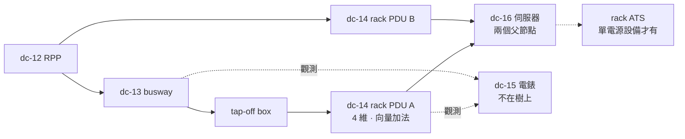

# 2026-W36 週報：電力鏈走完了，然後模型垮了

第六份週報，本週 **5 張卡**（W31 四張、W32 三張、W33 五張、W34 三張、W35 五張），五個工作日沒有空窗。

但這一週真正的事件不是產量，是**第一輪電力鏈在 9/2 走完**（`dc-01` ~ `dc-16`），然後 9/3 一開第二輪冷卻鏈，**前十六張卡建起來的那個計算模型在兩天內被拆掉了三層**：

| 日 | 卡 | 拆掉了哪一層假設 |
|---|---|---|
| 8/31 | `dc-14` rack PDU | **電流可以相加** — 線間負載要向量加法 |
| 9/1 | `dc-15` 電力監測儀表 | **量到的數字就是數字** — 值要帶誤差帶，還會 stale |
| 9/2 | `dc-16` 雙電源設備 | **每個節點一個上游** — 樹在最後一跳變成 DAG |
| 9/3 | `dc-17` 冷卻水塔 | **容量是純量** — 容量是環境的連續函數，而且電不是唯一的資源 |
| 9/4 | `dc-18` 冰水主機 | **容量是算出來的** — 互為因果，只能**解**不能算 |

W35 的母題是「容量不是一個數字」。**本週的母題更狠：容量甚至不是一個純函數。** 而且這件事是在同一週內、由後一張卡推翻前一張卡當場示範的——`dc-18` 把 `dc-17` 那張「濕球 30 °C、142%、紅燈」的表直接推翻。

---

## 本週卡片

- **[dc-14 機櫃電源 rack PDU](../devices/rack-pdu.md)** — **線間負載的電流不能相加**：L1-L2 掛 10 A、L2-L3 掛 10 A，共用的 L2 是 `√(10²+10²+10×10) = 17.32 A`，不是 20 A；而 30 A 機的 `binding` 是進線、50 A 機（AP8868）是 bank 斷路器，**同一份 code 兩個答案**。
- **[dc-15 電力監測儀表與電錶](../devices/power-meter.md)** — **精度沿感測鏈累加，而且跟取樣率完全正交**：class 0.2 的錶配 class 0.5 的 CT 是 0.7%（RSS 0.54%），在 2 MW 上是 **14 kW**；把輪詢從 5 分鐘改成 5 秒只是更頻繁地拿到同一個錯誤值。
- **[dc-16 設備端雙電源與單電源](../devices/dual-corded-equipment.md)** — **「每側 50%」是推論不是規定**，真正的約束是「單側扛得住全機櫃」；而 Dell hot spare 開著時分配是 100/0 不是 50/50，**這個設定住在 iDRAC，設施側任何一張表都沒有**。
- **[dc-17 冷卻水塔](../devices/cooling-tower.md)** — **它的出水溫是「濕球 ＋ approach」，濕球是天氣給的不是你設的**；冷水設定不變時濕球升 2 °C 容量掉一半。同時它是**第一個同時掛在電力樹與熱樹上的設備**，也是水這第二種資源的入口。
- **[dc-18 冰水主機](../devices/chiller.md)** — **真正的紅燈不是容量不足，是解出來的平衡點超過保護設定值**：WB 30 °C／2 格時冷卻水收斂在 35.8 °C，越過冷凝器進水上限 35 °C 高壓跳脫，而那一列的**容量用率看起來完全正常**。

---

## 串起來

### 一、第一輪收尾：電力鏈的最後兩跳，一跳比一跳不像樹

先把電力鏈補完。`dc-13` 的 busway 之後只剩兩跳，而這兩跳各自破壞了一個從 `dc-01` 沿用到現在的假設：



**`dc-14` 破壞的是算術。** 前十三張卡的容量計算全是加減乘除，電流沿路徑相加。北美 208 V delta 的 rack PDU 上這條不成立——插座接在線間，兩個線間負載共用一相時是向量差。**這是第一次「加總」這個動作本身需要一個模式欄位**（`wiring`），而台灣常見的 380Y/220V wye 反而回到直接相加。兩種算法都對，**錯的是不知道自己在哪一種**。

**`dc-16` 破壞的是形狀。** 前十五張建的是每個節點一個上游的樹；雙電源設備一來就是幾千個兩個父節點的葉子。`dc-10b` 的 common-ancestor 測試從「對幾台 STS 跑」變成「對每一台伺服器跑」，`dc-13` 立的前綴和要參數化成 `prefix_sum(edge, scenario)`。**樹在最後一跳變成 DAG，而 DAG 上沒有「沿路徑求值」這回事。**

**夾在中間的 `dc-15` 則根本不在樹上。** 電錶只看不供電，是掛在節點或邊上的**觀測器**。硬塞進拓撲的話每插一顆錶深度就多一層，`dc-10b` 的跳數會被污染。這條分界立完之後，CCTV、門禁讀卡機、溫濕度感測器全部跟著走標註不走拓撲——**一條規則清掉一整類設備**。

### 二、`binding` 這個問題被問了五次，五次的答案型別都不一樣

W35 把 `binding`（誰先卡住）認定為「這條電力鏈的共同回傳型別」，並在連貫性檢視 #1 要求統一 `CapacityReport`。**本週五張卡確實都用了它——然後五次都把它撐壞了一點：**

| 卡 | binding 被要求做什麼 | 型別後果 |
|---|---|---|
| `dc-14` | 在**同一台設備的四個維度**間跑（30 A 機是進線、50 A 機是 bank） | 證明 binding 是**查詢結果不是設定值** |
| `dc-15` | 輸入本身有誤差帶，而且可能 **stale** | `remaining` 要用誤差帶的**保守端**；`valid=False` 時 binding 要**跳過這一維** |
| `dc-16` | 跨 `normal` / `lose_a` / `lose_b` **三個情境**取最壞 | binding 多一個維度，而且**會讓既有數字變壞** |
| `dc-17` | 跨 **kW 與 L/min 兩種資源** | **跨資源比大小沒有意義** → `binding()` 改 per-resource 回傳 |
| `dc-18` | 值本身是**迭代解**出來的，且真正的紅燈**不是 binding** | 要 `converged` / `iterations`；`PROTECTION_TRIP_PREDICTED` 與 `OVERLOADED` **並列不可合併** |

**W35 才剛把它統一，五天內同一個型別被五次正交的擴充。** 這不是「三個人各寫各的」那種漂移（W35 的病），是**單一型別被塞進了它承載不了的語意**。`binding()` 的簽章在五天內變了三次：`Dimension` → `dict[Resource, Dimension]` → 還要跨情境取最壞 → 還要在 `converged=False` 時拒絕回綠燈。

這是下面連貫性檢視 #1 的由來，也是本週**唯一必須在 `dc-19` 動筆前處理**的事。

### 三、本週最深的一刀：容量從純函數變成不動點

前十七張卡的容量計算共用一個沒被說出來的假設：**下游不影響上游**。所以可以沿路徑求值，可以取 min，可以算前綴和。

`dc-18` 把這個假設打掉了：

```
冰機容量  依賴  冷凝器進水溫
冷凝器進水溫  由  水塔決定
水塔要排的熱  =  IT 負載 + 壓縮機功
壓縮機功  依賴  冷凝器進水溫   ← 繞回去了
```

**正回饋迴路，只能解不能算。** 把 `dc-17` 的水塔模型跟冰機模型接起來，WB = 30 °C：

```
650·x − 19500 = 1561.96 + 9.009·x
640.99·x      = 21061.96
x             = 32.86 °C
```

代回驗證：approach 2.86 K → 水塔排 1 859 kW；kW/ton 0.567 → 壓縮機 258 kW → 需排 1 858 kW ✔

**於是 `dc-17` 那張表錯了。** 它算「WB 30 °C、4 格只剩 1 300 kW、用率 142%、紅燈」，前提是冷卻水恆定 32 °C；真實系統的水溫會往上浮到排得掉為止，**收斂在 32.9 °C、綠燈**，代價只是冰機多吃 8 kW。

這件事有兩層意義。第一層是數字：**在該緊張的時候不緊張，是因為在不該緊張的時候先喊了狼**。第二層才是重點——**真正的紅燈條件被找到了，而它不長得像容量**：

| 情境 | 平衡冷卻水溫 | 容量用率 | 判定 |
|---|---|---|---|
| WB 30 °C、4 格 | 32.9 °C | 正常 | 綠燈（`dc-17` 說紅燈） |
| WB 28 °C、2 格 | 33.7 °C | 正常 | 黃燈 |
| **WB 30 °C、2 格** | **35.8 °C** | **仍然正常** | **紅燈：超過冷凝器進水上限 35 °C，高壓跳脫** |

**容量報表全綠、機器照跳。** 所以 `Finding` 需要 `PROTECTION_TRIP_PREDICTED` 這個與 `OVERLOADED` 並列的種類——**保護設定值不是容量維度**，混在一起就永遠算不出最後那一列。

反推臨界濕球（`dc-18` 加分題）得到這座機房的風險地圖：**4 格 32.1 °C / 3 格 31.1 °C / 2 格 29.2 °C**。台北極端濕球就在最後那個數字附近——**「兩格水塔同時不可用」在夏天會掉機房，四格全開則再熱都撐得住**。這三個數字是算出來的，不是誰的經驗。

### 四、第一條真正跨兩棵樹的連鎖

W35 的連鎖都在電力鏈內部往下游走。本週出現了第一條**橫向**的：

```
A 側停電（dc-16 的 lose_a）
  → 水塔某幾格的風扇／泵掉電（dc-17：水塔是電力樹的葉負載）
    → 在線格數從 4 掉到 2
      → 冷卻水平衡點從 32.9 °C 爬到 35.8 °C（dc-18 的迭代解）
        → 超過冷凝器進水上限 → 冰機高壓跳脫
          → 冰水供水溫開始爬，只剩 20 m³ 環路的 5.2 分鐘熱慣量
            → 冰機重啟又是分鐘級，且回水太熱時可能二次跳脫
```

**這條鏈上沒有任何一段是「容量不足」**，每一段都是別的東西。而它要成立，模型必須同時有：`ThermalNode.power_loads`（電→熱的橫向邊）、`scenario`（離散失效）、`env`（連續環境）、迭代求解器、保護設定值、以及 `ride_through_s`。**六樣東西裡有五樣是本週才長出來的。**

反方向也有一條，而且它接回四週前的卡：**冰機重啟是 step load**（一台 250 kW），`dc-05b` 的 ISO 8528-5 暫態性能吃的就是這種階躍。`dc-05b` 當時已經預告「冷卻鏈通常不在 UPS 後面——冰水主機、CRAH 風扇、水泵直接吃 G3 那 −15% / 4 秒的電壓包絡，`dc-18` 會回頭處理」。**本週 `dc-18` 只兌現了一半**（談了重啟時序與 step load，沒回頭對 G3 包絡與低電壓保護設定）。這筆帳記在下面的間隔複習。

### 五、時間常數差了六個數量級，而模型只有一種「掉了」

把整條鏈上的故障時間尺度排起來，本週補上的兩格讓對比第一次完整：

| 設備 | 掉了之後多久有影響 | 多久回得來 |
|---|---|---|
| [UPS](../devices/ups-double-conversion.md) | 0 ms | — |
| [STS](../devices/static-transfer-switch.md) | 4–15 ms | — |
| rack ATS（`dc-16`） | 8 ms（餘裕可能只剩 **4 ms**） | — |
| [ATS](../devices/ats-transfer-switch.md) | 百毫秒 | — |
| [發電機](../devices/diesel-generator.md) | 10 秒 | 10 秒 |
| **冷卻水塔（`dc-17`）** | **分鐘**（溫度慢慢爬） | 立刻（風扇復電即可） |
| **冰水主機（`dc-18`）** | **分鐘** | **4–15 分鐘，且可能拒絕啟動** |

**冰機是整條鏈上唯一「掉了不會馬上回來」的設備。** 前十六張卡的 `故障域` 那一格記的都是「誰跟著死」，這是空間問題；`dc-17` / `dc-18` 第一次讓它變成時間問題——**熱側的故障域必須帶一個時間常數**，而那個時間常數（`restart_time_s`）根據 Cundall 的雪梨實測**本身還是回水溫的函數**，不是設備欄位。

這就是為什麼 `CapacityReport` 那種穩態結構表達不了 ride-through，需要另一個 `TransientScenario`。**下週的 `dc-19`（泵）與 `dc-20`（儲冷槽）整個就住在這個時間軸上**——`dc-18` 算出「撐 15 分鐘需要 57 m³、將近 3 倍」的那一刻，就已經替 `dc-20` 出好題目了。

### 六、真相不在設施手上——本週的第三與第四類

`dc-15` 立了「拓撲 vs 標註」，本週又連著長出兩類，加起來是四類**都不住在設備拓撲上的事實**：

| 類別 | 立卡 | 例子 | 為什麼不能塞進拓撲 |
|---|---|---|---|
| 觀測器（標註） | `dc-15` | 電錶、CT、感測器 | 塞進去會污染 common-ancestor 跳數 |
| IT 管理平面 | `dc-16` | `psu_policy`、hot spare、power cap | **真相在 iDRAC**，會被伺服器管理員在設施不知情下改掉 |
| 站點級外生變數 | `dc-17` | 濕球、乾球、RH | 同時被四個消費者用，掛在單一設備下會複製四份且互相不一致 |
| 求解元資料 | `dc-18` | `converged` / `iterations` / `residual_k` | 它不是任何設備的屬性，是**這次計算**的屬性 |

**共同點是它們都會讓一個「看起來正常」的欄位悄悄變成謊言。** 而處置方式在本週收斂成同一套：`source` ＋ `fetched_at` ＋ TTL ＋ 過期時 `valid=False` ＋ 吐一條降級 `Finding`。`dc-15` 的 `METER_STALE`、`dc-16` 的 `PSU_POLICY_STALE`、`dc-17` 的 `ENV_STALE` 是同一個形狀出現三次——**三次之後它該是一個型別，不是三張卡各寫一次**。這條線索直接通到連貫性檢視 #2，那裡有本週最有價值的一個發現。

---

## 自我測驗

**Q1.（事實回憶）你的錶標 class 0.2，聽起來很準。為什麼這句話不構成任何保證？把 2 MW 負載下的誤差算成 kW，並說明為什麼新機房第一年更糟。**

??? note "答案"
    **因為精度沿感測鏈累加，而錶只是鏈上的一段。** IEC 61557-12 明文規定：帶外部感測器的 PMD，最終等級要把感測器的 IEC 61869-2 等級與 PMD 本身**合併**。

    ```
    最壞情況（線性相加）：0.2% + 0.5% = 0.7%
    統計合成（RSS）：    √(0.2² + 0.5²) = √0.29 ≈ 0.54%
    2 MW × 0.7% = 14 kW   ← 比兩個 6 kW 機櫃還多
    ```

    拿去跟客戶分帳的話，這 14 kW 每個月都在跑。

    **新機房第一年更糟的原因**：CT 精度等級是在**額定電流附近**定義的（IEC 61869-2 驗證點 1%/5%/20%/100%/120%）。CT 照最終滿載選，但第一年只跑得到一小部分——`400/5` 的 CT 上跑 60 A 是 **15% 額定**，落在 5%–20% 這一段，誤差比 ±0.5% 差得多。**而第一年正是最需要準確用電資料做容量規劃的時候。** 這是系統性的坑不是個案。

    **順帶一個最容易犯的錯**：想改善精度就去提高輪詢頻率。**沒用。** 精度與取樣率完全正交（Eaton 的比喻：精度是樂手唱得準不準，取樣率是你用 HD 還是 VHS 錄他）。取樣率決定你**看得到什麼事件**，精度決定你**數字有多可信**，不能互相替代。

**Q2.（事實回憶）一個機櫃日常兩側各 46.7%，儀表板全綠。另一個機櫃日常兩側各 58.4%，儀表板也全綠。為什麼第二個是紅燈？另外，如果 A 側天天貼著 93.5% 而 B 側接近零，這是故障還是設計？**

??? note "答案"
    **前半：50% 是推論不是規定。** 真正的約束只有一條——**單側必須扛得住全機櫃負載**：

    ```
    P_rack ≤ C_side
    C_side = √3 × 208 × 24 = 8 646 VA   （208 V delta、30 A 機、derated 24 A）

    8 kW 機櫃（PF 0.99 → 8 081 VA）：
      normal 每側 4 040 VA = 46.7%   failover 8 081 VA = 93.5%  ✔ 過，但沒餘裕
    10 kW 機櫃（10 101 VA）：
      normal 每側 5 050 VA = 58.4%   failover 10 101 VA = 116.8% ✘ 斷路器跳
    ```

    **日常儀表板一片綠，事故當下才發現，而冗餘設計反而造成全損。** 所以容量報表必須在 `failover` 情境下算——這是 `dc-10b`「枚舉配置取 max」從幾台 STS 推廣到每一個葉節點。

    **後半：那是設計行為，不是故障。** Dell 的 **Hot Spare** 開啟時一顆 PSU 進睡眠、幾乎全部負載壓在 active 那顆，並可用 `Primary PSU` 指定是哪一顆。同一個 8 kW 機櫃：

    | 政策 | A 側 | B 側 | failover 後 |
    |---|---|---|---|
    | 平分 | 46.7% | 46.7% | 93.5% |
    | Hot spare，primary=PSU1 | **93.5%** | ≈0 | 93.5% |

    總量一樣，設施側看到的是完全不同的兩張圖。**若整櫃伺服器都用出廠預設 `Primary PSU = 1`，A 側天天貼著 93.5% 跑，而這個事實不在設施的任何一張表裡——它在 iDRAC。**

    **對你的模型**：在追一個不存在的「不平衡故障」之前，先確認 `psu_policy` 有沒有被匯入。這是設施模型第一次必須向 IT 管理平面借欄位。

**Q3.（應用）`dc-17` 說「濕球 30 °C、4 格全開、用率 142%、紅燈」，`dc-18` 隔天說「綠燈」。誰對？把聯立解出來，並說出真正的紅燈條件是什麼。**

??? note "答案"
    **`dc-18` 對，`dc-17` 的前提錯了。**

    `dc-17` 建立在「冷卻水恆定 32 °C」的假設上，於是濕球升高只能表現成 approach 縮小、容量掉一半。但真實系統的冷卻水溫**會往上浮，直到水塔排得掉為止**；水溫一浮，冰機更耗電、排熱更多——正回饋。

    ```
    Q_tower(T) = 650 × (T − WB)                              （4 格）
    P_comp(T)  = 455 × 0.55 × (1 + 0.036 × (T − 32))
    Q_reject   = 1600 + P_comp(T)

    WB = 30：650T − 19500 = 1561.96 + 9.009T
             640.99T = 21061.96  →  T = 32.86 °C
    驗證：approach 2.86 K → 排 1 859 kW；kW/ton 0.567 → 壓縮機 258 kW → 需排 1 858 kW ✔
    ```

    **系統不會停，它停在冷卻水 32.9 °C，代價是冰機多吃 8 kW。**

    **真正的紅燈條件是「解出來的平衡點超過 `max_condenser_entering_c`」**，不是容量不足：

    ```
    WB 30、2 格：325T − 9750 = 1561.96 + 9.009T
                 315.99T = 11311.96  →  T = 35.80 °C  >  35 °C 上限  → 高壓跳脫
    ```

    **而那一列的容量用率看起來完全正常**——水塔「排得掉」1 877 kW，數字上不算超載。**容量報表全綠、機器照跳。**

    **對你的模型**：(a) `CapacityReport` 要有 `converged` / `iterations` / `residual_k`，不收斂的報表必須能明講自己不收斂，而不是吐一個看起來很正常的數字；(b) **保護設定值與容量維度分開存**，`Finding` 要有 `PROTECTION_TRIP_PREDICTED`，與 `OVERLOADED` 並列不可合併。

**Q4.（應用 · 建模）A 側停電，`lose_a`。這一側供電的兩格水塔風扇跟著掉，當天濕球 30 °C。會發生什麼？你的模型要有哪些東西才算得出這個答案？**

??? note "答案"
    **會掉機房，而且原因不在電力側也不在水塔的容量上。**

    ```
    lose_a → 在線格數 4 → 2
           → 解聯立：T_cw = 35.8 °C
           → 超過冷凝器進水上限 35 °C → 冰機高壓跳脫
           → 冰水供水溫開始爬，只剩 20 m³ × 4.186 × 6 K / 1600 kW = 314 s ≈ 5.2 分鐘
           → 冰機重啟是分鐘級，且回水太熱時可能二次跳脫（Cundall 雪梨實測）
    ```

    **這條鏈上沒有任何一段是「容量不足」。** 電力側掉的是幾格風扇（幾十 kW，在電力報表上微不足道）；水塔的熱容量報表也不會紅；冰機的容量用率正常。紅的只有一個保護設定值。

    **模型需要六樣東西，其中五樣是本週才長出來的：**

    1. **`ThermalNode.power_loads: list[device_id]`**（`dc-17`）——電→熱的橫向邊。沒有它，電力側的 `lose_a` 根本傳不到熱側。
    2. **`scenario`**（`dc-16`）——`normal` / `lose_a` / `lose_b`，離散失效情境。
    3. **`SiteEnvironment.wet_bulb_c`**（`dc-17`）——站點級外生變數，不是掛在某台水塔下的遙測點。
    4. **迭代求解器 ＋ `converged`**（`dc-18`）——`T_cw` 是解出來的。
    5. **`max_condenser_entering_c` 與容量維度分開存**（`dc-18`）——否則最後那一列永遠算不出來。
    6. **`ride_through_s(loop_volume, allowed_dt, load, pumps_on_ups, restart_time)`**（`dc-18`）——橫跨冰機／泵／儲槽／UPS 四類設備，`CapacityReport` 這種穩態結構表達不了，要 `TransientScenario`。

    **最容易漏的是第 6 樣的 `pumps_on_ups`**：那 20 m³ 的熱慣量只有在水還在流的時候才送得到機房。**有儲量不等於送得到**——這正是明天 `dc-19`（冰水泵）要查證的事。

**Q5.（建模判斷）本週產生了四種 `Finding`：`OVERLOAD_ON_FAILOVER`、`PROTECTION_TRIP_PREDICTED`、`UNDERLOADED`、`METER_STALE`。W34 立過一條規則「`Finding` 不得有 `acked`——它是設計期事實，不會被人『知道了』就消失」。這條規則還成立嗎？**

??? note "答案"
    **對前三個成立，對第四個不成立，而這個裂縫是本週最重要的建模發現。**

    先分類。四者其實橫跨了**兩個正交的軸**：

    | | 方向 | 生命週期 | 例子 |
    |---|---|---|---|
    | 超出上界 | 要**減少**負載 | **靜態**（改設計才會消失） | `OVERLOAD_ON_FAILOVER` |
    | 保護跳脫 | 要**改設定或加設備** | **靜態** | `PROTECTION_TRIP_PREDICTED` |
    | 低於下界 | 要**減少在線設備**（方向相反！） | **靜態** | `UNDERLOADED` |
    | 資料品質 | 要**修通訊／補資料** | **暫態**（錶一回來就自己消失） | `METER_STALE` / `ENV_STALE` / `PSU_POLICY_STALE` |

    **前三列證明 `severity` 不夠用。** `UNDERLOADED`（`dc-18`：三台冰機並聯跑 136 RT，每台 18% < 最小負載 25–30% → surge 或熱氣旁通純燒電）跟 `OVERLOADED` 可能同為 `WARNING`，但**處置方向完全相反**。`PROTECTION_TRIP_PREDICTED` 與 `OVERLOADED` 同理，`dc-18` 明寫兩者並列不可合併。→ **`Finding` 需要 `kind`，而不是只有 `severity`。**

    **第四列才是裂縫。** `METER_STALE` 既不是設計期事實（錶修好就消失，沒有人要「改設計」），也不是設備告警（設備本身好好的，是**我的資料**壞了）。W34 立的 `Alarm` / `Finding` 二分在這裡不夠用——**它是第三類：資料品質旗標。**

    後果很實際：如果照 W34 的規則把 `METER_STALE` 做成不可 ack、不會自己消失的 `Finding`，那麼一次網路抖動就會在報表上留下一條永遠清不掉的紅字，最後有人會去加一個「清除」按鈕——**然後那個按鈕遲早會被用在真正的設計期 Finding 上**，W34 防的那件事就從後門回來了。

    **建議**：`Finding` 加 `lifecycle: Literal["static", "transient"]`，並讓 `acked` 這個欄位**只在 `transient` 上存在**（型別層擋掉，見連貫性檢視 #2）。W34 那條規則不是錯的，是**它的前提沒被寫下來**——這正是 W35 立的判準「當同一個欄位在兩種情況下一個是必要、一個是謊言時，模式必須先被記錄」的第四次應用。

---

## 間隔複習

依 index 預告，本週抽 **W34**（兩週前）與 **W32**（四週前，第二次）。

| 週次 | 抽兩週前 | 抽四週前 |
|---|---|---|
| W34 | W32 的 `dc-05c` ✅ | 尚無 |
| W35 | W33 的 `dc-07b` ✅ | W31 的 `dc-03b` ✅ |
| **W36（本週）** | **W34 的 `dc-10` ✅** | **W32 的 `dc-05b` ✅（第二次抽 W32）** |
| W37 | W35 的卡（`dc-11` ~ `dc-13`） | W33 的卡（第二次） |

### 抽 W34 的 [dc-10 靜態切換開關 STS](../devices/static-transfer-switch.md)（2026-08-20，17 天前）

**Q. 兩週前你學過：STS 的 `transfer_time_ms` 不能是設備欄位，因為它是 `algorithm × line_hz × downstream_has_transformer × load_pct` 的函數。本週 `dc-16` 的機櫃級 rack ATS 標 8 ms。這是同一件事嗎？兩者在 schema 上該長出一樣的東西嗎？**

??? note "答案"
    **是同一個病，但本週那張卡多帶了一個更難處理的東西：名字本身在說謊。**

    **相同的部分**——兩者的「餘裕」都被同一組不在設備身上的變數吃掉：

    ```
    dc-10（設施級 STS）：18 ms（WP 62 實測重載 SMPS）
      60 Hz + POG（1/4 cycle）：18 − 4.17  = 13.83 ms
      50 Hz + VSS（3/4 cycle）：18 − 15.00 =  3.00 ms   ← 剩 21.7%

    dc-16（機櫃級 rack ATS）：APC AP4423 典型 8 ms
      滿載 hold-up 20 ms：20 − 8 = 12 ms
      負載 90% 時 hold-up 12 ms：12 − 8 = 4 ms          ← 而 failover 正好發生在負載最高時
    ```

    兩邊都是「型錄數字看起來很寬裕，三個變數一起往壞的方向走就剩零頭」，也都**沒有任何監控看得到那 3 ms 或 4 ms**。

    **不同的部分，也是本週的新東西**：`dc-10` 的問題是「一個數字被當成常數」，`dc-16` 的問題是「**兩個數量級不同的東西共用一個名字**」——

    | 來源 | 說法 |
    |---|---|
    | EPC Energy | 接觸器式 ATS 約 **100–500 ms**；「UPS 下游放 ATS 餵伺服器，不是保護它們，是重開它們」 |
    | Schneider/APC | 機櫃級 AP4423 掛 "ATS" 名，實測典型 **8 ms** |
    | TRG Datacenters | 行銷文案只寫 "seamless"，不給數字 |

    **兩邊都沒錯。** 設施級 ATS（[dc-04](../devices/ats-transfer-switch.md)，UL 1008）與機櫃級「ATS」是不同的東西共用一個名字。

    **schema 後果**：`dc-10` 需要的是「把常數換成函數」；`dc-16` 需要的是**在那之前先把型別分開**——`device_role == "ats"` **推不出**轉換時間，所以 `transfer_time_ms` 必須是**實測或型錄值**並帶出處，且 `redundancy_class` 的中間態 `single_corded_on_ats` 要標記 **rack ATS 是拓撲上的新節點**（不像 [dc-15](../devices/power-meter.md) 的電錶是標註）——它是那台設備的新共同祖先，故障域要把它算進去。

    **一句話**：`dc-10` 教的是「別把函數存成欄位」，`dc-16` 補的是「**別把名字當型別**」。

### 抽 W32 的 [dc-05b 發電機起動時序與暫態性能](../devices/genset-start-and-transient.md)（2026-08-05，32 天前）

**Q. 四週前那張卡在正文裡留了一句「`dc-18` 會回頭處理」。它指的是什麼？本週的 `dc-18` 兌現了嗎？**

??? note "答案"
    **指的是這一段，而本週只兌現了一半——這是一筆要記下來的欠帳。**

    `dc-05b` 原文：ISO 8528-5 的 **G3 允許電壓掉到 −15% 並花 4 秒恢復**。IT 負載有 UPS 擋著看不到；但**冷卻鏈通常不在 UPS 後面**——冰水主機、CRAH 風扇、水泵直接吃這 4 秒。壓縮機低電壓保護的動作範圍與這個包絡有重疊，所以**「G3 合規」不等於「切換時冷卻不會跳」**，必須拿實際的保護電驛設定去對，不能推論。

    **`dc-18` 兌現的部分**：
    - 確認冰機**不在 UPS 上**，停電後要走完重啟程序（10–15 分鐘，新機種 4–5 分鐘）
    - 找出比重啟計時器更麻煩的東西：Cundall 雪梨 L4 實測顯示**回水溫爬太高時冰機重啟後蒸發器過壓、幾分鐘內二次跳脫** → `restart_time_s` 不能是欄位，要是 `restart(return_water_temp, attempt_n)` 且必須能回傳「重啟會失敗」
    - 反方向也接上了：冰機重啟是 **step load**（一台 250 kW），`PowerLoad` 要有 `startup_profile`（步階大小、允許延遲、可否分批），而這正是 `dc-05b` 的 BMEP 步階要吃的東西

    **沒兌現的部分**：**沒有回頭把 G3 的 −15% / 4 秒包絡對上冰機的低電壓保護設定**。`dc-18` 談的是「停電後怎麼回來」，`dc-05b` 問的是「**切換的那 4 秒會不會直接把它打掉**」——後者更早發生，而且如果它成立，「停電後怎麼回來」這個問題**每次市電切換都會發生一次**，不只在真的停電時。

    **兩個相關但獨立的驗收條件**，正是 `dc-05b` 自己立的那條規則的又一個實例（`iso8528_class` 與 `nfpa110_type` 必須是兩個獨立欄位，合成一個「等級」會讓驗收無法追溯）。

    **行動**：`dc-19`（泵）與 `dc-22`（CRAH）會再碰到同一件事——它們也在發電機後面、也有低電壓保護。**建議在 `dc-19` 的「該問 facility 的問題」裡就地補上這一問**，不要等到第二輪結束。順帶檢查 `dc-05b` 那張卡的 `related` 有沒有把 `dc-17` / `dc-19` / `dc-22` 加進去。

---

## 本週的 model code 連貫性檢視

先結算 W35 的六項優先序。

| W35 優先序 | 項目 | 狀態 |
|---|---|---|
| 1 | `Finding` 定義 ＋ `validate()` 改回 `list[Finding]` | ✅ **做了**：`dc-14` 的動手練習定義了 `Finding`，`dc-15` / `dc-16` / `dc-17` / `dc-18` 四張卡全程用它，沒有一張退回 `list[str]`。**W35 的預測「不做的話 dc-14 會照抄」被主動避免了** |
| 2 | `CapacityReport` 統一 | ✅ **做了**，但見 #1 —— **統一之後五天內被五次正交擴充** |
| 3 | `continuous_factor` 收成一份 | 🔴 **未做**。本週五張卡都沒碰電力側的降載，所以沒有惡化，但也沒清 |
| 4 | `Breaker` / `Panelboard` 合併（`load_kw` 遺失） | 🔴 **未做**，`dc-11` 的不平衡計算仍是壞的 |
| 5 | W34 #1 `energy_kwh()` 改名 | 🔴 **未做，連續第三週掛第一順位**。10 分鐘 |
| 6 | `Constraint` 基數分類 | ⚠️ **決定不走**（`dc-14` 沒採用），但 `dc-14` 的確帶來了第五種基數（同一 bank 內的向量和）。這個決定要明寫下來，不然下次又會重新討論一次 |

**W34/W35 那條規律第三次成立**：**寫成可貼 code 的建議會被採納，需要跨卡重構的不會。** 第 1、2 項是 W35 附了完整 dataclass 的，兩項都在隔一個工作日就被 `dc-14` 實作掉；第 3、4、5 項是「去改某某地方」，一項都沒動。**所以下面同樣全部寫成可貼的 code。**

本週新增六處，前兩處是紅的。

### 🔴 1. `CapacityReport` 被五次正交擴充，它已經不是一個型別而是三個

W35 統一出來的形狀是「一個實體、一組維度、取最小的那一維」。本週五張卡各加了一層，而**這五層互相正交**：

```python
dc-14: dims = [input_current, bank, outlet, rack_u]      # 多維
dc-15: Dimension.method="measured" + valid + Bound       # 值有誤差帶、會 stale
dc-16: 每一維 × scenario(normal|lose_a|lose_b)           # 離散情境
dc-17: Dimension.resource + unit；limit(env)；binding() -> dict[Resource, ...]
dc-18: converged / iterations / residual_k；lower_limit  # 值是解出來的、還有下界
```

**問題不是「欄位變多」，是三件事被塞進了同一個 dataclass**：

1. **一次求值的結果**（某資源、某維度、在某情境某環境下的剩餘量 ＋ 它的出身）
2. **一次求解的元資料**（收斂了嗎、迭代幾次、殘差多少）——**這不是任何設備的屬性**
3. **一次判定**（誰先卡住、是不是紅燈、紅在哪一種）——而 `dc-18` 證明紅燈**可能不來自任何維度**（保護跳脫）

於是 `binding()` 的簽章在五天內改了三次，且現在同時要：跨情境取最壞、跨資源不比較、`valid=False` 時跳過、`converged=False` 時拒絕回綠燈。**一個 method 扛四條規則，而且沒有一條寫在型別上。**

**收斂建議**（可直接貼，約 30 分鐘；`dc-19` 動筆前做完）：

```python
from dataclasses import dataclass, field
from typing import Literal

Resource   = Literal["power_kw", "power_a", "water_lpm", "thermal_kw", "space_u", "count"]
Source     = Literal["nameplate", "measured", "curve"]          # 值從哪來
Algorithm  = Literal["direct", "vector_sum", "prefix_sum",      # 怎麼算的
                     "pole_count", "outlet_count", "measured_125pct", "solve"]
Scenario   = Literal["normal", "lose_a", "lose_b"]
FindingKind = Literal["OVER_UPPER", "UNDER_LOWER", "PROTECTION_TRIP", "DATA_QUALITY"]

@dataclass(frozen=True)
class EvalContext:
    """★ dc-16 的 scenario 與 dc-17 的 env 是同一件事的兩半，合成一個。
    這是讓兩棵樹真的接起來的那個型別：lose_a 要能傳播成熱側的格數變化。"""
    scenario: Scenario = "normal"
    wet_bulb_c: float | None = None
    mode: Literal["mechanical", "free_cooling"] | None = None
    env_valid: bool = True          # RH 感測器失效 → 退回設計濕球並降級

@dataclass(frozen=True)
class Dimension:
    name: str
    resource: Resource
    unit: str
    remaining: "Bound | None"       # ★ 統一回 Bound（點值＝Bound(x,x)），見 #4
    used_pct: float | None
    source: Source                  # ★ 從 Method 拆出來的第一半
    algorithm: Algorithm            # ★ 第二半
    lower_limit: float | None = None    # dc-18：冰機最小負載，違反時方向相反
    valid: bool = True

@dataclass(frozen=True)
class Solve:
    """★ 求解元資料不是設備屬性，也不是維度屬性，是這次計算的屬性。"""
    converged: bool = True
    iterations: int = 0
    residual_k: float = 0.0

@dataclass(frozen=True)
class Assessment:
    """一個實體、在一個 EvalContext 下、跨所有資源的完整判定。"""
    entity_id: str
    ctx: EvalContext
    dims: list[Dimension]
    solve: Solve = field(default_factory=Solve)
    findings: list["Finding"] = field(default_factory=list)

    def binding(self) -> dict[Resource, Dimension]:
        """per-resource（dc-17：kW 不能跟 L/min 比）。
        跳過 valid=False 的維度；solve.converged=False 時一律不得回綠燈。"""
        ...

    @staticmethod
    def worst(*assessments: "Assessment") -> "Assessment":
        """跨 EvalContext 取最壞（dc-16 的三情境）。"""
        ...

    @staticmethod
    def chain_min(*assessments: "Assessment") -> dict[Resource, tuple[float, str]]:
        """沿鏈取 min，回 (剩餘, 是誰卡住)。dc-13 的加分題到現在還沒被寫出來。"""
        ...
```

**為什麼第一順位**：`dc-19`（泵）會同時帶來**流量（L/min）、揚程（m）、電力（kW）三種資源**，且泵在 UPS 上與否直接改變 `dc-18` 的 `ride_through_s`——**它會是第六個實作者，而且是第一個把兩棵樹的資源綁在同一台設備上的**。現在拆成本 30 分鐘；`dc-19` 寫完再拆就是六張卡一起改。

### 🔴 2. `Finding` 只有 `severity`，但本週證明它至少還需要 `kind` 與 `lifecycle`

W35 定義的 `Finding` 是：

```python
Finding(id, policy_id, severity: CRITICAL|WARNING|INFO, entity_ids, message, computed_at)
# 且明訂：不得有 acked —— Finding 是設計期事實
```

本週產生的 `Finding` 有六種，**它們在兩個軸上分岔**（自我測驗 Q5 的表）：

```
方向軸：OVER_UPPER（減負載）／ UNDER_LOWER（減在線設備，方向相反）
        ／ PROTECTION_TRIP（改設定或加設備，且不來自任何維度）
生命週期軸：static（改設計才消失）／ transient（錶一回來就自己消失）
```

**`severity` 表達不了任何一個。** `UNDERLOADED` 與 `OVERLOADED` 可以同為 `WARNING` 而處置相反；`PROTECTION_TRIP_PREDICTED` 在 `dc-18` 明寫**不可併進 `OVERLOADED`**。

**而 `lifecycle` 那條是本週最重要的發現**：`METER_STALE`（`dc-15`）／ `PSU_POLICY_STALE`（`dc-16`）／ `ENV_STALE`（`dc-17`）**同一個形狀出現三次**，且它們既不是設計期事實也不是設備告警——是**資料品質**。照 W34 的規則把它們做成不可 ack 的 `Finding`，一次網路抖動就留下永遠清不掉的紅字，最後有人會加一個「清除」按鈕，**而那個按鈕遲早會被用在真正的設計期 Finding 上**——W34 防的那件事從後門回來。

**收斂建議**（可直接貼，約 20 分鐘）：

```python
@dataclass(frozen=True)
class Finding:
    id: str
    policy_id: str
    kind: FindingKind                     # ★ 方向／種類，決定處置
    severity: Literal["CRITICAL", "WARNING", "INFO"]
    lifecycle: Literal["static", "transient"]   # ★ 決定它會不會自己消失
    entity_ids: list[str]
    ctx: EvalContext                      # ★ 「在哪個情境下成立」本身就是結論的一部分
    message: str
    computed_at: str

    def __post_init__(self):
        # W34 的規則保留，但把它的前提寫成型別：
        #   static 的 Finding 不得被 ack；只有 transient 的資料品質旗標可以
        if self.lifecycle == "static" and self.kind == "DATA_QUALITY":
            raise ValueError("資料品質旗標必須是 transient")

@dataclass
class DataQualityFlag(Finding):
    """lifecycle 固定 transient、kind 固定 DATA_QUALITY 的子型別。
    唯一可以有 acked/suppressed_until 的一種。"""
    acked: bool = False
    suppressed_until: str | None = None
```

**`ctx` 那個欄位不要省**：`OVERLOAD_ON_FAILOVER` 只在 `lose_b` 下成立，`PROTECTION_TRIP_PREDICTED` 只在 WB 30 °C ＋ 2 格下成立。**沒有 `ctx` 的 Finding 三個月後沒有人知道它為什麼曾經是紅的**，跟 W35 記過的「210.6 kVA 是哪來的」是同一個病。

### 🔴 3. `dc-16` 的驗收表有一個算錯的數字，而它會讓實作跑不過

`dc-16` 的驗收表寫：

```
| 10 kW 同上 | `normal` 50.5% 綠燈，但 `binding()` 回 116.8% 並吐 OVERLOAD_ON_FAILOVER |
```

**`normal` 那個 50.5% 是錯的，正確是 58.4%。**

```
10 kW / PF 0.99 = 10 101 VA
C_side = √3 × 208 × 24 = 8 646 VA
normal 每側 = 5 050 / 8 646 = 58.4%          ← 不是 50.5%
failover    = 10 101 / 8 646 = 116.8%  ✔     ← 這個是對的
```

自我一致性檢查很簡單：**failover 恰好是 normal 的兩倍**，116.8 / 2 = 58.4。同卡的 8 kW 那列（46.7% / 93.5%）就是這個關係，**只有 10 kW 這列破了**。50.5% 大概是把分母誤用成 10 kVA 而非單側 derated 容量 8 646 VA。

**影響**：這是驗收表，**照它寫測試會直接紅**。而且它剛好落在最不該錯的地方——那一列的教學重點正是「normal 看起來還好」，58.4% 比 50.5% 更能撐住這個論點（它離 50% 更遠卻仍然綠燈）。

**動作**：改 `dc-16` 卡片那一格為 `58.4%`，並在 `Assessment` 的測試裡加一條**不變式**：`used_pct(lose_b) == 2 × used_pct(normal)`（平分政策下）。**這條不變式本身就能自動抓出這類錯誤**，比逐格核對可靠。

> 順帶一提，這是本軌跡第一次由週報而非隔天的卡片抓到數字錯誤。W35 的自我修正（0.80 被修正兩次）是下一張卡發現上一張卡；本週的 `dc-18` 推翻 `dc-17` 也是。**這次是橫向核對抓到的**——`8 kW` 與 `10 kW` 兩列的關係不一致。**建議把「同卡內數字的自我一致性」加進 `dc-daily-card` 的收尾檢查。**

### 🟡 4. `Bound` 與 `Dimension.remaining: float | None` 打架

```python
dc-15: Reading.band() -> tuple[float, float]；「remaining 用 band() 的保守端，不是中央值」
dc-17: CoolingTowerCell.capacity_kw(...) -> Bound      # 直接回 Bound
dc-14: Dimension.remaining: float | None               # 仍是純量
```

**同一個欄位，一張卡說它是保守端純量、一張卡說它是區間。** 而 `dc-17` 的 `Bound` 是 W33 立、`dc-10c` 首次使用的那個值物件（`Angle(deg, kind)`），現在被用在第二個地方卻沒有統一定義。

**收斂建議**：`remaining` 一律是 `Bound`，點值寫成 `Bound(x, x)`。理由是**「保守端」是消費端的決策不是儲存端的**——容量規劃要保守端，容量**報告**要中央值 ± 誤差，兩者都要用到同一筆資料。先把區間存下來，`conservative()` 是查詢：

```python
@dataclass(frozen=True)
class Bound:
    lo: float
    hi: float
    kind: str = "scalar"            # 沿用 dc-10c：不同 kind 之間比較 → TypeError
    def conservative(self) -> float: return self.lo      # 剩餘量取下界
    def mid(self) -> float: return (self.lo + self.hi) / 2
```

**驗收**：`dc-15` 那條「量到 1000 kW、上限 1200 kW → remaining = 1200 − 1007 = 193，不是 200」要能直接跑出來。

### 🟡 5. `Method` 混了兩件正交的事，而它已經長到 8 個值

```
W35 定義：nameplate | measured_125pct | pole_count | prefix_sum | outlet_count
dc-14 加：vector_sum
dc-15 加：measured
dc-17 加：curve
```

**`nameplate` / `measured` / `curve` 是「值從哪來」；`vector_sum` / `prefix_sum` / `pole_count` / `outlet_count` 是「怎麼算的」。** 兩者正交：可以有「用廠商曲線查出來的容量，再用前綴和沿 busway 累加」。硬塞成一個 Literal，遲早出現 `curve_prefix_sum` 這種複合值。

**收斂建議**：拆成 `source: Source` 與 `algorithm: Algorithm` 兩欄（已寫進 #1 的 code）。**5 分鐘，純機械，趁 `dc-19` 之前做。**

### 🟡 6. 方法命名第三次漂移

```python
dc-12: Rpp.headroom(method)        -> dict
dc-13: Busway.free_capacity()      -> dict
dc-14: RackPdu.capacity()          -> CapacityReport     ← W35 統一到這個
dc-17: CoolingTowerCell.capacity_kw(env, cold_water_c, mode) -> Bound   ← 又開一個
```

`dc-17` 的 `capacity_kw()` 帶單位後綴、回 `Bound` 而非報表、且參數是散的（`env`、`cold_water_c`、`mode` 三個）。

**收斂建議**：統一成 `assess(ctx: EvalContext) -> Assessment`，單位活在 `Dimension.unit` 裡不進方法名（否則水塔會需要 `capacity_kw()` ＋ `capacity_lpm()` 兩個方法，而它們回的是同一份報表的兩個維度）。`cold_water_c` 與 `mode` 進 `EvalContext`。**10 分鐘。**

---

> **優先序**
>
> 1. **#1 `Assessment` / `EvalContext` 拆分** — 30 分鐘，**必須在 `dc-19` 之前**。泵會帶來第三種資源（揚程 m）並把 `ride_through_s` 綁進來，是第一個橫跨兩棵樹資源的設備。
> 2. **#2 `Finding` 加 `kind` / `lifecycle` ＋ `DataQualityFlag`** — 20 分鐘。`*_STALE` 已經出現三次，第四次（`dc-19` 的泵狀態）就在下週。
> 3. **#3 改掉 `dc-16` 驗收表的 50.5% → 58.4%，並加不變式測試** — 5 分鐘，**這是本週唯一一個已經錯了的數字**。
> 4. **#5 `Method` 拆 `source` × `algorithm`** — 5 分鐘，跟 #1 一起做等於免費。
> 5. **#4 `Bound` 統一** — 15 分鐘。
> 6. **#6 方法名收斂成 `assess(ctx)`** — 10 分鐘，跟 #1 一起做。
> 7. **W35 #5 / W34 #1 `energy_kwh()` 改名** — **連續第三週掛在第一順位卻沒做。10 分鐘。** 它仍然是整個模型裡唯一會產生錯誤數字的既有項目（`aggregate_energy()` 誤用 usable 會小 20%，剛好足以讓 725 kWh 看起來像 580 kWh 而通過 600 kWh 那道 NFPA 855 閘門）。**若這週再不做，建議直接把它降級成「已知缺陷」寫進 `topic-01`，不要再掛在優先序上假裝要做。**
> 8. W35 #3 `continuous_factor` 收一份、W35 #4 `Breaker`/`Panelboard` 合併 — 電力鏈已經走完，這兩項不會再惡化，但 `dc-11` 的不平衡計算**現在是壞的**。

---

## 本週該問 facility 的問題

五張卡共提出 15 個問題，去重後選 3 個**下週真的拿去問人**的。挑選標準沿用前五週：「**現在問還來得及改，晚問就固化了**」。本週三題全部落在冷卻鏈，因為第二輪剛開，而冷卻的設計決策比電力晚定案——**這是唯一還有得問的窗口**。

### Q1 — 問 **機電設計單位 ＋ 冰機供應商**（⚠️ 決定儲冷槽要買多大，是採購決策）

> **「冷凝器進水溫上限與蒸發器低溫保護的設定值各是多少？出廠值有沒有被現場改過？另外，停電後的重啟時序是什麼——誰先起、間隔多久？回水太熱時機器會拒絕啟動還是啟動後二次跳脫，實測過沒有？」**

**為什麼是第一題**：這一問決定本週算出來的**臨界濕球風險地圖**（4 格 32.1 °C / 3 格 31.1 °C / 2 格 **29.2 °C**）是真的還是我瞎猜的——那張表整個建立在「冷凝器進水上限 35 °C」這個**常見典型值**上，而各機型不同。若真值是 33 °C，2 格的臨界濕球會掉到台北夏天的日常區間；若是 38 °C，整張表的緊張度完全不同。

**第二問（重啟）決定儲冷槽尺寸，而那是要花錢的**：現況 20 m³ 環路只撐 **5.2 分鐘**，要撐 15 分鐘需要 **57 m³**，將近 3 倍。而 15 分鐘這個數字本身就取決於重啟時序——Climaveneta 口徑是 10–15 分鐘、新機種 4–5 分鐘；Cundall 2026-07 的雪梨 L4 實測則說**重啟計時器不是重點，回水溫太高會讓它重啟後蒸發器過壓、幾分鐘內二次跳脫**。**兩種說法差的不是數字是型別**（常數 vs 條件函數），而儲冷槽買小了就補不回來。

**追一句**：「**冰水泵在 UPS 上嗎？**」——熱慣量的整個計算建立在水還在流的前提上。**有儲量不等於送得到。** 這一問明天寫 `dc-19` 時必問，先探路。

### Q2 — 問 **機電設計單位 ＋ 水塔供應商**（⚠️ 設計基礎，且性能曲線是免費文件）

> **「設計濕球用的是哪個數字、哪一年的氣象資料、哪個百分位（0.4% / 1% / 2%）？站址有沒有做過熱氣再循環修正？另外，水塔的廠商性能曲線（cold water temp vs 濕球 vs 水量）拿得到嗎？」**

**為什麼第二**：本週所有冷卻鏈的數字——容量表、平衡點、臨界濕球——**全部建立在「台北夏季設計濕球 28 °C」這個佔位數字上**，而 `dc-17` 已明標**未查證、不要直接引用**。這一問是整條冷卻鏈的地基。

**性能曲線那半是零成本高報酬**：`dc-17` 用的「容量係數 = approach 比值」是**一階線性近似**，卡片裡已經明寫不可用於設計或驗收。h2ocooling 明說廠商會為每個機型與水量發布性能曲線。**拿到曲線就能把 `Method.curve` 那條路接上**，整條冷卻鏈的數字從「理解方向與量級」升級成「可以拿去對驗收」。要不到的話，我存的那個銘牌數字**一年裡大概只有幾小時是對的**。

**追一句**：「**補水從哪來？斷水時盆內存量撐幾分鐘？排污有沒有排放許可的水量／水質上限？**」——水是本週新增的第二種資源，這三問一起決定它的容量維度長什麼樣（補水管流量上限、盆存量 ride-through、廢水許可上限、COC 設定值）。COC 從 3 拉到 6 可以讓補水降 20%（71.6 → 57.2 L/min），但那是**控制設定值不是設備屬性**，要跟水處理談。

### Q3 — 問 **伺服器／IT 團隊 ＋ 維運**（⚠️ 跨團隊，且 commissioning 前盤點越早越好）

> **「機櫃內伺服器的 PSU 冗餘政策是什麼？hot spare 開著嗎？primary PSU 是哪一顆？另外，現場有多少單電源設備、各接在哪裡、有沒有 rack ATS、型號與標稱轉換時間多少？」**

**為什麼是唯一一題電力側的**：因為它**問的對象不是 facility**。`psu_policy` 的真相在 iDRAC，設施側任何一張表都沒有——這是 `dc-16` 立的「設施 vs IT 管理平面」分界。**這一問可能要兩邊一起問，而這種跨團隊的問題最容易一直沒人問。**

**它決定你的 A/B 平衡報表是不是在報一個不存在的問題**：hot spare 開著時分配是 100/0 不是 50/50，A 側天天貼著 93.5% 跑是**設計行為**。若不知道這件事，會有人去追一個不存在的故障；反過來，若整櫃預設 `Primary PSU = 1` 而沒人知道，failover 演練的結果會跟預期完全不同。

**後半的單電源盤點是時效問題**：EPC 指出「Tier III 設計為了省錢砍掉 STS，後來才發現三分之一的機櫃是單電源」。**這個盤點越早做越好**，而且它剛好是 `dc-16` 加分題的產出——對整個機房跑一次 `check_path_independence()`，統計有多少台設備的獨立性只到 rack PDU 層。**那個數字就是進 commissioning 前最該修的清單。**

### 這週沒選上、但別忘記的

- **「對外報的 PUE 是 category 幾？量測點在哪顆錶上？用 ISO/IEC 30134-2 還是 Green Grid 的定義？」** 第三問決定要不要做連續量測——Green Grid Level 3 是一年 ≥ 35 040 個資料點，ISO 可以是 12 個，**遙測系統的儲存與輪詢設計差一個數量級**。而 PUE₁ 與 PUE₂ 在同一座機房就差 0.04–0.05，沒寫 category 的數字不合規也不可比。
- **「每顆錶的 CT 變比與精度等級表給我；初期負載下這些 CT 實際跑在額定的百分之幾？」** 後半是殺手——CT 照滿載選，我讀它時機房是空的（15% 額定已落在 class 定義點之外）。
- **「Demand 用 fixed block 還是 rolling？區間幾分鐘？跟台電帳單的計費區間對得上嗎？」** 同一批原始資料，fixed block 報 750 kW、rolling 報 1000 kW，**差 33%**。
- **「機櫃內是 208 V line-to-line（delta）還是 220 V line-to-neutral（wye）？rack PDU 型錄給我。」** 這一問決定容量計算用哪套算法，答錯**整個機房的每相電流都是錯的**。
- **「rack PDU 的分路斷路器幾個、額定多少？進線導體線規多少？」** 同一顆 CS8365C 插頭依內部斷路器數量有 35 A 與 40 A 兩個正確答案，型錄封面上不會有。
- **「冰機的最小負載多少？低負載靠變頻還是熱氣旁通？運轉策略是輪流開一台還是全部並聯？」** 決定 `min_load_pct` 與 `RedundancyPolicy` 怎麼填——**這是第一個「加冗餘反而讓事情變糟」的案例**。
- **「水塔的清洗／檢驗排程照哪一套？」** 美規（ASHRAE 188 口徑，每 90 天培養檢驗）與台灣業界指引（每年至少一次、高風險半年一次）**差一個數量級**。不要把美規排程硬編進工單系統。
- **`dc-05b` 欠的那一問（見間隔複習）**：「**冰水主機、冷卻水泵、CRAH 接在 UPS 後面還是直接吃發電機？它們的低電壓保護設定多少伏、延時多久？對上 G3 的 −15% / 4 秒包絡會不會每次切換都跳？**」建議在 `dc-19` 就地補上。
- **前幾週留下、仍未問的**：鋰電室樓板承重上限（W33 起掛著）、off-gas 偵測器清單、STS 波形記錄保存期、盤體 80% vs 100% rated 與外殼列名、STS 上游兩台變壓器的向量組。

---

## 節奏

**5 張卡 / 5 個工作日，零空窗**，是 W33、W35 之後第三次滿週，而且是**第一次沒有補寫**（W35 是 8/25、8/26 空窗後靠 8/27、8/28 各補兩張追回來的）。

**W35 記下的機制性教訓奏效了**：「拆卡的當下必須同時往 `backlog.md` 插入新項目」。本週五張卡沒有一張需要拆，`backlog` 也沒有出現指向不存在卡片的連結。

**字數全部落在舒適區上緣**：9457 / 9994 / 9552 / 9916 / 9998 字元，五張全在 9400–10000 之間、全部貼著 10000 上限。這值得記一筆——**連續五張都逼近上限，代表 10000 這個上限已經是實質約束而不是安全網**。`dc-17` 初稿 10231、`dc-18` 也是靠壓縮收進來的。若之後某張卡的主題本來就大（`dc-22` CRAH、`dc-26` 液冷 CDU 都有這個風險），**應該一開始就規劃拆成兩張，不要寫完再壓**。

**沙箱環境**：本週發現 `.git/HEAD.lock` 從 **9/4 08:20** 起殘留（`dc-18` 那次排程留下的），本次週報開工時清掉。CLAUDE.md 記的「每支排程 skill 開工前與收工後都要 `rm -f .git/*.lock`」**顯然沒有被 `dc-daily-card` 執行**——它留了三天沒被清，期間如果使用者在本機下過 git 指令就會被擋。**建議把清 lock 這件事從 SKILL 的文字提醒改成 skill 的第一個與最後一個動作，並在週報固定檢查一次。**

---

## 下週

- **佇列下一張：`dc-19` 一次側／二次側冰水泵。** `dc-18` 的 ride-through 整段建立在「泵在 UPS 上」這個假設上——20 m³ 撐 5.2 分鐘的前提是**水還在流**。明天正好查證這件事的代價與做法。
- **`dc-19` 會是第六個容量報表實作者，而且是第一個橫跨兩棵樹資源的**（流量 L/min ＋ 揚程 m ＋ 電力 kW，且直接改變熱側的 ride-through）。**所以連貫性檢視 #1 與 #2 請在動筆之前做完**——現在 30 + 20 分鐘，`dc-19` 寫完再做就是六張卡一起改。
- **`dc-19` → `dc-20`（儲冷槽）是本輪最緊的一組**：`dc-18` 已經把 `dc-20` 的題目算好了（**現況 20 m³ / 5.2 分鐘，撐 15 分鐘需 57 m³**），而那是一個要花錢的決定。Q1 的答案會直接改變這個數字。
- **`energy_kwh()` 改名連續第三週。10 分鐘。** 若這週再不做，**建議停止把它列在優先序上**，改成寫進 `topic-01` 的「已知缺陷」——一項連續三週排第一卻不做的事，掛在清單上只是讓清單失去可信度。
- ⚠️ **commissioning 隨時可能開始。** 本週的 Q1 為現場驗收單加了一項**只有在 commissioning 當下才做得到**的量測：**回水溫偏高時的冰機重啟實測**（Cundall 的雪梨案例證明這件事不能用型錄推論）。連同 W32 Q3（ATS 五個計時器設定值、NFPA 110 分段時序記錄）、W33 Q2（ZSI 注入電流功能測試、tie 閉合互鎖驗證、arc flash 標籤）、W34 Q3（STS 演算法、抑制門檻、latched reset 權限）、W35 Q2（兩源實際相位差 ＋ 手動轉換實測）——**這五份清單合起來就是現場驗收單。W35 說「建議現在就整理成一頁帶去現場」，一週過去仍未整理。這件事的時效性比佇列上任何一張卡都高。**
