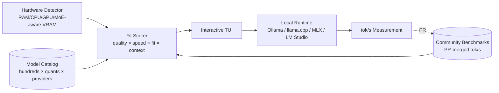

# AlexsJones/llmfit

## 前言

我在 trending 看到「Hundreds of models & providers. One command to find what runs on your hardware」，直覺以為又是一個「curl huggingface API 列出來讓你選」的清單工具。實際跑一次才發現它做了兩件遠比列表深的事：一是**把「模型-硬體適配」建成一套 4 維打分模型**（quality/speed/fit/context），二是把 TUI 內建成一個 **「量測完直接開 PR 貢獻」的資料回流閉環**。這個閉環才是這個專案真正的架構亮點——它讓 llmfit 越用估算越準，因為每個使用者都是資料來源。

## 系統架構

Rust binary 單檔部署，`brew install` 之外還簽 SignPath 證書。TUI 內含「量測 → 上傳 PR」快捷鍵，不需要開 `gh` CLI 或註冊帳號。runtime layer 抽象化 5 個 backend，每個 backend 提供 `serve(model, quant) → tok/s`。

## 資料設計

Model catalog 用嵌入式 registry（Rust crate 內），每 release 隨 binary 一起發。每筆 entry 帶 `{model_id, quant_format, context_window, param_count, expected_quality, community_bench_tok_s?}`。Community benchmark 是 `Option`——沒有實測就用 heuristic 估算（基於 model size × user hardware profile），有實測就標 `✓`。使用者跑完 benchmark 產出的 JSON 走**TUI 內建 PR flow**：`git remote add fork → commit → push → open PR`，全部在 TUI 內完成。這就是`benchmark-collect-share-loop`的精華：**貢獻摩擦降到零，資料才會回流**。fit scoring 是 memory-aware：模型 GGUF Q4_K_M 需 5.2GB，你 GPU 8GB → fit 分數 = 1.0；需 12GB → fit = 0，直接不推薦。MoE 模型特別處理（活躍參數 vs 總參數分開算 VRAM）。

## 為什麼這樣做

三個乾脆的取捨。第一，**Rust 而非 Python**：hardware detection 要跨平台 syscall（macOS `sysctl` / Linux `/proc/meminfo` / Windows WMI），Rust 的 crate ecosystem 對這種 low-level 綁定更成熟，還能編成單一 binary 分發，避免 Python venv 地獄。第二，**PR flow 內建 TUI**：作者知道「你可以貢獻資料」是空話，只有摩擦低於「打開瀏覽器」使用者才會做。第三，**runtime abstraction over specific backend**：不綁 Ollama 或 llama.cpp，是因為 local LLM 生態太亂——今天 MLX 快、明天 Docker Model Runner 出、後天 LM Studio 升級，llmfit 只做「調度層」不做「執行層」，把 runtime 選擇留給使用者。這是[multi-provider-llm-routing](../concepts/multi-provider-llm-routing.md)應用在**本地** LLM 場景的變體。

## 我能學到

想帶回自己專案的兩件事：
1. **量測資料的「內建貢獻閉環」設計**：任何有 estimation 的系統（性能、成本、品質），如果能讓使用者一鍵貢獻實測數據替換估算值，估算就會被自然淘汰。這對我寫 SaaS 定價工具 / benchmark dashboard 都有直接啟示。
2. **多維 fit scoring 而非單一 recommend**：不推薦「最好的模型」，而是給 4 個維度分數讓使用者自己權衡。因為使用者情境差異太大（有人要品質、有人要速度、有人要 context 長度）——這是把「決策權留給使用者、系統只提供可比較的數據」的健康心態，我自己做工具常常太雞婆。

另外看到「MoE-aware VRAM accounting」這種細節——一般人算 VRAM 用總參數 × 精度，MoE 應該只算活躍 expert 的部分——這種**細節正確性**是分辨「跑過真實硬體」和「複製別人程式」的關鍵。

## 費曼式回顧

### 用生活比喻重講一次

想像你走進一家鞋店（llmfit），店員（TUI）先量你的腳（hardware detector），然後從牆上的鞋架（model catalog）挑出**幾百雙可能適合你的鞋**，每雙都給你 4 個分數：**耐穿**（quality）/**輕便**（speed）/**貼腳**（fit）/**能塞多少東西**（context）。有些鞋牌子貼「✓ 客人實穿過」（community benchmark），有些只是店員憑經驗猜（heuristic）。你穿完覺得好穿？店員說「你可以把心得寫進門口那本簿子（PR flow）」——**簿子就在門口，不用去別家寫**——你寫完之後下一個客人來就看得到「✓」，不用再猜。店家從來不逼你穿某雙，只給你比較表。

### 你接下來最可能誤解的 3 個地方

1. **以為它是「模型下載器」，但實際上**它一雙鞋也不賣（不下載模型），只**告訴你哪雙鞋在你腳上會怎樣**——真正的下載 / 執行是別的工具（Ollama / MLX）做的。llmfit 只做「配對決策層」。
2. **以為 benchmark 資料存在雲端伺服器，但實際上**它存在 GitHub repo（每 release 一起打包），意思是離線也能用、也能自己 fork 加私人資料，**不需要中央 server 這種東西**——這是 local-first 的極致。
3. **以為 "fit 分數高" 就是「最推薦的」，但實際上**fit 只是 4 維之一（記憶體吻合度），跟 speed 和 quality 是**獨立軸**——某個模型可能 fit=1.0 但 quality=0.3（跑得動但笨），要不要選看你在意什麼。分數是**決策輔助**，不是自動推薦。

### 換你解釋

現在用你自己的話講給朋友：「為什麼 llmfit 敢開 4 個維度分數而不直接推薦一個最好的模型？」講到卡住的地方，回來對照上面兩段。

## 相關概念

- [multi-provider-llm-routing](../concepts/multi-provider-llm-routing.md)
- _pending（待第 2 個專案觸及才開頁）_：`hardware-model-fit-scoring`、`benchmark-collect-share-loop`
