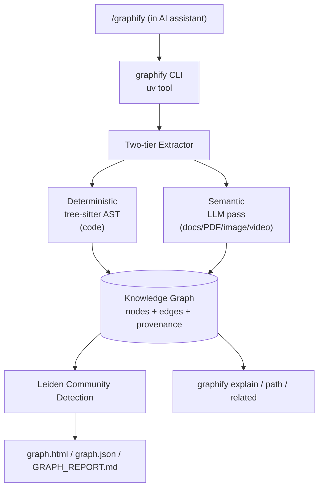

# Graphify-Labs/graphify

## 前言

我今天分析的第五個專案是 graphify——它跟 07-22 的 code-review-graph 都做「codebase → knowledge graph」但取了不同的角度。graphify 把「code / docs / PDF / image / video」全都變成 graph node，讓你在 AI assistant 裡打 `/graphify .` 就能對整份 project 做 graph query。最觸動我的設計是：**每條 edge 顯性標記 EXTRACTED 或 INFERRED**——你隨時知道「這個關聯是原文寫的」還是「AI 猜的」。這對信任 AI 產出是關鍵：不是要它保證正確，而是**讓你看得出哪些部分可以信**。

## 系統架構

Two-tier extraction 是核心：**code 走 deterministic tree-sitter 完全 offline，非 code（docs/PDF/image/video）走 semantic LLM pass**。所有 edge 都帶 provenance tag。輸出三個檔（graph.html / graph.json / GRAPH_REPORT.md），graph.html 是可互動的 D3 force-directed 視覺化。

## 資料設計

Node schema：`{id, type, name, source_path, source_line?, community_id, degree}`。Edge schema：`{source, target, relation, extraction_method, confidence?, provenance_snippet}`——`extraction_method ∈ {EXTRACTED, INFERRED}` 是[[deterministic-vs-llm-inference]]的關鍵欄位。EXTRACTED 帶 source_line 指回原始 token，INFERRED 帶 confidence + provenance_snippet（LLM 的推理依據）。這種**edge-level 可稽查性**讓 graph 從「AI 產出的一大坨」變成「可審計、可質疑、可修正的知識結構」。community detection 用 Leiden 演算法（Louvain 的改良版）自動分群，每個 node 得 `community_id`，graph.html 依此上色。這在大 codebase 特別有用——FastAPI 用 graphify 跑完後，「routing 相關的 node」、「dependency injection 相關的 node」、「pydantic schema 相關的 node」會自動分成不同色塊，比 folder structure 還準（因為 folder 是人為劃分，community 是**實際引用關係**產生的）。graph.json 是 portable 格式，可以放 git、可以做 diff、可以拿去別的工具再處理。

## 為什麼這樣做

三個乾脆的取捨。第一，**不用 embedding，用 graph**：作者的判斷是「structural query」（誰依賴誰、路徑追蹤）比「semantic similarity」更適合 code / docs 導覽。這是**選擇 shape 而非 ranking**——結構性答案有 canonical form（一條路徑、一個 subgraph），vector 只能給你一個排序清單。第二，**Deterministic vs Inferred 標記強制透明**：多數 AI 工具把兩者混在一起輸出，讓使用者無法區分。graphify 拒絕這種混淆——這是**信任作為 first-class feature**，代價是輸出多一個維度但換來使用者對系統的信任。第三，**local-first + optional cloud**：CLI 完全本地，只有 semantic pass 需要 LLM（可用 assistant 內建 model 或自帶 API key），配套 SaaS graphify.com 是可選的 always-on 版本。這是[[local-first-agent-workbench]]的一種變體：open source 是完整可用的產品，SaaS 是「懶得自己跑」的付費升級。

## 我能學到

想帶回自己專案的兩件事：
1. **provenance 作為 edge-level 一等欄位**：AI 產出的資料一律標「這是規則抽的 vs 模型推的」讓下游決定信任度。我以前把「AI-generated」當 opaque 黑盒；graphify 教我 provenance 應該是**每條資料的 metadata**，不是整份文件的 header。
2. **community detection 揭示「實際結構」而非「宣稱結構」**：folder structure / 官方文件章節都是**作者宣稱**的組織方式，graph community 是**引用關係實際形成**的組織方式，兩者常不一樣。任何有引用關係的資料（code / paper / wiki / documentation）都能用同一招揭露隱藏結構。

另外 `.html + .json + .md` 三檔輸出很聰明——`.html` 給人看、`.json` 給機器再處理、`.md` 給 AI 讀。**同一份資料三種消費者、三種格式**，不強迫使用者只能用一種。

## 費曼式回顧

### 用生活比喻重講一次

想像你搬進一間老房子，牆上到處是前任屋主寫的便條、書櫃裡有老照片、抽屜裡有錄音帶——你想搞懂這間房子過去發生的所有事。以前你只能一件件翻，很慢。graphify 做的事：**派出兩組人**——一組是**認真拿放大鏡看的**（tree-sitter，只看能看清楚的東西比如寫死的名字），一組是**憑經驗猜的**（LLM，處理照片和錄音這種模糊的）——他們把所有人事物之間的關係畫成一張大地圖。**兩組人畫的線都會**顯性標出來**「這條是看到寫的」還是「這條是猜的」**，這樣你之後不會被誤導。地圖有顏色分區塊，跟屋子的**格局**（folder）常常不一樣——「都跟廚房有關的東西」可能散在不同房間，但地圖會把它們畫成同一色塊。

### 你接下來最可能誤解的 3 個地方

1. **以為 graph 和 vector RAG 是敵人，但實際上**它們解不同問題：vector 適合「找相似東西」，graph 適合「找有關係的東西」。graphify 選 graph 是因為 code / docs 的問題 80% 是**結構性**（誰引用誰、路徑），vector 反而模糊化。如果你問「找內容相近的段落」，vector 還是贏。
2. **以為 EXTRACTED / INFERRED 只是給程式看的元資料，但實際上**這是給**人**看的信任信號——「這條連線是規則抽出來的（100% 可信）還是 LLM 猜的（可能錯）」是使用者能否採信這張圖的關鍵。**顯性標記** > 統一產出，因為前者尊重使用者的判斷力。
3. **以為 community detection（Leiden）就是把檔案照資料夾分色，但實際上**它是照**實際引用關係**分——最後常常「不同資料夾的檔案被畫成同一群」（因為它們互相引用）。這揭露的是「你以為的結構」和「真實結構」的差距，通常是重構的線索。

### 換你解釋

現在用你自己的話講給朋友：「為什麼 graphify 要在圖上顯性標記『這條邊是規則抽的還是 AI 猜的』？如果全部混在一起輸出會怎樣？」講到卡住的地方，回來對照上面兩段。
