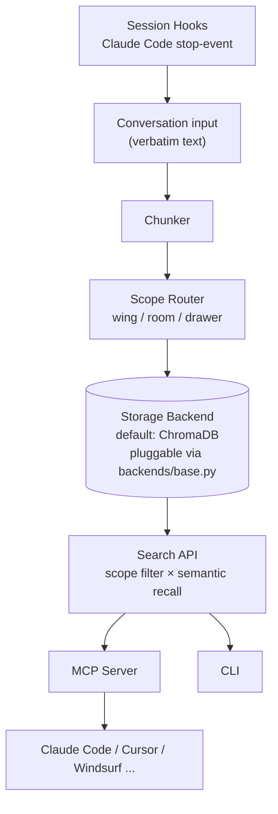

# MemPalace/mempalace

## 前言

我一開始把 MemPalace 歸類為「又一個 vector DB wrapper」，直到讀到它 README 裡那句：「It does not summarize, extract, or paraphrase.」這是刻意的[[verbatim-memory-vs-summary]]取捨——大多數 AI memory 系統會把長對話 LLM-壓縮成摘要存進去，MemPalace 拒絕這樣做，理由是「摘要一定會漏東西」。它把 UI 抽象和 storage 抽象徹底分開，甚至用「宮殿」的空間隱喻（wing/room/drawer）做 scope query，讓 embedding 不再是唯一的召回機制。

## 系統架構

Storage backend 用 `mempalace/backends/base.py` 定義的三個抽象方法（`add / search / delete`）解耦，ChromaDB 只是預設實作。整條 write path**沒有 LLM**——原始文字進去就是原始文字。read path 用 embedding 做 recall，但先由 scope filter 收斂搜尋範圍。

## 資料設計

三層 hierarchy 是 MemPalace 最有創意的部分：
- **Wing**（人 / 專案）：`alice`, `github-learn-log`
- **Room**（主題）：`design-decisions`, `debugging-notes`
- **Drawer**（verbatim chunk）：實際的一段對話原文

查詢時可寫 `wing:alice/room:design-decisions?q="local-first tradeoffs"`——scope filter 先把候選集從幾十萬 chunk 降到幾百，才做 embedding 相似度排序。這比純 vector 快而且準（scope 是使用者顯性告知的訊號，比模型猜的相似度可信）。metadata schema：每個 drawer 帶 `{wing_id, room_id, timestamp, source_session_id, content_hash}`——content_hash 用來偵測重複進站的 chunk 不重寫。verbatim 帶來一個問題：**存量會很大**——README 沒細講怎麼解，但看得出 ChromaDB 的 disk footprint 是可接受痛點（畢竟 local 不用付雲端錢）。LongMemEval R@5 = 96.6%，作者主打「best-benchmarked」——這在 memory 系統裡是罕見的公開評測。

## 為什麼這樣做

三個乾脆的取捨。第一，**verbatim over summary**：摘要不可逆，一旦壓縮就丟資訊，日後想改召回策略就沒素材了；verbatim 讓 memory 是「原始日誌」而非「二手筆記」，代價是儲存空間但那在 local 幾乎免費。第二，**metaphor 和 backend 分離**（[[pluggable-storage-backend]]）：palace 隱喻是 UX，ChromaDB 是實作，兩者用 `backends/base.py` 徹底解耦——當 Chroma 被更快的 vector DB 取代（vector DB 生態每年洗牌），MemPalace 的 API contract 一行都不用改。第三，**只做 memory，不做 orchestration**：README 明說「Nothing leaves your machine unless you opt in」——它拒絕變成 agent framework 的一部分，堅持自己是 storage tier。這種**單一職責**在 AI infra 是稀缺品質。

## 我能學到

想帶回自己專案的兩件事：
1. **hierarchical filter × embedding recall 的混合檢索**：純 vector 對「意思相近」有力但「範圍過濾」很爛；純 tag 精確但語義弱。用 scope filter 先切集合、embedding 排序，兩層各發揮所長。適用場景遠不只 memory——任何有 metadata 的文件檢索都能套（我自己 note-taking 應用就想試）。
2. **拒絕壓縮的 storage 哲學**：對「日後想換召回策略」的可能性下賭注，選擇保留原始資料而非早早壓縮。這是「optionality」的價值——保留未來的可能性有溢價。反例：一堆 log 系統早早 aggregate 掉 raw event，事後想重跑分析就沒 raw 了。

另外 `backends/base.py` 那 3 個抽象方法（add / search / delete）——精簡到極致但足夠。這種**最小介面設計**很難做，通常會忍不住多加方法。這是可以學的節制。

## 費曼式回顧

### 用生活比喻重講一次

想像你有一座豪宅（palace）。不同「翼」（wing）住不同的家人（Alice 一翼、公司專案一翼）；每個翼有幾個「房間」（room）分主題（工作房 / 讀書房 / 廚房）；每個房間有很多「抽屜」（drawer），抽屜裡放的是**你當天寫的原始便條紙**（verbatim），不是筆記本濃縮版。找東西時，你不是全屋翻——先想「這事該在哪個翼、哪個房間」（scope 過濾），再在那房間裡翻找「跟今天問題有關」的抽屜（embedding）。要換裝新的儲物櫃（換 vector DB）？換就是了——房間的隔局和你在哪找東西的習慣完全不變。

### 你接下來最可能誤解的 3 個地方

1. **以為 memory 就是要 LLM 幫你濃縮才夠聰明，但實際上**MemPalace 刻意拒絕濃縮——因為**濃縮不可逆**，日後想改召回方式就沒原文可用。它相信「保留原料」比「聰明摘要」更有長期價值。
2. **以為 wing/room/drawer 只是漂亮的比喻，但實際上**這是**真的查詢條件**——你查詢時真的會寫 `wing:alice/room:project-x`。空間結構不是裝飾，是**顯性的搜尋收斂機制**，比讓模型自動猜「你想找哪類」精確得多。
3. **以為它跟其他 vector DB（Chroma / Qdrant / Pinecone）競爭，但實際上**它建立在 Chroma 之上，且允許你隨時換掉——它競爭的不是 vector DB 這一層，而是**「怎麼把記憶組織成人類能理解的空間」**這一層。這是 UX 抽象，不是 infra 抽象。

### 換你解釋

現在用你自己的話講給朋友：「為什麼 MemPalace 寧可占更多硬碟也不肯讓 AI 幫你濃縮對話？」講到卡住的地方，回來對照上面兩段。
