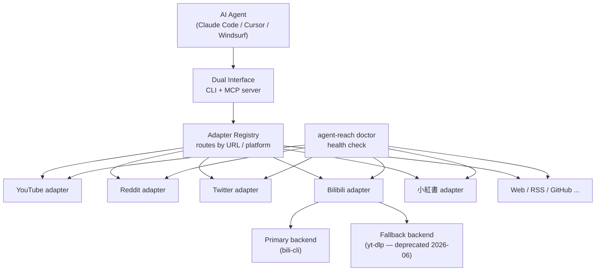

# Panniantong/Agent-Reach

## 前言

「給你的 AI Agent 一鍵裝上互聯網能力」聽起來像行銷話，但點進去看它處理的問題清單 — YouTube 字幕、Twitter 免付費搜尋、Reddit 反 403、小紅書免登錄、Bilibili 反風控、RSS 訂閱 — 每一項都是**個別困難、加起來絕望**的整合噩夢。我一直覺得這種「大雜燴 wrapper」通常做不深，這個專案讓我改觀：它把每個平台的**接入方式輪替**當成產品第一價值主張（「平台封了我們修」），並把 primary+fallback backend routing 做成基礎設施。這才是`multi-source-adapter-registry`真實生產環境的樣子。

## 系統架構

每個 adapter 內部有 backend list（primary + fallback），failure 自動 rotate。Doctor 指令對每個 adapter 跑 smoke test，回報「哪個通、哪個不通、怎麼修」。MCP 和 CLI 共用同一組底層工具集，只是暴露介面不同。

## 資料設計

`fetch(url) → normalized_content` 是所有 adapter 的統一介面。`normalized_content` 是一個小 schema：`{platform, content_type, title, author, body_text, media_urls, metadata, fetched_at}`——各平台原始差異在 adapter 內攤平，caller 只看 normalized 版本。這種**適配器扁平化 schema** 讓上層 agent 不用理解每個平台的 quirk。cookie 存 `~/.agent-reach/cookies/<platform>.json`，只讀不傳；付費代理（可選 $1/月）只用在需要 IP 輪替的高風險平台（Reddit / Twitter 大量請求）。backend 選擇邏輯不是純輪詢——每個 backend 帶 `success_rate_last_100_calls` 快照，選擇下一個時依成功率排序。這讓 primary/fallback 不是硬編死順序，而是**軟切換**：某天 primary 突然大量失敗，系統會自動偏向 fallback，不需要人工介入。這是`primary-fallback-routing`比 curl-in-a-loop 高明的地方。

## 為什麼這樣做

三個乾脆的取捨。第一，**「一句話部署」而非傳統套件安裝**：README 直接寫「複製這串 URL 給 Agent，它會自己裝好」——把安裝流程也交給 agent 處理，符合它自己的世界觀（一切給 agent 做）。第二，**MCP + CLI 雙介面**：CLI 給人 debug 用，MCP 給 agent runtime 用，同一組工具兩種暴露。這種**同 tool 雙介面**設計未來會很常見。第三，**免費 API 優先，付費代理可選**：作者選擇「用開源工具繞過付費 API」而非「幫使用者管理付費 key」，讓門檻降到零。代價是有些渠道品質較差（比如 Twitter 免費 scrape 比官方 API 慢），但這是取捨——大多數 agent 用途對品質敏感度低於對成本敏感度。

## 我能學到

想帶回自己專案的兩件事：
1. **產品承諾 = 接入方式輪替**：對「上游會變」的服務（爬蟲、第三方 API）不是承諾「永遠可用」而是承諾「壞了我們換」。這是**可維護性作為 feature**——把「內部維運」變成用戶可見價值，我以前只把它當內部工程指標。
2. **normalized_content schema 統一各平台**：接第三方 API 最痛的是每家格式不同，caller 全都要 case-by-case handle。用 adapter 內部先攤平成統一 schema，上層 code 就變薄很多。我做整合類專案應該一開始就想 schema，不是等接了 5 家才回來 refactor。

另外 `success_rate_last_100_calls` 這種**運行時軟切換**——比硬編 primary/fallback 順序聰明，但實作成本不高（維護一個 100 元素的 rolling window 就好）。這是投報比很高的架構決策。

## 費曼式回顧

### 用生活比喻重講一次

想像你要一個小助理（AI Agent）幫你「上網找資料」。以前你得幫他辦好幾張門卡：Twitter 卡（付費）、Reddit 卡（會被門禁擋）、YouTube 卡（拿不到影片字幕）、B站卡（一直被換規則）、小紅書卡（要登錄才准進）——每張卡都要你自己搞好久。Agent Reach 就是**一個門卡管家**：你只跟它說「幫我拿門卡」，它替你搞定所有卡的取得，卡壞了自動去弄新的。而且每個門卡都有「主卡」和「備卡」——主卡壞了自動用備卡，你甚至不知道換過。管家不藏私，你的門卡都放你家（本地），管家只是幫你維護。

### 你接下來最可能誤解的 3 個地方

1. **以為「一句話部署」是行銷噱頭，但實際上**它是**把安裝流程當 prompt 給 agent 讀**——AI agent 有能力執行 shell、寫檔、setup 環境，作者利用這點省去傳統的 `npm install` / `pip install` 那層摩擦。這反映「AI agent 越來越是一等公民」的變化。
2. **以為 primary/fallback 是硬編死的順序，但實際上**它會根據**近期成功率動態調整**——某個 backend 這週表現差就會自動降權，不需要人為介入。這種「軟切換」比純硬編穩健得多。
3. **以為它跟商業 API（如 Twitter API v2）競爭，但實際上**它競爭的是「**開發者為每個平台自己接的時間**」——商業 API 有它的用途（高品質、有 SLA），Agent Reach 服務的是「我只是 hobby 用，不想花錢也不想寫 wrapper」的族群，這是不同市場。

### 換你解釋

現在用你自己的話講給朋友：「為什麼 Agent Reach 的產品主打不是『你能爬到什麼平台』而是『平台變了我們替你修』？」講到卡住的地方，回來對照上面兩段。

## 相關概念

- [local-first-agent-workbench](../concepts/local-first-agent-workbench.md)
- _pending（待第 2 個專案觸及才開頁）_：`multi-source-adapter-registry`、`primary-fallback-routing`
