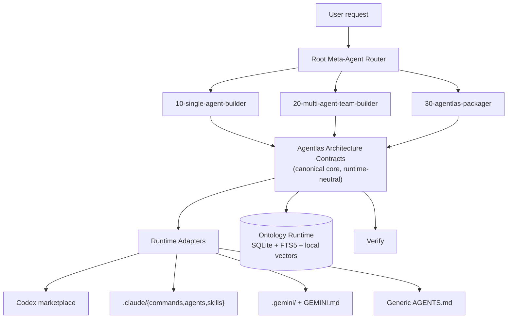

# agentlas-ai/Agentlas-OS

## 前言

我看到「Agent OS: keep specialist agents in a hub, spin up a temporary orchestrator per task」時，第一反應是「又一個 multi-agent framework 吧」。點進去發現它把整套設計切成三個 meta-agent（single-builder / team-builder / packager）— 也就是這個 repo 本身是**用 agent 產出 agent** 的模板廠。真正震撼的是 `.agentlas/super-ontology-*.json` 那 25+ 個維度的 contract file。這個 repo 把「agent 該如何被治理」拆到我沒見過的顆粒度。

## 系統架構

Canonical core 只有 markdown + JSON contract — **runtime-neutral**。每個 runtime（Claude Code / Codex / Gemini / 純 AGENTS.md CLI）只是一組薄 adapter，翻譯同一份 core。這是 [[runtime-neutral-agent-contract]]。

## 資料設計

`.agentlas/` 目錄是這個 repo 的核心 data model — 每個 aspect 一個 JSON 檔：`mode-map.json` 決策 mode / `agent-card.json` 定義身分 / `memory-map.json` + `memory-tickets.jsonl` 是記憶條目 / `skill-registry.json` + `skill-trials.jsonl` + `curator-decisions.jsonl` 是技能生命週期。最猛的是 `super-ontology-*.json` × 25+：coverage、consensus、causal-impact、adversarial-provenance、epistemic-calibration、resilience-control ... 每個維度都獨立一支 contract file。Production Ontology Runtime 把可攝入的檔案（md / json / csv / docx / xlsx / pptx / pdf-text / hwpx / OCR）灌進 **SQLite + FTS5 + deterministic local vectors** — 沒有雲，走 GraphRAG 查詢。缺 parser 時記 `unsupported_pending_adapter`，不假裝成功。

## 為什麼這樣做

它的核心賭注：**agent 是 portable user asset，不是 hosted 服務**。這推導出所有設計：canonical core 用 markdown/JSON 而非某個 runtime 私有格式；credentials 只在 gitignored local file，public package 只保 value-free reference；skill 有 lifecycle（candidate → trial → curator-approved），runtime first-class recall 預設關掉；memory 有 curator gate，公開 export 只能 candidate-only 且 value-free。這樣做的 cost 是「多層 indirection、大量 boilerplate JSON」，但換到「可 audit + 可 restore + 可搬 runtime」— 是把 governance 從 policy 檔升到 architecture 層。它跟 openscience 一樣選 [[local-first-agent-workbench]]，但更激進：連 memory / skill 都要 gate。

## 我能學到

三個東西想帶走：
1. **Meta-agent 分工**（builder / team-builder / packager）— 這是把「產 agent」和「執行 agent」清楚切開的 lever。我以前寫 agent framework 時，設計和實例混在同一份 config。
2. **Skill lifecycle registry**（[[skill-lifecycle-promotion]]）— skill 不是「寫完就能用」，而是要走 trial evidence + curator decision，這比我單純用 flag 開關 skill 嚴謹很多。
3. **`unsupported_pending_adapter` 這種明確 fail 標記** — 比「靜默 skip」或「拋 exception」都好，是 future work backlog 的 in-place 標記。

## 重造難度

**5/5** — 25+ 個 ontology 維度光是把每個 contract 想清楚就要幾個月；ontology runtime 涉及 SQLite + FTS5 + local vector + GraphRAG 至少要 2–3 週末。週末只能重造「三個 meta-agent 的 mode-classifier + clarify-question-loop」這個薄 slice。阻力點：super-ontology 每個維度的判準不明確，需要領域 taste。
