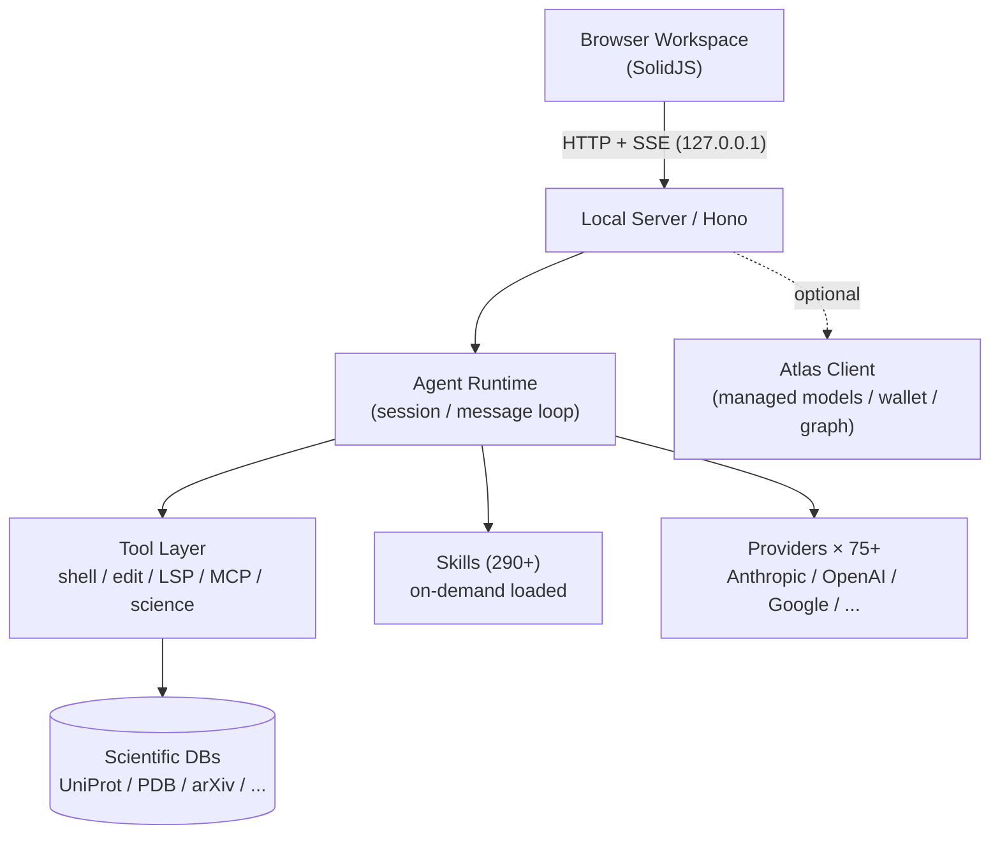

# synthetic-sciences/openscience

## 前言

我在 trending 上看到「AI workbench for scientific research」這個描述，心裡想這通常是包一層 chat + 幾個 plot 的 demo。點進去看 [ARCHITECTURE.md](https://github.com/synthetic-sciences/openscience/blob/main/ARCHITECTURE.md) 才發現它把整個科學研究 loop（讀 paper → 假設 → 寫 code → 跑實驗 → 分析 → 寫報告）真的當「一個 agent session」在跑。而且刻意把整個 workbench 綁在 localhost、走 SSE 推 browser。它像是把 Cursor 那種 IDE 心智，搬去給科學家用。

## 系統架構

CLI 用 Bun + TypeScript 編成單一 native binary（每個平台各自 npm package，meta package 選對的裝）。Server 綁 `127.0.0.1` 並 enforce Host + Origin allowlist，**沒有 remote mode**。這是 [[local-first-agent-workbench]] 的很硬派版本。

## 資料設計

Session / artifacts / provenance 全落在本機 XDG 目錄（`~/.config/openscience/`、`~/.local/state/openscience/`）。Provider metadata 從 [models.dev](https://models.dev) 拉並 cache，帶 bundled snapshot fallback — 網掛了也還有東西可查。Prompt 分兩層組（provider-level system prompt + agent-level workflow prompt），這樣同一個 agent 換 model 時 prompt 只換一半，避免 prompt 亂噴。Skills 是 instruction bundle，released build 從 Atlas skill index 抓 catalog 快取，跑 source 則直接讀 bundled `skills/` tree — 兩種 load 路徑同一 interface。

## 為什麼這樣做

它做了兩個乾脆的 trade-off。第一，**只綁 localhost**：不做 remote mode 就不需要處理 auth / multi-tenant / infra，開發面向立刻收斂。第二，**Atlas 是 optional 客戶端**：所有 BYOK 使用者根本不需要碰到 Atlas 這個 closed platform，開源 repo 只有 client 端，wire contract 明確列出（`synsci` provider id、`thk_` wallet key、`/api/cli/*`）。這是把商業產品「clean 分離出可安裝的 workbench + 可有可無的雲端」的教科書範例 — 開源不是切一角，是分工 [[multi-provider-llm-routing]]。

## 我能學到

想帶回自己專案的兩件事：
1. **雙層 prompt 組裝**（provider-level + agent-level）讓「換 model」和「換 agent 角色」變成正交軸，不會每個 agent 都要為每個 model 各寫一版 prompt。
2. **catalog 兩路 load 同 interface**（cache-from-cloud vs bundled-source）— 開發者跑 source 時不用 mock 雲端，發布版又能拿到最新 catalog。這比「build 時 embed 一份」和「runtime always fetch」都更務實 [[on-demand-skill-catalog]]。

另外看到「blind reviewer gate 在 finalize 前跑」這種設計，我以前只把 review 放在 CI，沒想過可以放在 agent runtime 內部做為 finalize step。

## 費曼式回顧

### 用生活比喻重講一次

想像巷口一家獨立咖啡店（openscience）。老闆自己會煮、店裡有豆子、有咖啡機，客人**走進店裡**就能點餐。旁邊有間中央倉庫（Atlas）會定期送新豆子和新機器，但今天倉庫罷工，這家店還是照常開。這家店刻意**不接外送、不裝 Uber Eats**：只服務走進來的客人。因為不做外送，就不用處理付款系統、外送員身分、路線規劃那堆麻煩事，全部精力放在把咖啡煮好、把客人的杯子擦亮。

### 你接下來最可能誤解的 3 個地方

1. **以為 local-first = 不打電話出去，但實際上**這家店照樣打電話叫豆子（provider API）、照樣訂設備更新（Atlas catalog），只是**「客人來店裡」這個動作在本地發生** — 差別在「誰是主人、誰是客人」，不是「有沒有對外通訊」。
2. **以為兩層 prompt 只是把長字串拆兩段方便管理，但實際上**它把「換咖啡機」和「換咖啡師」變成**兩個可以獨立換的軸** — 換一台新機器只需要調下層（provider prompt），換一個「懂手沖的咖啡師」→「懂拿鐵拉花的咖啡師」只需要調上層（agent prompt）。
3. **以為「從雲端拉技能清單」和「跑源碼直接讀技能資料夾」是 production vs dev 的差別，但實際上**這兩條路對上層**看起來一模一樣** — 開發者跑源碼也照樣有完整功能，不是「debug 模式」，是**同一個抽象接兩種後端**。

### 換你解釋

現在用你自己的話講給朋友：「為什麼這家咖啡店寧可放棄外送客源，也要堅持 localhost only？」講到卡住的地方，回來對照上面兩段。
