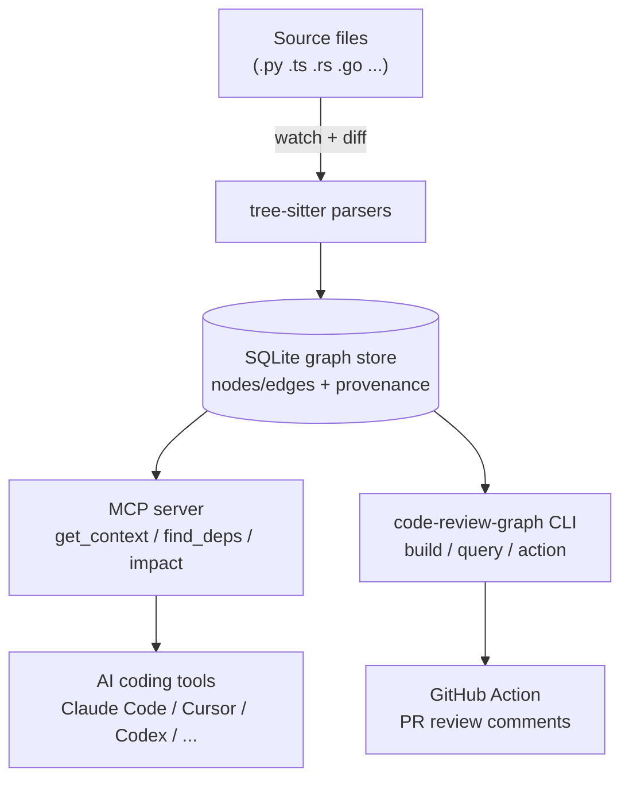

# tirth8205/code-review-graph

## 前言

我第一眼看到「Local-first code intelligence graph for MCP and CLI」時想，這不就是又一個 RAG-over-code 嗎？點進 README 才注意到它把主 slogan 寫成 "Stop burning tokens"，並附上 38x–528x 的實測資料。這不是「AI 讀你的 codebase」，是「讓 AI **不要**讀你的 codebase」——它介於 grep 和 vector search 之間找了一個新縫隙：**用 AST graph 當 context cache**，AI 只調用 graph query，不再拉全檔。

## 系統架構

Parse loop 是 tree-sitter，deterministic，no LLM in the write path。graph 落地在本機 SQLite；incremental 只重 parse 改動的檔。MCP server 把 graph 包成 tool set 給 agent 用；agent 一問「這個 class 誰依賴？」拿到的是 20 個 node 名字，不是 20 個檔案內文。

## 資料設計

Node types：`file`, `class`, `function`, `import`。Edge types：`defines`, `calls`, `imports`, `inherits`。每條 edge 帶 `(source_file, line, extractor_version)`——這是[[code-ast-knowledge-graph]]的關鍵欄位，允許 caller 判斷「這條 edge 是最近 tree-sitter 版本抽出來的還是舊快照」，因此升級 parser 不用全重 build。graph 用 SQLite 而非 Neo4j / 專用圖 DB，是刻意的 local-first 取捨：一份檔、可 diff、可 grep、無 daemon。查詢用 recursive CTE 做 traversal，對「函式 X 的呼叫深度 3 內誰改動會炸」這種 impact 分析夠用。change tracking 靠 file mtime + content hash，比 git-blame 快十倍。

## 為什麼這樣做

三個乾脆的取捨。第一，**不做 embedding**：作者判斷 code review 場景「結構性問題」（依賴、呼叫圖、影響半徑）遠比「語義相似度」有價值，vector top-k 反而稀釋 signal。第二，**MCP over CLI-only**：MCP 讓 AI agent 主動 pull 需要的 sub-graph，不用 human middleman 貼結果；這是「[[mcp-context-provider]]」而不是「CLI 玩具」。第三，**incremental over rebuild**：codebase 每天改幾百行，重建 graph 十秒無所謂，但 review workflow 每分鐘查 20 次，那才是熱路徑。所以 write path 慢一點沒關係，query path 必須秒回。

## 我能學到

想帶回自己專案的兩件事：
1. **「幫模型不要讀」比「幫模型讀」更值錢**：一般 RAG 思維是把更多內容塞進 context，這個專案反過來——先把結構抽出來，query 只回結構性答案。適用場景遠不只 code，任何有明確 schema 的資料（DB schema、API spec、log format）都可套。
2. **SQLite 當 graph store 的可行性**：以往覺得 graph 一定要 Neo4j / DGraph，其實對「單機、可 diff、node 數 < 100K」的場景，SQLite + recursive CTE 完全夠用，還多了「一份檔」的可攜性。

另外「edge 帶 extractor_version」這個小欄位讓 schema 有 forward compatibility——parser 升級不用宣告 breaking change，這是我在自己專案裡沒想過要做的。

## 費曼式回顧

### 用生活比喻重講一次

想像圖書館裡有個特別聰明的管理員（AI）。以前你問「這本《紅樓夢》裡誰是林黛玉的表哥」，管理員得把整本書從頭翻一遍，累死。code-review-graph 做的事，是**先叫一組工讀生（tree-sitter）把整個圖書館的所有書都畫成一張「誰認識誰」的關係圖**，貼在牆上。管理員之後被問「表哥是誰」，只要抬頭看牆上的圖，不用再翻書。書改了才重畫那幾頁的關係，其他不動。

### 你接下來最可能誤解的 3 個地方

1. **以為它是「更聰明的 grep」，但實際上**它是「結構化的關係地圖」——grep 給你「文字出現在哪」，這個東西給你「這個東西跟誰有關」。同樣是找答案，但一個是字串命中，一個是圖節點命中。
2. **以為 graph 就等於 Neo4j 那種專門圖資料庫，但實際上**它用 SQLite 存，因為單一 codebase 的 node 數不多（幾千到幾萬），SQLite 的 recursive CTE 就能處理，還多了「一個檔案存全部、可以拷貝也可以放進 git」的方便性——選 tool 要看規模。
3. **以為它跟 vector RAG 是競爭關係，但實際上**兩者處理的問題不同：vector 適合「意思相近」（自然語言查詢），graph 適合「結構相關」（明確關係）。code review 的問題 90% 是後者（誰呼叫這個、改這裡會炸哪裡），所以作者選了 graph；如果做「找 Python 版本的類似寫法」還是要 vector。

### 換你解釋

現在用你自己的話講給朋友：「為什麼在 code review 場景下，用『關係圖』會比『語義搜尋』更省 token？」講到卡住的地方，回來對照上面兩段。
